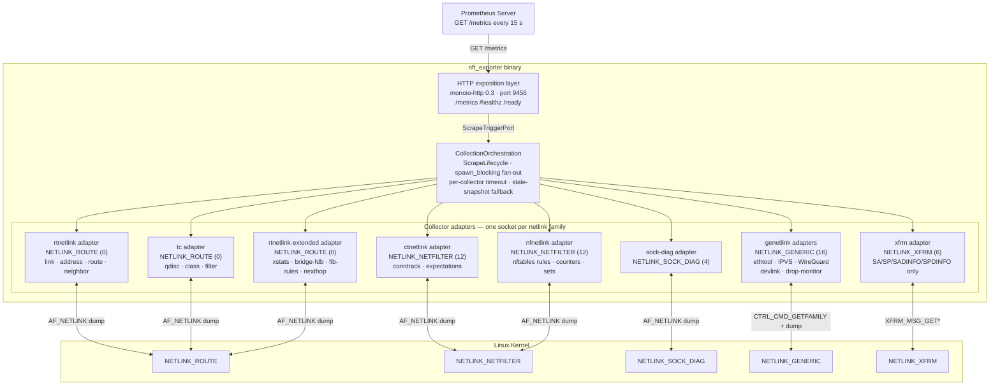
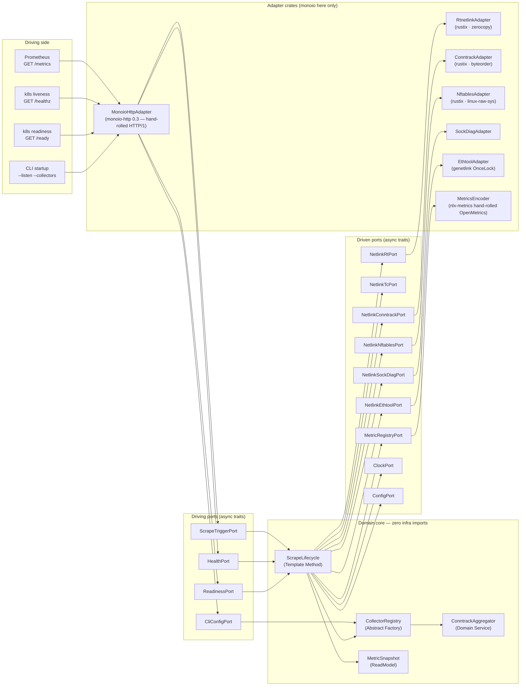

# netlink_exporter

> A zero-dependency, direct-AF_NETLINK Prometheus exporter delivering full Linux network observability from a single static binary with `CAP_NET_ADMIN` only.

[](LICENSE)
[](docs/arch/adr/0003-rust-edition-and-toolchain.md)
[]()

---

## What

`netlink_exporter` (binary: `nft_exporter`) scrapes the Linux kernel across six
raw `AF_NETLINK` socket families and exposes the result as OpenMetrics text on
`GET /metrics` at port `9456`. Every metric label set is **aggregated at
collection time**; there are no per-flow, per-route-prefix, per-socket-inode,
or per-MAC-address series.

## Why

Existing exporters either shell out to CLI tools, depend on procfs text parsing
that breaks in container namespaces, or import high-level Rust netlink crates
that abstract away the raw framing needed for:

- `IPCTNL_MSG_CT_GET_STATS_CPU` per-CPU conntrack statistics (raw
  `nf_conntrack_stat` struct, three kernel-version sizes: 52/56/60 bytes).
- `NLM_F_DUMP_INTR` restart semantics checked on every received frame.
- `TCA_STATS2` nested `gnet_stats_basic` / `gnet_stats_queue` parsing.
- genetlink family resolution with `OnceLock` caching across scrapes.

`netlink_exporter` speaks the wire directly: `rustix 1.1.4` for socket
syscalls, `linux-raw-sys 0.12.1` for UAPI constants, `zerocopy 0.8` for
zero-copy struct casting, and `byteorder 1.5` for big-endian nfnetlink fields.
No `rtnetlink`, no `rustables`, no `netlink-proto` in the dependency graph
(ADR-0011).

---

## Architecture

### Container diagram



### Hexagonal ports-and-adapters

Domain-core crates declare only `async trait` ports and immutable ReadModels.
`monoio` is confined to driven adapter crates and the binary composition root
(ADR-0023). `tokio`, `mio`, and `axum` are absent from the dependency graph.
No domain-core crate imports any infrastructure crate; enforced by `cargo deny`
workspace rules (ADR-0002, ADR-0023).



### Scrape sequence

```mermaid
sequenceDiagram
    participant P as Prometheus
    participant AXM as MonoioHttpAdapter
    participant SL as ScrapeLifecycle
    participant JS as spawn_blocking fan-out
    participant CT as ctnetlink adapter
    participant NFT as nfnetlink adapter
    participant K as Linux Kernel

    P->>AXM: GET /metrics
    AXM->>SL: trigger_scrape()
    SL->>JS: spawn_blocking per collector (concurrent fan-out)

    JS->>CT: probe_availability() + collect()
    CT->>K: IPCTNL_MSG_CT_GET_STATS_CPU (per-CPU)
    K-->>CT: nf_conntrack_stat frames
    CT->>K: IPCTNL_MSG_CT_GET (full dump)
    K-->>CT: conntrack flow frames → ConntrackAggregator
    CT-->>JS: ConntrackSummary (ReadModel)

    JS->>NFT: probe_availability() + collect()
    NFT->>K: NFT_MSG_GETRULE + NFT_MSG_GETCOUNTER
    K-->>NFT: nfnetlink frames
    NFT-->>JS: NftCounterSnapshot (ReadModel)

    JS-->>SL: all ReadModels joined
    SL->>SL: post_process → MetricSnapshot
    SL-->>AXM: MetricSnapshot
    AXM-->>P: OpenMetrics text<br/>application/openmetrics-text; version=1.0.0<br/>(encoded by nlx-metrics)
```

---

## Collectors

| Collector | Netlink family | Key metrics | Runtime-gated? |
|---|---|---|:---:|
| `rtnetlink` | `NETLINK_ROUTE` (0) | `nft_link_receive_bytes_total`, `nft_link_transmit_bytes_total`, `nft_link_receive_errors_total`, `nft_link_receive_dropped_total`, `nft_link_mtu_bytes`, `nft_address_count`, `nft_route_count`, `nft_neighbor_count` | no |
| `link-xstats` | `NETLINK_ROUTE` (0) — `RTM_GETSTATS` | `nft_link_xstats_bridge_rx_multicast_bytes_total`, `nft_link_xstats_offload_rx_bytes_total`, `nft_bridge_fdb_entries`, `nft_fib_rules`, `nft_nexthop_objects` | yes (kernel >= 4.20) |
| `address` | `NETLINK_ROUTE` (0) — `RTM_GETADDR` | `nft_address_info`, `nft_address_flags_info` | no |
| `route` | `NETLINK_ROUTE` (0) — `RTM_GETROUTE` | `nft_route_count{table,family,protocol,route_type}` | no |
| `neighbor` | `NETLINK_ROUTE` (0) — `RTM_GETNEIGH` | `nft_neighbor_count{interface,family,state}` | no |
| `bridge-fdb` | `NETLINK_ROUTE` (0) — `RTM_GETNEIGH AF_BRIDGE` | `nft_bridge_fdb_entries{interface}` (via rtnetlink-extended) | yes (kernel >= 4.20) |
| `fib-rule` | `NETLINK_ROUTE` (0) — `RTM_GETRULE` | `nft_fib_rules{family}` | yes (opt-in) |
| `nexthop` | `NETLINK_ROUTE` (0) — `RTM_GETNEXTHOP` | `nft_nexthop_objects` | yes (kernel >= 5.3) |
| `tc-qdisc` | `NETLINK_ROUTE` (0) — `RTM_GETQDISC` + `RTM_GETTCLASS` + `RTM_GETTFILTER` | `nft_tc_qdisc_bytes_total`, `nft_tc_qdisc_drops_total`, `nft_tc_qdisc_backlog_bytes`, `nft_tc_class_bytes_total`, `nft_tc_filter_packets_total` | no |
| `conntrack` | `NETLINK_NETFILTER` (12) — ctnetlink | `nft_conntrack_entries{protocol,state}`, `nft_conntrack_bytes_total{protocol,direction}`, `nft_conntrack_drop_total`, `nft_conntrack_insert_total`, `nft_conntrack_clash_resolve_total` (kernel >= 5.10) | no |
| `conntrack-expectations` | `NETLINK_NETFILTER` (12) — `NFNL_SUBSYS_CTNETLINK_EXP` | `nft_conntrack_expectation_entries{l4proto,helper}`, `nft_conntrack_expectation_new_total`, `nft_conntrack_expectation_new_failed_total` | yes (helpers must be loaded) |
| `nftables` | `NETLINK_NETFILTER` (12) — nfnetlink | `nft_rule_counter_bytes_total{table,chain,comment}`, `nft_named_counter_bytes_total{table,name}`, `nft_set_elements{table,name,type}`, `nft_chain_info`, `nft_table_info` | no |
| `sock-diag` | `NETLINK_SOCK_DIAG` (4) | `nft_socket_count{protocol,state}`, `nft_socket_receive_queue_bytes`, `nft_socket_drops_total`, `nft_socket_retransmits_total` | no |
| `ethtool` | `NETLINK_GENERIC` (16) — ethtool family | `nft_ethtool_stat{interface,stat}`, `nft_ethtool_link_info`, `nft_ethtool_pause_rx_total`, `nft_ethtool_fec_corrected_total{interface,lane}` | yes (kernel >= 5.12, per-NIC) |
| `ipvs` | `NETLINK_GENERIC` (16) — IPVS family | `nft_ipvs_connections_total{proto,vip,port}`, `nft_ipvs_dest_active_connections`, `nft_ipvs_connection_table_size` | yes (`ip_vs` module) |
| `wireguard` | `NETLINK_GENERIC` (16) — wireguard family | `nft_wireguard_peer_receive_bytes_total{interface,peer}`, `nft_wireguard_peer_last_handshake_seconds`, `nft_wireguard_peer_endpoint_present` | yes (`wireguard` module) |
| `devlink` | `NETLINK_GENERIC` (16) — devlink family | `nft_devlink_health_reporter_error_total{bus_name,dev_name,reporter}`, `nft_devlink_health_reporter_state` | yes (`CONFIG_NET_DEVLINK`) |
| `drop-monitor` | `NETLINK_GENERIC` (16) — NET_DM family | `nft_drop_packets_total{reason,origin}` (sw + hw) | yes (opt-in, `drop_monitor` module) |
| `xfrm-ipsec` | `NETLINK_XFRM` (6) | `nft_xfrm_sa_count{proto,mode}`, `nft_xfrm_sp_count{dir,action}`, `nft_xfrm_sad_hash_count`, `nft_xfrm_spd_hash_count` | yes (`xfrm_user` module) |

Runtime-gated collectors emit `nft_scrape_collector_available{collector}=0` when
their kernel subsystem is absent and return `HTTP 200` without error, so `nft_up`
is unaffected by missing optional modules (ADR-0015).

### procfs/sysfs collectors — opt-in (ADR-0027)

These cover Linux network signals that have **no netlink API** (stack pressure,
IP/TCP MIB, IRQ accounting, NIC hardware health). They are the only readers of
`/proc` and `/sys`, isolated in the `nlx-procfs` crate behind a fixed path
allowlist, and ship **disabled by default** — enable per collector in config
(`[collectors] softnet = true`, …). Everything else stays native-API-only
(ADR-0025).

| Collector | Source | Key metrics | Default |
|---|---|---|:---:|
| `softnet` | `/proc/net/softnet_stat` | `nft_softnet_dropped_total{cpu}`, `nft_softnet_time_squeeze_total{cpu}`, `nft_softnet_backlog_length{cpu}` | off |
| `netstat` | `/proc/net/snmp` + `/proc/net/netstat` | `nft_netstat{protocol,field}` (TCP/IP/UDP/ICMP MIB: RetransSegs, ListenDrops, …) | off |
| `softirq` | `/proc/softirqs` | `nft_softirq_total{cpu,kind}` (`net_rx`/`net_tx`) | off |
| `irq` | `/proc/interrupts` | `nft_irq_total{irq,device}` (per-IRQ, summed across CPUs) | off |
| `sockstat` | `/proc/net/sockstat` | `nft_sockstat{protocol,key}` (TCP mem pages, orphans, tw) | off |
| `nic_bql` | sysfs `byte_queue_limits` | `nft_nic_bql_limit_bytes{device}`, `nft_nic_bql_inflight_bytes{device}` | off |
| `nic_pcie` | sysfs `device/{current_link_*,aer_dev_*}` | `nft_nic_pcie_link_speed_gts{device}`, `nft_nic_pcie_aer_correctable_total{device,kind}` (PFs only; VFs skipped) | off |
| `nic_temp` | sysfs `device/hwmon/*/temp*_input` | `nft_nic_temperature_celsius{device,sensor}` | off |

---

## Metrics sample — nftables counters

```
# HELP nft_rule_counter_bytes_total Total bytes matched by nftables rules carrying a counter expression, keyed by (table, chain, comment).
# TYPE nft_rule_counter_bytes_total counter
nft_rule_counter_bytes_total{table="filter",chain="input",comment="allow-ssh"} 1.4823e+09
nft_rule_counter_bytes_total{table="filter",chain="input",comment="drop-invalid"} 3.27e+05

# HELP nft_named_counter_bytes_total Total bytes counted by a named nftables counter object.
# TYPE nft_named_counter_bytes_total counter
nft_named_counter_bytes_total{table="filter",name="web-traffic"} 9.812e+10

# HELP nft_set_elements Current number of elements in an nftables set or map.
# TYPE nft_set_elements gauge
nft_set_elements{table="filter",name="blocklist",type="ipv4_addr"} 4321
nft_set_elements{table="nat",name="port-map",type="inet_service"} 12

# HELP nft_chain_info Metadata gauge (always 1) for each nftables chain.
# TYPE nft_chain_info gauge
nft_chain_info{table="filter",chain="input",type="filter",hook="input",priority="0",policy="drop"} 1

# HELP nft_table_info Metadata gauge (always 1) for each nftables table.
# TYPE nft_table_info gauge
nft_table_info{table="filter",family="inet"} 1
```

> Only rules carrying a non-empty `comment` expression are exported.
> Anonymous rules without a comment are suppressed; their count increments
> `nft_scrape_collector_error_total{reason="cardinality_overflow"}` when the
> unnamed-rule count exceeds 500 per chain.

---

## Cardinality philosophy

Every metric family has a hard **design-time cardinality ceiling** enforced by the
CUE schema (`docs/arch/schemas/metric_contract.cue`) and the Rego policy
(`docs/arch/policies/cardinality.rego`). The overall ceiling is **50,000 series
per node** (ADR-0005).

Key aggregation decisions:

| Subsystem | Aggregation key | Forbidden labels |
|---|---|---|
| Conntrack | `(protocol, state)` and `(protocol, direction)` | `src_ip`, `dst_ip`, `src_port`, `dst_port`, `CTA_ID`, `CTA_MARK` |
| Routes | `(table, family, protocol, route_type)` | `RTA_DST`, `RTA_SRC`, `RTA_GATEWAY` |
| Neighbors | `(interface, family, state)` | `NDA_DST` (IP), `NDA_LLADDR` (MAC) |
| Sockets | `(protocol, state)` | `idiag_inode`, port numbers |
| nftables rules | `(table, chain, comment)` | anonymous rules, CTA_ID |

Conntrack statistics are sourced **exclusively from ctnetlink**
(`IPCTNL_MSG_CT_GET_STATS_CPU`). The procfs path `/proc/net/nf_conntrack` is
empty on the reference probe host and is explicitly forbidden as a data source
(ADR-0011, grounding note).

---

## Quick start

```bash
# Run with all default collectors on port 9456
sudo ./nft_exporter --listen 0.0.0.0:9456

# Scrape metrics
curl -s http://localhost:9456/metrics | head -40

# Health and readiness probes
curl -s http://localhost:9456/healthz   # returns "ok" immediately
curl -s http://localhost:9456/ready     # returns "ready" after first scrape

# Key flags
nft_exporter \
  --listen           0.0.0.0:9456 \
  --scrape-timeout-ms 9800 \
  --collectors       rtnetlink,conntrack,nftables,sockdiag,ethtool,tc \
  --interface-exclude-regex "^(veth|cali|tunl|flannel|cni|docker|br-)" \
  --log-format       json \
  --log-level        info
```

| Endpoint | Description |
|---|---|
| `GET /metrics` | OpenMetrics text (`application/openmetrics-text; version=1.0.0`) |
| `GET /healthz` | Kubernetes liveness probe — 200 when the monoio event loop is alive |
| `GET /ready` | Kubernetes readiness probe — 200 after the first successful scrape |

---

## Build

### Cross-compile to static musl on macOS (development)

```bash
# Install the musl target (once)
rustup target add x86_64-unknown-linux-musl

# Build — requires cargo-zigbuild or cross (no Linux sysroot needed)
cargo build --target x86_64-unknown-linux-musl --release

# Verify the result is fully static
file target/x86_64-unknown-linux-musl/release/nft_exporter
# output: ELF 64-bit LSB executable, statically linked

# ARM64 variant (for aarch64 nodes)
rustup target add aarch64-unknown-linux-musl
cargo build --target aarch64-unknown-linux-musl --release
```

The binary requires no shared libraries (`ldd` reports `not a dynamic
executable`). This hermetic property is preserved across all build paths
(ADR-0008, ADR-0011).

### Container image

```bash
# Multi-platform build with Docker Buildx
docker buildx build \
  --platform linux/amd64,linux/arm64 \
  --tag ghcr.io/example/nft_exporter:latest \
  --push .
```

The base image is `gcr.io/distroless/static-debian12:nonroot` pinned by SHA-256
digest. The image contains only the `nft_exporter` binary; no shell, no package
manager, no C library (ADR-0008).

### Kubernetes DaemonSet

Deployment manifests live under `deploy/`. A complete DaemonSet with
ServiceMonitor, NetworkPolicy, and PodDisruptionBudget is documented in the
[operations runbook](docs/arch/operations/runbook.md).

```bash
# Apply the DaemonSet (edit the image digest first)
kubectl apply -f deploy/daemonset.yaml
kubectl rollout status daemonset/nft-exporter -n monitoring
```

### systemd service

```bash
# Install binary
install -o root -g root -m 0755 nft_exporter /usr/local/bin/nft_exporter

# Install and enable systemd unit (see runbook for full unit file)
systemctl daemon-reload
systemctl enable --now nft-exporter
```

---

## Capabilities

`netlink_exporter` requires **`CAP_NET_ADMIN` only**. All other capabilities are
dropped immediately after the netlink sockets are opened (before the tokio
runtime starts accepting HTTP connections).

```
# Kubernetes pod securityContext
capabilities:
  drop: ["ALL"]
  add:  ["NET_ADMIN"]
allowPrivilegeEscalation: false
runAsNonRoot: true
runAsUser: 65532              # distroless nonroot uid
readOnlyRootFilesystem: true
seccompProfile:
  type: Localhost
  localhostProfile: nft-exporter.json  # deploy/seccomp/
```

`CAP_NET_RAW` is **not** required (`SOCK_RAW` over `AF_NETLINK` does not need
it). `CAP_SYS_ADMIN` is **not** required for normal operation; however, when
the `drop-monitor` collector is **enabled**, `CAP_SYS_ADMIN` is transiently
required during startup to join the `NET_DM_GRP_ALERT` multicast group
(see ADR-0026, ADR-0009). See ADR-0009 for the capability-drop model.

The custom seccomp profile (`deploy/seccomp/nft-exporter.json`) is a
RuntimeDefault baseline extended to allow `io_uring_setup` (425),
`io_uring_enter` (426), and `io_uring_register` (427) (required by monoio;
blocked by default under `RuntimeDefault`).  It denies `execve`, `execveat`,
`ptrace`, `bpf`, `clone(CLONE_NEWUSER)`, and `perf_event_open`.  `epoll_wait`
is **not** in the allowlist — the runtime is monoio io_uring, not epoll
(ADR-0023).  The profile must be deployed to
`/var/lib/kubelet/seccomp/nft-exporter.json` on every node before the
DaemonSet is applied.

---

## Configuration

All configuration is available as both environment variables and CLI flags.

| Environment variable | CLI flag | Default | Description |
|---|---|---|---|
| `NFT_EXPORTER_LISTEN` | `--listen` | `0.0.0.0:9456` | HTTP listen address |
| `NFT_EXPORTER_SCRAPE_TIMEOUT_MS` | `--scrape-timeout-ms` | `9800` | Per-scrape timeout in milliseconds |
| `NFT_EXPORTER_COLLECTORS` | `--collectors` | all enabled | Comma-separated list of enabled collectors |
| `NFT_EXPORTER_INTERFACE_INCLUDE_REGEX` | `--interface-include-regex` | `.*` | Include interfaces matching this regex |
| `NFT_EXPORTER_INTERFACE_EXCLUDE_REGEX` | `--interface-exclude-regex` | _(none)_ | Exclude interfaces matching this regex (wins over include) |
| `NFT_EXPORTER_LOG_LEVEL` | `--log-level` | `info` | `trace`, `debug`, `info`, `warn`, `error` |
| `NFT_EXPORTER_LOG_FORMAT` | `--log-format` | `json` | `json` or `text` |
| `NFT_EXPORTER_NETLINK_RECV_BUF_BYTES` | `--netlink-recv-buf-bytes` | `4194304` | Netlink socket receive buffer (4 MiB minimum) |
| `MONOIO_DRIVER` | _(none)_ | `iouring` | Set to `legacy` to force the epoll fallback without recompiling (ADR-0023) |

### Collector enable flags

```bash
# Default — all six core collectors plus opt-in ones disabled
NFT_EXPORTER_COLLECTORS=rtnetlink,conntrack,nftables,sockdiag,ethtool,tc

# Add opt-in collectors
NFT_EXPORTER_COLLECTORS=rtnetlink,conntrack,nftables,sockdiag,ethtool,tc,\
  xfrm_ipsec,wireguard,devlink,drop-monitor,rtnetlink_extended

# Suppress ephemeral container interfaces on a Kubernetes node
NFT_EXPORTER_INTERFACE_EXCLUDE_REGEX='^(veth|cali|tunl|flannel|cni|docker|br-)'
```

The `drop-monitor` collector is opt-in because activating
`NET_DM_CMD_MONITOR_START` enables kernel drop-reason accounting overhead
(ADR-0020). The `rtnetlink_extended` collector adds `RTM_GETSTATS` dumps and is
also opt-in (ADR-0021).

---

## Architecture documentation

All architectural decisions are recorded as MADR 4.0 files in
`docs/arch/adr/`. Key ADRs:

| ADR | Decision |
|---|---|
| [ADR-0002](docs/arch/adr/0002-hexagonal-port-model.md) | Hexagonal ports-and-adapters with no-infra-import rule for domain-core crates |
| [ADR-0003](docs/arch/adr/0003-rust-edition-and-toolchain.md) | Rust edition 2024, stable >= 1.87, native `async fn` in traits |
| [ADR-0005](docs/arch/adr/0005-metric-cardinality-strategy.md) | Aggregate-only model; 50,000 series ceiling; no per-flow labels |
| [ADR-0008](docs/arch/adr/0008-packaging-and-deployment.md) | Static musl binary in `distroless/static-debian12:nonroot` |
| [ADR-0009](docs/arch/adr/0009-privilege-and-security-model.md) | `CAP_NET_ADMIN` only; capabilities dropped after socket open |
| [ADR-0010](docs/arch/adr/0010-http-exposition-stack.md) | monoio-http 0.3 (hand-rolled HTTP/1) on port 9456; `GET /metrics /healthz /ready` |
| [ADR-0011](docs/arch/adr/0011-adopt-direct-netlink-wire-protocol.md) | Direct AF_NETLINK wire protocol (rustix + linux-raw-sys + zerocopy) |
| [ADR-0013](docs/arch/adr/0013-interface-and-collector-filtering.md) | Include/exclude regex interface filter; per-collector enable flags |
| [ADR-0023](docs/arch/adr/0023-io-uring-runtime.md) | monoio 0.2 + monoio-http 0.3; single thread; io_uring SEND/RECV; tokio/mio/axum removed |
| [ADR-0015](docs/arch/adr/0015-collector-runtime-gating.md) | Per-scrape availability probe; `nft_scrape_collector_available` gauge |

Domain model, bounded-context map, and ubiquitous language:
[`docs/arch/domain/overview.md`](docs/arch/domain/overview.md).

Wire-level byte layouts, attribute catalogues, and endianness invariants for all
six netlink families:
[`docs/arch/domain/netlink-protocol.md`](docs/arch/domain/netlink-protocol.md).

CUE schemas for every ReadModel and the full metric contract:
[`docs/arch/schemas/`](docs/arch/schemas/).

Rego policies enforcing hexagonal boundaries, cardinality bounds, and metric
naming conventions:
[`docs/arch/policies/`](docs/arch/policies/).

---

## Testing

### Unit tests

Unit tests use in-process fakes implementing the port traits. No kernel or
netlink socket is required. Domain aggregates (`ConntrackAggregator`,
`ScrapeLifecycle`) are testable on macOS CI runners.

```bash
cargo test
```

### Remote integration loop

Full integration tests run against a remote Linux VM on `vm.services` accessible
via SSH. The loop:

1. Cross-compiles the static musl binary on macOS.
2. Transfers the binary to the VM using `ssh_rsync` via the ssh-mcp v7.0 layer.
3. Executes the binary as root for two 15-second scrape intervals.
4. Validates the OpenMetrics response against `docs/arch/schemas/metric_contract.cue`
   using `cue vet`.

SSH credentials are stored in the Merkle vault at
`vault://netlink-exporter/ssh/vm-services-root` and accessed exclusively via the
`vault_spawn` decode bridge pattern. The key is never present in CI logs, environment
variables, or conversation context. See ADR-0012 for the full credential handling
contract.

```bash
# CI integration stage (requires GitLab runner with vault access)
# The CI_INTEGRATION_VM_ENABLED variable gates this stage
# See .gitlab-ci.yml integration:remote job
```

### Spec validation

```bash
# Validate CUE schemas, Rego policies, MADR ADRs, and Mermaid diagrams
spec validate
```

---

## Contributing

1. Ensure `spec validate` passes before opening a merge request.
2. New metric families require a CUE schema entry in
   `docs/arch/schemas/metric_contract.cue` and a corresponding Rego cardinality
   check. The Rego policy rejects any metric definition that adds an unbounded
   label dimension.
3. New netlink subsystems require an ADR under `docs/arch/adr/` following MADR
   4.0 format (ADR-0001).
4. Domain-core crates must not import any infrastructure crate. `cargo deny
   check bans` enforces this in CI.
5. All public items in adapter crates must be documented with rustdoc. Wire-level
   byte offsets and endianness rules belong in the doc comment, not in inline
   comments.

---

## Security

`netlink_exporter` is a read-only kernel consumer. It never writes to the kernel
or modifies network state. The full threat model is in
[`docs/arch/threat-model/threat-model.md`](docs/arch/threat-model/threat-model.md).

To report a security vulnerability, contact `fabricio@eonf.ltd` with subject
`[SECURITY] netlink_exporter`. Do not open a public issue for security reports.

---

## License

Apache License 2.0. See [LICENSE](LICENSE).
