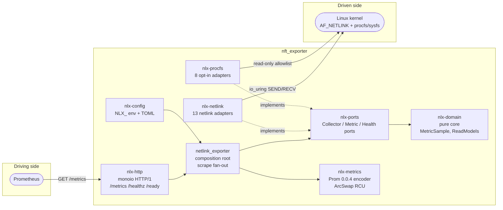

<div align="center">

# 🛰️ nft_exporter

### Full-spectrum Linux network observability for Prometheus — straight from the kernel.

A Prometheus exporter that reads the Linux networking stack **directly over `AF_NETLINK`**,
on an **`io_uring`** runtime, with **zero `/proc` text-scraping** by default.

[](rust-toolchain.toml)
[](Cargo.toml)
[](docs/arch/adr/0023-io-uring-runtime.md)
[](LICENSE)
[](#-collectors)
[](https://github.com/farchanjo/netlink_exporter/releases/tag/v0.1.0)

</div>

---

## ✨ Why this exporter?

Most network exporters shell out, parse `/proc/net/*` text, or wrap `iproute2`. `nft_exporter`
talks to the kernel the way the kernel wants to be talked to — **binary netlink messages** — and
only falls back to `procfs`/`sysfs` for the handful of signals that have **no netlink API at all**
(and even then, only when you opt in).

| 🎯 | Principle | How |
|----|-----------|-----|
| 🧬 | **Native-first** | Direct `AF_NETLINK` / generic-netlink wire protocol — no `iproute2`, no `rustables`, no text scraping ([ADR-0025](docs/arch/adr/0025-native-api-no-procfs-sysfs.md)) |
| ⚡ | **`io_uring` runtime** | `monoio` thread-per-core, `FusionDriver` (io_uring with epoll fallback) ([ADR-0023](docs/arch/adr/0023-io-uring-runtime.md)) |
| 🔒 | **Least privilege** | Opens sockets, then drops to **`CAP_NET_ADMIN`** only ([ADR-0009](docs/arch/adr/0009-privilege-and-security-model.md)) |
| 🧊 | **Lock-free** | Cross-thread state via `arc-swap` RCU + atomics — zero `Mutex`/`RwLock` |
| 📐 | **Hexagonal** | Pure domain core, ports & adapters, 8 crates ([ADR-0002](docs/arch/adr/0002-hexagonal-port-model.md)) |
| 🪶 | **Bounded cardinality** | Aggregation + a duplicate-series guard keep scrapes lean ([ADR-0005](docs/arch/adr/0005-metric-cardinality-strategy.md)) |

---

## 📚 Table of contents

- [🚀 Quick start](#-quick-start)
- [📊 Collectors](#-collectors)
- [🏗️ Architecture](#️-architecture)
- [⚙️ Configuration](#️-configuration)
- [🚢 Deployment guide](#-deployment-guide)
- [📈 Prometheus & alerting](#-prometheus--alerting)
- [🔭 Self-observability](#-self-observability)
- [🛠️ Building from source](#️-building-from-source)
- [🔐 Security](#-security)
- [🤝 Contributing & license](#-contributing--license)

---

## 🚀 Quick start

```bash
# 1. Grab the release binary (Linux x86_64, glibc)
curl -sSL -o nft.tgz \
  https://github.com/farchanjo/netlink_exporter/releases/download/v0.1.0/netlink_exporter-v0.1.0-x86_64-unknown-linux-gnu.tar.gz
tar xzf nft.tgz

# 2. Run it (needs CAP_NET_ADMIN — root is simplest for a quick look)
sudo ./netlink_exporter            # serves on 0.0.0.0:33400

# 3. Scrape
curl -s localhost:33400/metrics | head

# 4. Health & readiness
curl -s localhost:33400/healthz     # liveness  → 200 when up
curl -s localhost:33400/ready       # readiness → 200 after startup probes
```

> 💡 The 13 netlink collectors are **on by default**. The 8 `procfs`/`sysfs` collectors are
> **opt-in** — flip them on with `NLX_COLLECTORS__<NAME>=true` (see [Configuration](#️-configuration)).

---

## 📊 Collectors

**21 collectors** total. Each one is a hexagonal adapter behind the `Collector` port; availability is
probed at startup, and a disabled or unavailable subsystem simply emits no series
([ADR-0015](docs/arch/adr/0015-collector-runtime-gating.md)).

### 🌐 Netlink collectors — on by default (native API)

| Collector | Kernel source | What it reports |
|-----------|---------------|-----------------|
| `rtnetlink` | `RTM_GETLINK/ADDR/ROUTE/NEIGH` | Link up/down, byte/packet/error/drop counters, address/route/neighbor counts |
| `rtnetlink_extended` | rtnetlink xstats | Bridge FDB entries, FIB rules, nexthop objects, offload/bridge xstats |
| `traffic_control` | `RTM_GETQDISC/TCLASS/TFILTER` | qdisc / class / filter stats (aggregated per `device,kind`) |
| `conntrack` | ctnetlink `CTA_STATS_*` | Global conntrack entries, inserts, drops, early-drops, clashes, invalids |
| `conntrack_expect` | ctnetlink expectations | Expectation-table size |
| `nftables` | nftables subsystem | Tables, chains, sets/maps, named counters, rule counters |
| `sock_diag` | `sock_diag` | Socket counts and drops by family/state |
| `ethtool` | genl `ethtool` `STATS_GET` | Per-NIC hardware/driver statistics |
| `ipvs` | genl `IPVS` | L4 load-balancer services, destinations, conn/byte/packet rates |
| `wireguard` | genl `wireguard` | Device + per-peer state (bounded by `wireguard_max_peers`) |
| `devlink` | genl `devlink` | Devices, ports, health-reporter state/errors/recoveries |
| `drop_monitor` | genl `NET_DM` multicast | Dropped-packet counters (hybrid multicast accumulator, [ADR-0026](docs/arch/adr/0026-drop-monitor-hybrid-multicast-accumulator.md)) |
| `xfrm` | `NETLINK_XFRM` | IPsec SAs, policies, SAD/SPD watermarks |

### 🧩 procfs / sysfs collectors — opt-in, off by default ([ADR-0027](docs/arch/adr/0027-procfs-sysfs-relax-for-stack-metrics.md))

These cover signals the kernel exposes **only** through `procfs`/`sysfs`. They live in the isolated
`nlx-procfs` crate behind a read-only path allowlist, and ship **disabled** so the exporter stays
native-only unless you relax it.

| Collector | Source | What it reports |
|-----------|--------|-----------------|
| `softnet` | `/proc/net/softnet_stat` | Per-CPU backlog drops, `time_squeeze`, RPS, flow-limit |
| `netstat` | `/proc/net/snmp` + `/proc/net/netstat` | IP / TCP / UDP / ICMP MIB counters |
| `softirq` | `/proc/softirqs` | Per-CPU `NET_RX` / `NET_TX` softirq counts |
| `irq` | `/proc/interrupts` | Per-IRQ counts (summed across CPUs) |
| `sockstat` | `/proc/net/sockstat` | Socket memory / orphan / TW counts |
| `nic_bql` | sysfs byte-queue-limits | BQL limit + in-flight bytes per device |
| `nic_pcie` | sysfs PCIe link + AER | Link speed/width + aggregated AER error totals ([ADR-0028](docs/arch/adr/0028-nic-pcie-aer-aggregation.md)) |
| `nic_temp` | sysfs hwmon | NIC temperature per sensor (°C) |

---

## 🏗️ Architecture

`nft_exporter` is a **hexagonal (ports & adapters)** application split across 8 crates. The domain core
knows nothing about netlink, io_uring, or HTTP — those live in adapters wired by the composition root.



**Data path.** Netlink dumps run on a blocking pool thread and send/receive over `io_uring`
(`IORING_OP_SEND`/`RECV`, [ADR-0024](docs/arch/adr/0024-netlink-io-uring-data-path.md)). Each scrape
fans out across enabled collectors with a per-collector timeout; results are encoded to Prometheus
text and published into an `ArcSwap` snapshot the HTTP handler reads lock-free.

```mermaid
sequenceDiagram
    participant P as Prometheus
    participant H as nlx-http
    participant S as ScrapeService
    participant C as Collectors (×N)
    participant K as Kernel
    P->>H: GET /metrics
    H->>S: scrape()
    par per collector (timeout-bounded)
        S->>C: collect()
        C->>K: netlink dump / sysfs read
        K-->>C: wire response
        C-->>S: Vec<MetricSample>
    end
    S->>S: encode 0.0.4 + dedup guard
    S-->>H: text body
    H-->>P: 200 text/plain; version=0.0.4
```

> 📎 The full C4 model lives in [`docs/arch/architecture/workspace.dsl`](docs/arch/architecture/workspace.dsl)
> (Structurizr), and every decision is recorded as an ADR under [`docs/arch/adr/`](docs/arch/adr/).

---

## ⚙️ Configuration

Precedence (highest wins): **CLI flags → `NLX_*` env vars → TOML file → built-in defaults.**

### CLI flags

| Flag | Env | Default | Meaning |
|------|-----|---------|---------|
| `--config <path>` | `NLX_CONFIG_PATH` | `nft_exporter.toml` | TOML config file (optional) |
| `--listen-addr <addr>` | `NLX_LISTEN_ADDR` | `0.0.0.0:33400` | HTTP listen address |
| `--log-level <level>` | `NLX_LOG_LEVEL` | `info` | `trace`/`debug`/`info`/`warn`/`error` |

### Settings

| Key (TOML) | Env | Default | Meaning |
|------------|-----|---------|---------|
| `listen_addr` | `NLX_LISTEN_ADDR` | `0.0.0.0:33400` | Metrics/health bind address |
| `scrape_timeout_ms` | `NLX_SCRAPE_TIMEOUT_MS` | `30000` | Per-collector scrape timeout |
| `netlink_dump_max_restarts` | `NLX_NETLINK_DUMP_MAX_RESTARTS` | `8` | `NLM_F_DUMP_INTR` restarts before stale-snapshot fallback |
| `log_level` | `NLX_LOG_LEVEL` | `info` | Log verbosity |
| `interface_include_regex` | `NLX_INTERFACE_INCLUDE_REGEX` | _(all)_ | Only export matching interfaces |
| `interface_exclude_regex` | `NLX_INTERFACE_EXCLUDE_REGEX` | _(none)_ | Drop matching interfaces |
| `wireguard_max_peers` | `NLX_WIREGUARD_MAX_PEERS` | `1000` | Cap WireGuard peer series per device |
| `collectors.<name>` | `NLX_COLLECTORS__<NAME>` | 13 on / 8 off | Enable/disable a collector |

### Enabling the opt-in collectors

```bash
# Env: double underscore nests into the collector flags
NLX_COLLECTORS__SOFTNET=true \
NLX_COLLECTORS__NETSTAT=true \
NLX_COLLECTORS__SOFTIRQ=true \
NLX_COLLECTORS__IRQ=true \
NLX_COLLECTORS__SOCKSTAT=true \
NLX_COLLECTORS__NIC_BQL=true \
NLX_COLLECTORS__NIC_PCIE=true \
NLX_COLLECTORS__NIC_TEMP=true \
  ./netlink_exporter
```

```toml
# nft_exporter.toml — equivalent TOML
listen_addr = "0.0.0.0:33400"
scrape_timeout_ms = 30000
log_level = "info"

[collectors]
# turn the procfs/sysfs collectors on
softnet  = true
netstat  = true
nic_pcie = true
# ... (defaults: 13 netlink = true, 8 procfs = false)
```

---

## 🚢 Deployment guide

The exporter is a single binary (dynamic glibc) plus an optional TOML file. It needs the
**`CAP_NET_ADMIN`** capability; the `drop_monitor` collector additionally needs **`CAP_SYS_ADMIN`** at
startup (to join the `NET_DM` multicast group — it is dropped immediately after). On the kernel side:
**Linux ≥ 5.15 recommended** (io_uring ≥ 5.1; the runtime falls back to epoll where io_uring is
unavailable).

### 1️⃣ Bare metal / VM — systemd

```bash
# Install the binary
sudo install -m 0755 netlink_exporter /usr/local/bin/netlink_exporter

# Optional config
sudo install -m 0644 nft_exporter.toml /etc/nft_exporter.toml
```

```ini
# /etc/systemd/system/nft_exporter.service
[Unit]
Description=nft_exporter — Linux netlink Prometheus exporter
After=network-online.target
Wants=network-online.target

[Service]
ExecStart=/usr/local/bin/netlink_exporter --config /etc/nft_exporter.toml
Environment=NLX_LISTEN_ADDR=0.0.0.0:33400
Environment=NLX_LOG_LEVEL=info

# Least privilege: run unprivileged, grant only the caps the exporter needs.
# Add CAP_SYS_ADMIN only if you enable the drop_monitor collector.
User=nft-exporter
Group=nft-exporter
AmbientCapabilities=CAP_NET_ADMIN
CapabilityBoundingSet=CAP_NET_ADMIN
NoNewPrivileges=true
ProtectSystem=strict
ProtectHome=true
PrivateTmp=true
Restart=on-failure

[Install]
WantedBy=multi-user.target
```

```bash
sudo useradd --system --no-create-home --shell /usr/sbin/nologin nft-exporter
sudo systemctl daemon-reload
sudo systemctl enable --now nft_exporter
systemctl status nft_exporter
```

### 2️⃣ Container — Docker / Podman

```bash
# Build the image (glibc, distroless runtime — see Dockerfile)
docker build -t nft_exporter:0.1.0 .

# Run with the required capability
docker run -d --name nft_exporter \
  --network host \
  --cap-drop ALL --cap-add NET_ADMIN \
  -e NLX_LOG_LEVEL=info \
  nft_exporter:0.1.0
```

> 🌐 `--network host` is recommended: the exporter reports the **host's** network stack, so it should
> live in the host netns. Add `--cap-add SYS_ADMIN` only if `drop_monitor` is enabled.

### 3️⃣ Kubernetes — DaemonSet

Run one pod per node, in the host network namespace, to observe each node's stack.

```yaml
apiVersion: apps/v1
kind: DaemonSet
metadata:
  name: nft-exporter
  labels: { app: nft-exporter }
spec:
  selector:
    matchLabels: { app: nft-exporter }
  template:
    metadata:
      labels: { app: nft-exporter }
      annotations:
        prometheus.io/scrape: "true"
        prometheus.io/port: "33400"
    spec:
      hostNetwork: true            # observe the node's netns
      hostPID: false
      containers:
        - name: nft-exporter
          image: ghcr.io/farchanjo/nft_exporter:0.1.0   # or your registry
          ports:
            - { name: metrics, containerPort: 33400, hostPort: 33400 }
          env:
            - { name: NLX_LISTEN_ADDR, value: "0.0.0.0:33400" }
            - { name: NLX_LOG_LEVEL,   value: "info" }
          securityContext:
            runAsNonRoot: true
            allowPrivilegeEscalation: false
            readOnlyRootFilesystem: true
            capabilities:
              drop: ["ALL"]
              add: ["NET_ADMIN"]    # + ["SYS_ADMIN"] if drop_monitor enabled
          livenessProbe:
            httpGet: { path: /healthz, port: 33400 }
          readinessProbe:
            httpGet: { path: /ready, port: 33400 }
          resources:
            requests: { cpu: 25m, memory: 32Mi }
            limits:   { cpu: 200m, memory: 128Mi }
      tolerations:
        - { operator: Exists }     # run on every node, incl. control-plane
```

---

## 📈 Prometheus & alerting

```yaml
# prometheus.yml — scrape every node's exporter
scrape_configs:
  - job_name: nft_exporter
    kubernetes_sd_configs: [{ role: pod }]
    relabel_configs:
      - source_labels: [__meta_kubernetes_pod_label_app]
        action: keep
        regex: nft-exporter
  # or static:
  # - job_name: nft_exporter
  #   static_configs: [{ targets: ['node1:33400', 'node2:33400'] }]
```

```promql
# Interface drops/sec
rate(nft_link_receive_drops_total[5m])

# Conntrack table fill (alert before insert failures)
nft_conntrack_entries

# A PCIe link that down-trained from its expected width
nft_nic_pcie_link_width < 16

# Per-collector scrape failures (self-telemetry)
increase(nft_scrape_collector_error_total[10m]) > 0
```

---

## 🔭 Self-observability

Every scrape emits its own health, so you always know whether a collector is working:

| Metric | Type | Meaning |
|--------|------|---------|
| `nft_build_info` | gauge | Build/version info (always `1`) |
| `nft_scrape_collector_available` | gauge | `1` if the collector's subsystem was available at probe time |
| `nft_scrape_collector_success` | gauge | `1` if the last scrape of this collector succeeded |
| `nft_scrape_collector_duration_seconds` | gauge | Per-collector scrape duration |
| `nft_scrape_collector_error_total` | counter | Per-collector cumulative scrape errors |
| `nft_scrape_errors_total` | counter | Total scrape errors across all collectors |

> 🧪 Exposition is classic **Prometheus text `0.0.4`** with a serializer-level duplicate-series guard,
> so a regressing collector can never take down the whole scrape
> ([details](docs/arch/adr/0006-prometheus-client-crate.md)).

---

## 🛠️ Building from source

**Toolchain:** Rust **1.96** (pinned in [`rust-toolchain.toml`](rust-toolchain.toml)), edition 2024.
The full workspace builds on **Linux** (the `monoio`/`io_uring` runtime is Linux-only); pure crates
such as `nlx-procfs` build and test on any platform.

```bash
# With rustup, the toolchain auto-installs from rust-toolchain.toml
git clone https://github.com/farchanjo/netlink_exporter.git
cd netlink_exporter

cargo build --release --bin netlink_exporter   # → target/release/netlink_exporter
cargo test  --workspace                         # 318 tests
cargo clippy --workspace --all-targets
cargo fmt --all -- --check
```

### Project layout

```
crates/
├── nlx-domain       # pure domain core — MetricSample, ReadModels, no I/O
├── nlx-ports        # hexagonal ports — Collector / Metric / Health / Config traits
├── nlx-netlink      # driven adapters — 13 netlink/genetlink collectors
├── nlx-procfs       # driven adapters — 8 opt-in procfs/sysfs collectors (ADR-0027)
├── nlx-metrics      # Prometheus 0.0.4 encoder + ArcSwap snapshot store
├── nlx-http         # driving adapter — hand-rolled monoio HTTP/1
├── nlx-config       # NLX_ env + TOML config loader (figment)
└── netlink_exporter # composition root / binary entry point
docs/arch/           # ADRs (MADR), C4 (Structurizr), CUE metric contract
```

---

## 🔐 Security

- **Least privilege:** opens netlink sockets, then drops to `CAP_NET_ADMIN` only; an unrecoverable
  capability-drop failure aborts the process (`panic = "abort"`, [ADR-0009](docs/arch/adr/0009-privilege-and-security-model.md)).
- **No shell-out, no parsing of untrusted text from the network** — input is kernel wire data.
- **`procfs`/`sysfs` reads** are confined to the `nlx-procfs` crate behind a fixed read-only path
  allowlist, and are off by default ([ADR-0027](docs/arch/adr/0027-procfs-sysfs-relax-for-stack-metrics.md)).
- See [`SECURITY.md`](SECURITY.md) for the threat model and disclosure policy.

---

## 🤝 Contributing & license

Contributions welcome — see [`CONTRIBUTING.md`](CONTRIBUTING.md) and the
[`CHANGELOG.md`](CHANGELOG.md). Architecture changes start with an ADR under
[`docs/arch/adr/`](docs/arch/adr/).

Dual-licensed under **MIT OR Apache-2.0** — see [`LICENSE`](LICENSE). Use whichever fits your project.

<div align="center">
<sub>Built with 🦀 Rust, io_uring, and a healthy distrust of <code>/proc</code>.</sub>
</div>
