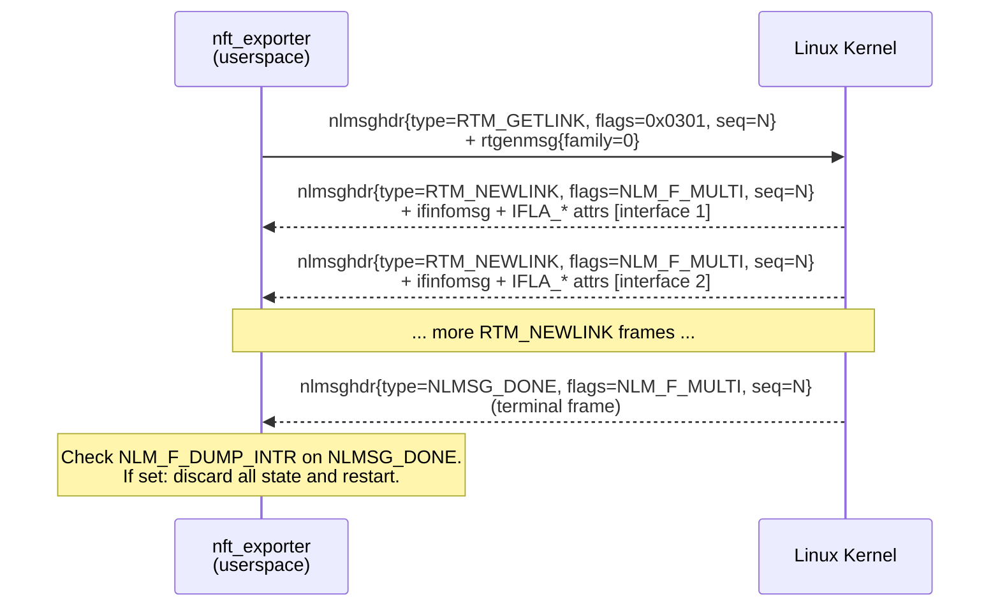
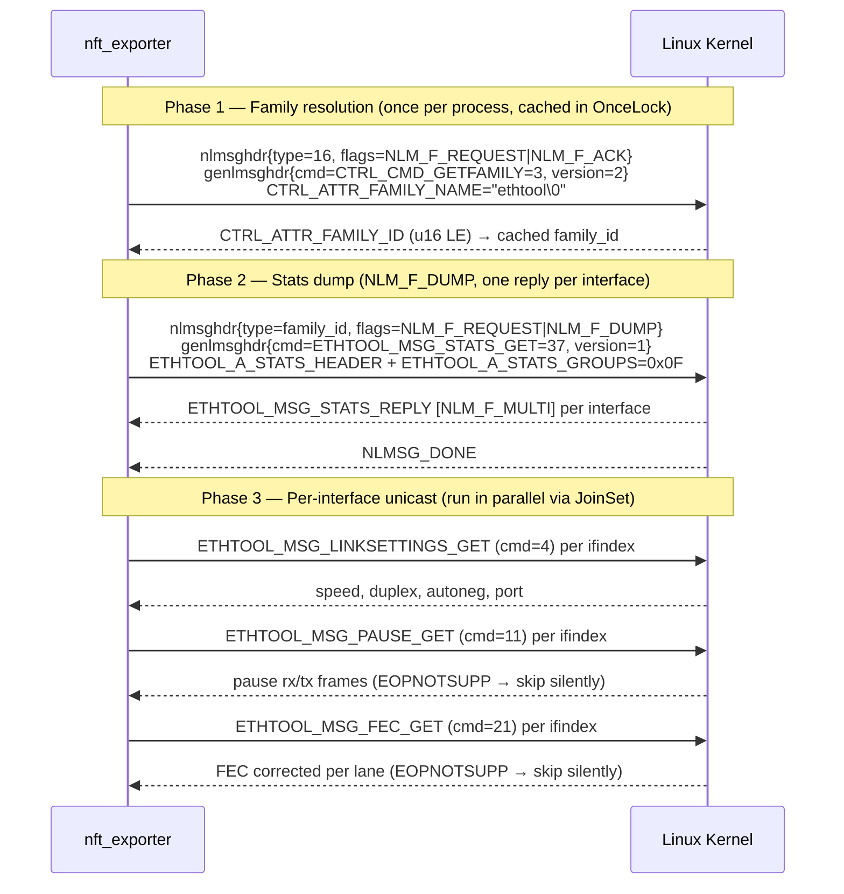

# Netlink Wire Protocol Reference

**Document scope:** canonical wire-level implementation reference for all six
netlink subsystems used by nft_exporter. This document supplements the ADR
chain (ADR-0002, ADR-0004 superseded by ADR-0011) by providing byte-exact
field layouts, attribute catalogues, endianness rules, and parsing gotchas
required to implement each adapter crate against raw AF_NETLINK sockets.

> **Grounding note — conntrack procfs:** On the test host, the conntrack procfs
> path (`/proc/net/nf_conntrack`) is empty during test execution. All conntrack
> metric data must therefore be collected via ctnetlink (NETLINK_NETFILTER,
> NFNL_SUBSYS_CTNETLINK). The IPCTNL_MSG_CT_GET_STATS_CPU path (section 5.3)
> is mandatory; procfs-based counting is explicitly forbidden.

---

## 1  Scope and Purpose

This document exists because the five wire-research probes confirm that the
rust-netlink org abstraction stack (rtnetlink, netlink-packet-\*, netlink-proto)
actively prevents access to the raw byte framing required for:

- IPCTNL_MSG_CT_GET_STATS_CPU raw nf_conntrack_stat body (no nlattr wrapping)
- genetlink family resolution with OnceLock caching
- TCA_STATS2 nested nlattr parsing
- NLM_F_DUMP_INTR restart semantics checked on every frame

ADR-0011 replaces ADR-0004 and mandates direct wire implementation via
`rustix 1.1.4` + `linux-raw-sys 0.12.1` + `zerocopy 0.8` + `bytemuck 1.25`.
This document is the single authoritative source for every byte offset, field
type, attribute constant, and endianness decision in that implementation.

All adapter crates read this document:

| Adapter crate | Netlink family | Sections |
|---|---|---|
| `nft_exporter_adapter_rt` | NETLINK_ROUTE (0) | 4, 9, 10, 11 |
| `nft_exporter_adapter_tc` | NETLINK_ROUTE (0) | 7, 9, 10, 11 |
| `nft_exporter_adapter_ct` | NETLINK_NETFILTER (12) | 5, 10, 11 |
| `nft_exporter_adapter_nft` | NETLINK_NETFILTER (12) | 3, 10, 11 |
| `nft_exporter_adapter_sockdiag` | NETLINK_SOCK_DIAG (4) | 6, 10, 11 |
| `nft_exporter_adapter_ethtool` | NETLINK_GENERIC (16) | 8, 10, 11 |
| `nft_exporter_adapter_xfrm` | NETLINK_XFRM (6) | 12 |
| `nft_exporter_adapter_ipvs` | NETLINK_GENERIC (16) | 13 |
| `nft_exporter_adapter_wg` | NETLINK_GENERIC (16) | 14 |
| `nft_exporter_adapter_devlink` | NETLINK_GENERIC (16) | 15 |
| `nft_exporter_adapter_dm` | NETLINK_GENERIC (16) | 16 |
| `nft_exporter_adapter_rt_extended` | NETLINK_ROUTE (0) | 17 |
| `nft_exporter_adapter_ct_exp` | NETLINK_NETFILTER (12) | 18 |

---

## 2  Socket Model

### One file descriptor per netlink family

The shared `nft_exporter_netlink_socket` crate owns one `AsyncFd<OwnedFd>` per
protocol constant. Sockets are never shared across concurrent scrapes and are
never reused across distinct netlink families.

| Collector | `protocol` constant | Value |
|---|---|---|
| RtnetlinkAdapter, TcNetlinkAdapter | `NETLINK_ROUTE` | 0 |
| ConntrackAdapter, NftablesAdapter | `NETLINK_NETFILTER` | 12 |
| SockDiagAdapter | `NETLINK_SOCK_DIAG` | 4 |
| EthtoolAdapter | `NETLINK_GENERIC` | 16 |

### Socket lifecycle

```
open --> bind --> setsockopt* --> [dump loop]* --> close
         |             |
         nl_pid=0   SO_RCVBUF=4MiB
                    NETLINK_GET_STRICT_CHK=1 (NETLINK_ROUTE only)
```

1. **open** — `socket(AF_NETLINK, SOCK_RAW | SOCK_CLOEXEC | SOCK_NONBLOCK, protocol)`
   via `rustix::net::socket_with`.
2. **bind** — `sockaddr_nl { nl_family: AF_NETLINK, nl_pid: 0, nl_groups: 0 }`.
   Setting `nl_pid=0` causes the kernel to assign the port number; the exporter
   never hard-codes a pid.
3. **setsockopt**:
   - `SO_RCVBUF` to 4 194 304 bytes (4 MiB minimum). The shared socket module
     doubles this on the first ENOBUFS occurrence.
   - `NETLINK_GET_STRICT_CHK` (value 11) to `1u32` on NETLINK_ROUTE sockets.
     Silently ignore `ENOPROTOOPT` on kernel < 4.20.
4. **dump loop** — repeated for each subsystem dump; see section 3.3.
5. **close** — `rustix::io::close` after all collectors finish. Capabilities
   are dropped before the first dump (ADR-0009).

### AsyncFd wrapper pattern

```rust
// Pseudocode — actual impl in nft_exporter_netlink_socket
let fd = socket_with(AF_NETLINK, SOCK_RAW | SOCK_CLOEXEC | SOCK_NONBLOCK, protocol)?;
bind(&fd, &sockaddr_nl { nl_family: AF_NETLINK, nl_pid: 0, nl_groups: 0 })?;
set_socket_recv_buffer_size(&fd, 4_194_304)?;
let async_fd = AsyncFd::new(fd)?;

// Non-blocking send:
loop {
    let mut guard = async_fd.writable().await?;
    match guard.try_io(|fd| sendmsg(fd, &request_bytes)) {
        Ok(Ok(_)) => break,
        Ok(Err(e)) if e == Errno::AGAIN => continue,
        Ok(Err(e)) => return Err(e.into()),
        Err(_) => continue,   // WouldBlock from AsyncFd
    }
}

// Non-blocking recv:
let mut buf = vec![0u8; recv_buf_size];
loop {
    let mut guard = async_fd.readable().await?;
    match guard.try_io(|fd| recvmsg(fd, &mut buf, RecvFlags::TRUNC)) {
        Ok(Ok(n)) => { process(&buf[..n]); break; }
        Ok(Err(e)) if e == Errno::AGAIN => continue,
        Ok(Err(e)) if e == Errno::NOBUFS => { handle_enobufs(); break; }
        Ok(Err(e)) => return Err(e.into()),
        Err(_) => continue,
    }
}
```

---

## 3  Common Wire Primitives

### 3.1  nlmsghdr Layout

Every netlink datagram begins with a 16-byte header. All fields are
**native-endian** (little-endian on x86-64 and aarch64 — all supported targets).

```
 0               1               2               3
 0 1 2 3 4 5 6 7 0 1 2 3 4 5 6 7 0 1 2 3 4 5 6 7 0 1 2 3 4 5 6 7
+-+-+-+-+-+-+-+-+-+-+-+-+-+-+-+-+-+-+-+-+-+-+-+-+-+-+-+-+-+-+-+-+
|                         nlmsg_len (u32)                       |  bytes 0-3
+-+-+-+-+-+-+-+-+-+-+-+-+-+-+-+-+-+-+-+-+-+-+-+-+-+-+-+-+-+-+-+-+
|       nlmsg_type (u16)        |       nlmsg_flags (u16)       |  bytes 4-7
+-+-+-+-+-+-+-+-+-+-+-+-+-+-+-+-+-+-+-+-+-+-+-+-+-+-+-+-+-+-+-+-+
|                         nlmsg_seq (u32)                       |  bytes 8-11
+-+-+-+-+-+-+-+-+-+-+-+-+-+-+-+-+-+-+-+-+-+-+-+-+-+-+-+-+-+-+-+-+
|                         nlmsg_pid (u32)                       |  bytes 12-15
+-+-+-+-+-+-+-+-+-+-+-+-+-+-+-+-+-+-+-+-+-+-+-+-+-+-+-+-+-+-+-+-+
```

| Field | Type | Notes |
|---|---|---|
| `nlmsg_len` | `u32` LE | Total datagram length in bytes, including this 16-byte header |
| `nlmsg_type` | `u16` LE | Message type constant (e.g. `RTM_NEWLINK=16`, `NLMSG_DONE=3`) |
| `nlmsg_flags` | `u16` LE | See flag table below |
| `nlmsg_seq` | `u32` LE | Sequence number; match in reply to detect stale messages |
| `nlmsg_pid` | `u32` LE | Sender port; **always 0 in requests** sent by userspace |

**nlmsg_flags bit definitions:**

| Constant | Value | Meaning |
|---|---|---|
| `NLM_F_REQUEST` | `0x0001` | This is a request message |
| `NLM_F_MULTI` | `0x0002` | Message is part of a multi-part dump sequence |
| `NLM_F_ACK` | `0x0004` | Request an ACK reply |
| `NLM_F_DUMP_INTR` | `0x0010` | **Kernel data was modified during this dump — restart required** |
| `NLM_F_DUMP` | `0x0300` | `NLM_F_ROOT (0x0100) | NLM_F_MATCH (0x0200)` — request full dump |

**Control message types (`nlmsg_type`):**

| Constant | Value | Meaning |
|---|---|---|
| `NLMSG_NOOP` | `1` | No-op; ignore |
| `NLMSG_ERROR` | `2` | Error reply; body is `struct nlmsgerr` |
| `NLMSG_DONE` | `3` | Terminal frame of a multi-part dump |
| `NLMSG_OVERRUN` | `4` | Data lost; treat as ENOBUFS |

**NLMSG_ALIGN macro:** `(len + 3) & !3` — rounds up to the next 4-byte boundary.
`NLMSG_HDRLEN = 16` (already 4-byte aligned).

**nlmsgerr and extended ACK:**

```
struct nlmsgerr {
    i32 error;           // negated errno; 0 = success ACK
    struct nlmsghdr msg; // original request header echoed back
    // optional: nlattr chain for NETLINK_EXT_ACK (kernel >= 4.12)
    //   NLMSGERR_ATTR_MSG (1): NUL-terminated error string
    //   NLMSGERR_ATTR_OFFS (2): u32 byte offset of bad attribute
}
```

The exporter reads `nlmsgerr.error`, negates it to get the `errno`, and maps it
to `NetlinkError::KernelError(errno)`. Extended ACK attributes are parsed only
when `error != 0` to provide diagnostic context in tracing spans.

### 3.2  nlattr Layout

Every netlink attribute (TLV) uses a 4-byte header:

```
 0               1               2               3
 0 1 2 3 4 5 6 7 0 1 2 3 4 5 6 7 0 1 2 3 4 5 6 7 0 1 2 3 4 5 6 7
+-+-+-+-+-+-+-+-+-+-+-+-+-+-+-+-+-+-+-+-+-+-+-+-+-+-+-+-+-+-+-+-+
|         nla_len (u16)         |   N |F|     nla_type (14 bits)|  bytes 0-3
+-+-+-+-+-+-+-+-+-+-+-+-+-+-+-+-+-+-+-+-+-+-+-+-+-+-+-+-+-+-+-+-+
|                     payload (nla_len - 4 bytes)               |
|                   ... padded to NLA_ALIGN ...                 |
+-+-+-+-+-+-+-+-+-+-+-+-+-+-+-+-+-+-+-+-+-+-+-+-+-+-+-+-+-+-+-+-+
```

| Field | Bits | Notes |
|---|---|---|
| `nla_len` | `u16` LE | **Unpadded** total size: 4-byte header + payload (not including pad bytes) |
| `NLA_F_NESTED` | bit 15 of `nla_type` | Set when payload is another nlattr chain |
| `NLA_F_NET_BYTEORDER` | bit 14 of `nla_type` | Set when scalar payload is network-byte-order (big-endian) |
| `nla_type` | bits 13..0 | Attribute type constant after masking off bits 15-14 |

**Critical rules:**

1. Strip flag bits before matching: `effective_type = nla_type & 0x1FFF`.
   Failing to strip `NLA_F_NESTED` (0x8000) is the most common parse bug.
2. `NLA_ALIGN(nla_len) = (nla_len + 3) & !3`. The **next** attribute starts at
   `current_attr_start + NLA_ALIGN(nla_len)`, not at `current_attr_start + nla_len`.
3. The payload starts at byte offset 4 (immediately after the header).
   `payload = &buf[attr_start + 4 .. attr_start + nla_len]`.
4. `NLA_HDRLEN = 4`.

### 3.3  NLM_F_DUMP Request Sequence

A dump request uses `nlmsg_flags = NLM_F_REQUEST | NLM_F_DUMP = 0x0301`. The
kernel responds with zero or more frames carrying `NLM_F_MULTI`, terminated by
`NLMSG_DONE`.



**NLM_F_DUMP_INTR restart logic:**

- Check `nlmsg_flags & NLM_F_DUMP_INTR (0x0010)` on **every received frame**,
  not only on `NLMSG_DONE`.
- When seen: discard all accumulated ReadModel state, increment restart counter.
- Cap restarts at `ExporterConfig.netlink_dump_max_restarts` (default: 8).
- After the cap: return `CollectorError::DumpIntr` and activate stale-snapshot
  fallback (ADR-0007). Increment
  `nft_scrape_collector_error_total{reason="dump_intr"}`.

### 3.4  ENOBUFS Circuit-Breaker

When `recvmsg` returns `ENOBUFS`, the kernel dropped messages from the socket
receive buffer. The dump is incomplete.

**Procedure:**

1. Increment `nft_netlink_errors_total{errno="ENOBUFS"}`.
2. Double `SO_RCVBUF` via `set_socket_recv_buffer_size` (max 16 MiB).
3. Retry the dump exactly once from the beginning.
4. If ENOBUFS occurs again: return `CollectorError::Enobufs`. Do not retry
   further. Serve stale snapshot.

### 3.5  NETLINK_GET_STRICT_CHK

`setsockopt(SOL_NETLINK=270, NETLINK_GET_STRICT_CHK=11, &1u32, 4)`

Available on kernel >= 4.20. When set, the kernel validates dump requests and
respects filter attributes. Silently ignore `ENOPROTOOPT` on older kernels.

**Warning:** Setting `RTEXT_FILTER_SKIP_STATS` in `IFLA_EXT_MASK` alongside
strict checking suppresses `IFLA_STATS64` from `RTM_NEWLINK` responses. Never
set this filter when collecting link counters.

---

## 4  NETLINK_ROUTE (family=0) — RTM_GETLINK / RTM_GETADDR / RTM_GETROUTE / RTM_GETNEIGH

### 4.1  Fixed Structs

All NETLINK_ROUTE structs are **native-endian** (little-endian on x86-64/aarch64).

**rtgenmsg (1 byte):**

```
u8 rtgen_family @ 0   (AF_UNSPEC=0, AF_INET=2, AF_INET6=10)
```

Request total for RTM_GETLINK/GETADDR/GETNEIGH:
`NLMSG_ALIGN(16 + 1) = 20 bytes`.

**rtmsg (12 bytes) — used in RTM_GETROUTE:**

```
u8  rtm_family   @ 0  (AF_INET=2, AF_INET6=10)
u8  rtm_dst_len  @ 1
u8  rtm_src_len  @ 2
u8  rtm_tos      @ 3
u8  rtm_table    @ 4  (RT_TABLE_MAIN=254, RT_TABLE_LOCAL=255, RT_TABLE_UNSPEC=0)
u8  rtm_protocol @ 5  (RTPROT_KERNEL=2, RTPROT_STATIC=4, RTPROT_BGP=186)
u8  rtm_scope    @ 6  (RT_SCOPE_UNIVERSE=0, RT_SCOPE_LINK=253, RT_SCOPE_HOST=254)
u8  rtm_type     @ 7  (RTN_UNICAST=1, RTN_LOCAL=2, RTN_BLACKHOLE=6)
u32 rtm_flags    @ 8
```

Request total for RTM_GETROUTE: `NLMSG_ALIGN(16 + 12) = 28 bytes` (all fields zero).

**ifinfomsg (16 bytes) — body of RTM_NEWLINK:**

```
u8  ifi_family  @ 0   (ignore)
u8  __ifi_pad   @ 1   (ignore)
u16 ifi_type    @ 2   (ARPHRD_ETHER=1, ARPHRD_LOOPBACK=772)
s32 ifi_index   @ 4   (interface index; always positive; cast to u32)
u32 ifi_flags   @ 8   (IFF_UP=0x1, IFF_RUNNING=0x40, IFF_LOOPBACK=0x8, IFF_MULTICAST=0x1000)
u32 ifi_change  @ 12  (0xFFFFFFFF in responses)
```

RTattrs start at byte offset 32 (`NLMSG_HDRLEN + NLMSG_ALIGN(16) = 16 + 16 = 32`).

**ifaddrmsg (8 bytes) — body of RTM_NEWADDR:**

```
u8  ifa_family    @ 0  (AF_INET=2, AF_INET6=10)
u8  ifa_prefixlen @ 1  (0-32 for v4; 0-128 for v6)
u8  ifa_flags     @ 2  (IFA_F_PERMANENT=0x80, IFA_F_SECONDARY=0x01,
                        IFA_F_TENTATIVE=0x40, IFA_F_DEPRECATED=0x20)
u8  ifa_scope     @ 3  (RT_SCOPE_UNIVERSE=0, RT_SCOPE_LINK=253,
                        RT_SCOPE_HOST=254, RT_SCOPE_SITE=200)
u32 ifa_index     @ 4  (parent ifindex)
```

RTattrs start at byte offset 24.

Note: `ifa_flags u8` is superseded when `IFA_FLAGS (type=8) u32` is present in
the RTattr chain; always prefer the u32 form.

**ndmsg (12 bytes) — body of RTM_NEWNEIGH:**

```
u8  ndm_family   @ 0  (AF_INET=2, AF_INET6=10; AF_BRIDGE=7 → skip)
u8  ndm_pad1     @ 1  (ignore)
u16 ndm_pad2     @ 2  (ignore)
s32 ndm_ifindex  @ 4  (interface index)
u16 ndm_state    @ 8  (NUD_REACHABLE=0x02, NUD_STALE=0x04, NUD_FAILED=0x20,
                       NUD_PERMANENT=0x80 — one bit set at a time)
u8  ndm_flags    @ 10 (NTF_PROXY=0x08, NTF_ROUTER=0x80)
u8  ndm_type     @ 11 (RTN_UNICAST=1)
```

RTattrs start at byte offset 28.

**rtnl_link_stats64 (192 or 200 bytes) — payload of IFLA_STATS64 (type=23):**

| Offset | Field | Metric |
|---|---|---|
| 0 | `rx_packets` u64 | `nft_link_receive_packets_total` |
| 8 | `tx_packets` u64 | `nft_link_transmit_packets_total` |
| 16 | `rx_bytes` u64 | `nft_link_receive_bytes_total` |
| 24 | `tx_bytes` u64 | `nft_link_transmit_bytes_total` |
| 32 | `rx_errors` u64 | `nft_link_receive_errors_total` |
| 40 | `tx_errors` u64 | `nft_link_transmit_errors_total` |
| 48 | `rx_dropped` u64 | `nft_link_receive_dropped_total` |
| 56 | `tx_dropped` u64 | `nft_link_transmit_dropped_total` |
| 64 | `multicast` u64 | (not exported) |
| 72 | `collisions` u64 | (not exported) |
| 80-184 | error detail counters u64 | (not exported) |
| 192 | `rx_otherhost_dropped` u64 | (kernel >= 5.18 only; check `payload_len >= 200`) |

**Always use IFLA_STATS64 (type=23).** Never read IFLA_STATS (type=7, u32 fields,
96 bytes) — it overflows on 100 GbE interfaces within hours.

Check payload size before reading `rx_otherhost_dropped`:

```rust
if payload.len() >= 200 {
    let dropped = u64::from_ne_bytes(payload[192..200].try_into()?);
    // emit nft_link_receive_otherhost_dropped_total
}
```

### 4.2  IFLA_* Attribute Catalogue

| Attribute | Type | Value | Payload | Metric |
|---|---|---|---|---|
| `IFLA_IFNAME` | 3 | u16=3 | NUL-terminated UTF-8 name; strip trailing NUL with `&payload[..payload.len()-1]` | `interface` label on all `nft_link_*` |
| `IFLA_MTU` | 4 | u16=4 | `u32` LE MTU bytes | `nft_link_mtu_bytes` gauge |
| `IFLA_OPERSTATE` | 16 | u16=16 | `u8`: 0=unknown, 1=notpresent, 2=down, 3=lowerlayerdown, 4=testing, 5=dormant, 6=up | `operstate` label in `nft_link_info` |
| `IFLA_IFALIAS` | 20 | u16=20 | NUL-terminated alias; absent when not configured | `alias` label in `nft_link_info`; empty string when absent |
| `IFLA_STATS64` | 23 | u16=23 | `rtnl_link_stats64` struct (192 or 200 bytes, LE) | All eight `nft_link_receive/transmit_*` counters |
| `IFLA_CARRIER` | 33 | u16=33 | `u8` (0=no carrier, 1=carrier present) | Not exported; reserved for future `nft_link_carrier` gauge |

### 4.3  rtnl_link_stats64 Field-to-Metric Table

| Field | Offset | Counter metric | Label |
|---|---|---|---|
| `rx_bytes` | 16 | `nft_link_receive_bytes_total` | `interface=<IFLA_IFNAME>` |
| `tx_bytes` | 24 | `nft_link_transmit_bytes_total` | `interface=<IFLA_IFNAME>` |
| `rx_packets` | 0 | `nft_link_receive_packets_total` | `interface=<IFLA_IFNAME>` |
| `tx_packets` | 8 | `nft_link_transmit_packets_total` | `interface=<IFLA_IFNAME>` |
| `rx_errors` | 32 | `nft_link_receive_errors_total` | `interface=<IFLA_IFNAME>` |
| `tx_errors` | 40 | `nft_link_transmit_errors_total` | `interface=<IFLA_IFNAME>` |
| `rx_dropped` | 48 | `nft_link_receive_dropped_total` | `interface=<IFLA_IFNAME>` |
| `tx_dropped` | 56 | `nft_link_transmit_dropped_total` | `interface=<IFLA_IFNAME>` |
| `rx_otherhost_dropped` | 192 | Conditional on `payload_len >= 200` (kernel >= 5.18) | `interface=<IFLA_IFNAME>` |

### 4.4  IFA_* Attribute Catalogue

| Attribute | Type | Payload | Metric use |
|---|---|---|---|
| `IFA_ADDRESS` | 1 | 4 bytes (AF_INET) or 16 bytes (AF_INET6) in network byte order | Fallback address when `IFA_LOCAL` absent (point-to-point remote end) |
| `IFA_LOCAL` | 2 | Same format as `IFA_ADDRESS` | **Preferred** local address; use over `IFA_ADDRESS` for p2p interfaces |
| `IFA_FLAGS` | 8 | `u32` LE extended flags; supersedes `ifa_flags u8` in `ifaddrmsg` | Decode `IFA_F_PERMANENT=0x80`, `IFA_F_TENTATIVE=0x40`, `IFA_F_DEPRECATED=0x20` for `nft_address_flags_info` |

**Disambiguation rule:** For non-point-to-point interfaces `IFA_LOCAL` and
`IFA_ADDRESS` carry the same value. For PPP, GRE, and tunnel interfaces
`IFA_ADDRESS` is the remote peer. Always prefer `IFA_LOCAL (type=2)`.

### 4.5  RTA_* Attributes

| Attribute | Type | Payload | Metric use |
|---|---|---|---|
| `RTA_TABLE` | 15 | `u32` LE routing table ID; **overrides** `rtmsg.rtm_table` for IDs > 255 | `table` label in `nft_route_count` (stringified u32) |
| `RTA_OIF` | 4 | `s32` LE egress interface index | Not a metric label; internal validation only |
| `RTA_DST` | 1 | 4/16 bytes destination prefix | **DISCARDED** — ADR-0005 cardinality enforcement; never stored |
| `RTA_SRC` | 2 | 4/16 bytes source prefix | **DISCARDED** — ADR-0005; never stored |
| `RTA_GATEWAY` | 5 | 4/16 bytes gateway address | **DISCARDED** — ADR-0005; never stored |

For routing tables with ID > 255, `rtmsg.rtm_table` is clamped to 255
(`RT_TABLE_COMPAT`). Always read `RTA_TABLE` when present; fall back to
`rtmsg.rtm_table` only when `RTA_TABLE` is absent.

**nft_route_count label mapping:**

| Label | Source |
|---|---|
| `table` | `RTA_TABLE u32` (fallback: `rtmsg.rtm_table u8`) |
| `family` | `rtmsg.rtm_family`: 2=inet, 10=inet6, 28=mpls |
| `protocol` | `rtmsg.rtm_protocol`: 2=kernel, 3=boot, 4=static, 9=ra, 16=dhcp, 42=babel, 186=bgp, 187=isis, 188=ospf, 189=rip, 192=eigrp |
| `route_type` | `rtmsg.rtm_type`: 0=unspec, 1=unicast, 2=local, 3=broadcast, 4=anycast, 5=multicast, 6=blackhole, 7=unreachable, 8=prohibit |

### 4.6  NDA_* Attributes

| Attribute | Type | Payload | Metric use |
|---|---|---|---|
| `NDA_DST` | 1 | 4/16 bytes neighbor IP | **DISCARDED** at parse time — ADR-0005; never heap-allocated |
| `NDA_LLADDR` | 2 | 6 bytes MAC address | **DISCARDED** at parse time — ADR-0005; never heap-allocated |

Skip `AF_BRIDGE (ndm_family=7)` entries entirely; `NeighborAggregateKey.family`
only accepts inet/inet6.

**nft_neighbor_count label mapping:**

| Label | Source |
|---|---|
| `interface` | `ndmsg.ndm_ifindex` resolved via link map to interface name |
| `family` | `ndmsg.ndm_family`: 2=inet, 10=inet6 |
| `state` | `ndmsg.ndm_state` single bit: 0x02=reachable, 0x04=stale, 0x08=delay, 0x10=probe, 0x20=failed, 0x40=noarp, 0x80=permanent |

### 4.7  Interface Filtering Application Point

The interface filter (ADR-0013) is applied **after IFLA_IFNAME is decoded and
before any series accumulation**:

```rust
let name = decode_ifname(payload)?;  // strip NUL, validate UTF-8
if filter.is_excluded(&name) {
    link_filtered_total.inc(); // nft_link_filtered_total{collector="rtnetlink"}
    continue;                  // skip rest of attribute parse
}
// ... accumulate stats for this interface
```

---

## 5  NETLINK_NETFILTER (family=12) — ctnetlink Subsystem

### 5.1  nfgenmsg Header

Every NETLINK_NETFILTER message follows `nlmsghdr` with a 4-byte `nfgenmsg`:

```
u8   nfgen_family @ 0   (AF_UNSPEC=0, AF_INET=2, AF_INET6=10)
u8   version      @ 1   (always NFNETLINK_V0=0)
__be16 res_id     @ 2-3 (ALWAYS BIG-ENDIAN regardless of host byte order)
```

`res_id` is a kernel UAPI invariant encoded in network byte order on all targets.
On x86-64 (little-endian), bytes 2-3 must be swapped:

```rust
let res_id = u16::from_be_bytes([buf[18], buf[19]]);  // always correct
// u16::from_ne_bytes([buf[18], buf[19]]) is WRONG on little-endian
```

In `CT_GET_STATS_CPU` replies, `res_id` carries the CPU index.
In all requests, `res_id` is `[0x00, 0x00]`.

### 5.2  nlmsg_type Encoding for ctnetlink

`nlmsg_type = (NFNL_SUBSYS_CTNETLINK << 8) | msg_type`

`NFNL_SUBSYS_CTNETLINK = 1`

| Symbolic name | Value | Purpose |
|---|---|---|
| `IPCTNL_MSG_CT_GET` | `0x0101` | Full conntrack table dump |
| `IPCTNL_MSG_CT_GET_STATS_CPU` | `0x0105` | Per-CPU global counters |
| `IPCTNL_MSG_CT_GET_STATS` | `0x0106` | Global entry ceiling |

### 5.3  Path A — CT_GET_STATS_CPU (per-CPU counters)

**Request:** 20 bytes total.

```
nlmsghdr { nlmsg_len=20, nlmsg_type=0x0105, nlmsg_flags=0x0001,
           nlmsg_seq=N, nlmsg_pid=local_pid }
nfgenmsg { nfgen_family=0x00, version=0x00, res_id=[0x00,0x00] }
```

**Reply:** One frame per CPU. Body is a raw `nf_conntrack_stat` struct —
**no nlattr wrapping**. The CPU index comes from `nfgenmsg.res_id` (big-endian).

**nf_conntrack_stat struct — three kernel-version sizes:**

| Offset | Field | Kernel version |
|---|---|---|
| 0 | `searched` u32 (obsolete, ignore) | all |
| 4 | `found` u32 | all |
| 8 | `new` u32 (obsolete) | all |
| 12 | `invalid` u32 | all |
| 16 | `ignore` u32 (obsolete) | all |
| 20 | `delete` u32 (obsolete) | all |
| 24 | `delete_list` u32 (obsolete) | all |
| 28 | `insert` u32 | all |
| 32 | `insert_failed` u32 | all |
| 36 | `drop` u32 | all |
| 40 | `early_drop` u32 | all |
| 44 | `error` u32 | all |
| 48 | `search_restart` u32 | all |
| 52 | `clash_resolve` u32 | **kernel >= 5.10; check payload_len >= 56** |
| 56 | `chaintoolong` u32 | **kernel >= 5.12; check payload_len >= 60** |

All fields are **native-endian u32**. Parse only fields within the actual
payload length; treat absent trailing fields as zero.

**Accumulation across CPUs:**

```rust
let mut sum = ConntrackGlobalStats::default();
// for each CPU reply frame:
let payload = &buf[NLMSG_HDRLEN + 4 .. nlmsg_len];
sum.found        += u32::from_ne_bytes(payload[4..8].try_into()?) as u64;
sum.insert       += u32::from_ne_bytes(payload[28..32].try_into()?) as u64;
sum.drop         += u32::from_ne_bytes(payload[36..40].try_into()?) as u64;
sum.early_drop   += u32::from_ne_bytes(payload[40..44].try_into()?) as u64;
sum.invalid      += u32::from_ne_bytes(payload[12..16].try_into()?) as u64;
if payload.len() >= 56 {
    sum.clash_resolve += u32::from_ne_bytes(payload[52..56].try_into()?) as u64;
}
if payload.len() >= 60 {
    sum.chaintoolong  += u32::from_ne_bytes(payload[56..60].try_into()?) as u64;
}
```

**Metric mapping:**

| Field | Metric | Labels | Type |
|---|---|---|---|
| `sum.found` | `nft_conntrack_found_total` | none | counter |
| `sum.insert` | `nft_conntrack_insert_total` | none | counter |
| `sum.drop` | `nft_conntrack_drop_total` | none | counter |
| `sum.early_drop` | `nft_conntrack_early_drop_total` | none | counter |
| `sum.invalid` | `nft_conntrack_invalid_total` | none | counter |
| `sum.clash_resolve` | `nft_conntrack_clash_resolve_total` | none | counter (kernel >= 5.10) |
| `sum.chaintoolong` | `nft_conntrack_chaintoolong_total` | none | counter (kernel >= 5.12) |

When `payload_len` is insufficient for `clash_resolve` or `chaintoolong`, no
series is emitted for that counter (not zero-value — absent).

### 5.4  Path B — CT_GET Dump

**Request:** 20 bytes. `nlmsg_flags = 0x0301 (NLM_F_REQUEST|NLM_F_DUMP)`.
`nfgen_family = 0x00 (AF_UNSPEC)` — returns both IPv4 and IPv6 entries.

**Reply:** One frame per conntrack flow. nlattr chain starts at offset
`NLMSG_HDRLEN + 4` (after nlmsghdr + nfgenmsg).

**Top-level attribute parsing (strip NLA_F_NESTED before matching):**

| Effective attr type | Content | Metric use |
|---|---|---|
| `CTA_TUPLE_ORIG` (1) | Nested: contains `CTA_TUPLE_IP` and `CTA_TUPLE_PROTO` | Extract `CTA_PROTO_NUM (u8)` → `ConntrackProtocol` |
| `CTA_STATUS` (3) | `u32` **big-endian** | `IPS_ASSURED = bit 2 (0x04)`; set → state=established for non-TCP |
| `CTA_PROTOINFO` (4) | Nested: `CTA_PROTOINFO_TCP` (1) → `CTA_PROTOINFO_TCP_STATE` (1) `u8` | TCP state label value (0-9) |
| `CTA_COUNTERS_ORIG` (9) | Nested: `CTA_COUNTERS_PACKETS` (1) u64 be + `CTA_COUNTERS_BYTES` (2) u64 be | Accumulate into `direction=original` bucket |
| `CTA_COUNTERS_REPLY` (10) | Nested: same structure | Accumulate into `direction=reply` bucket |
| `CTA_ID` (12) | `u32` big-endian | **Completely ignored** — never a label or key |
| `CTA_ZONE` (18) | `u16` big-endian | **Not a label** |
| `CTA_MARK` (8) | `u32` big-endian | **Not a label** |

**TCP state label values (CTA_PROTOINFO_TCP_STATE u8):**

| u8 value | Label string |
|---|---|
| 0 | `none` |
| 1 | `syn_sent` |
| 2 | `syn_recv` |
| 3 | `established` |
| 4 | `fin_wait` |
| 5 | `close_wait` |
| 6 | `last_ack` |
| 7 | `time_wait` |
| 8 | `close` |
| 9 | `listen` |

**Non-TCP state derivation:**

```rust
let status_be = u32::from_be_bytes(cta_status_payload[0..4].try_into()?);
let state = if status_be & 0x00000004 != 0 { "established" } else { "new" };
```

**Counter parsing (big-endian u64):**

```rust
let bytes = u64::from_be_bytes(cta_counters_bytes_payload[0..8].try_into()?);
// NOT from_ne_bytes — all CTA_COUNTERS_* values are big-endian
```

### 5.5  Cardinality Guard

```
ct_dump_max_entries = ExporterConfig.ct_dump_max_entries  // default: 200_000
```

If the total number of entries processed during a CT_GET dump exceeds this
limit, stop iteration immediately and increment:

```
nft_scrape_collector_error_total{collector="conntrack", reason="cardinality_overflow"}
```

Serve the stale snapshot for the conntrack collector.

### 5.6  Forbidden Attributes

These attributes must **never** appear as Prometheus labels or metric keys:

| Attribute | Reason |
|---|---|
| `CTA_ID` | Internal kernel flow ID; changes across scrapes; unbounded |
| `CTA_ZONE` | Zone ID; multiplies cardinality |
| `CTA_MARK` | Per-flow firewall mark; unbounded |
| `CTA_TIMEOUT` | Remaining seconds; continuous value; unbounded |
| `CTA_IP_*` | IP addresses; per-connection; unbounded |
| `CTA_PROTO_SRC_PORT` / `CTA_PROTO_DST_PORT` | Port numbers; per-connection; unbounded |

---

## 6  NETLINK_SOCK_DIAG (family=4) — inet Socket Statistics

### 6.1  inet_diag_req_v2 (56 bytes)

```
u8  sdiag_family    @ 0   (AF_INET=2 or AF_INET6=10)
u8  sdiag_protocol  @ 1   (IPPROTO_TCP=6, IPPROTO_UDP=17, IPPROTO_UDPLITE=136)
u8  idiag_ext       @ 2   (bitmask: INET_DIAG_INFO=0x02, INET_DIAG_SKMEMINFO=0x20
                           → combined 0x22)
u8  pad             @ 3   (always 0)
u32 idiag_states    @ 4   (0xFFFFFFFF = all states)
struct inet_diag_sockid id @ 8..56
  (48 bytes, all zero for a full dump — do not filter by port/address)
```

Total request: `NLMSG_ALIGN(16 + 56) = 72 bytes`.

### 6.2  inet_diag_msg (72 bytes)

```
u8  idiag_family  @ 0
u8  idiag_state   @ 1   (TCP_* constant 1-12; UDP always 7)
u8  idiag_timer   @ 2
u8  idiag_retrans @ 3   (in-flight retransmit timer count — DO NOT use for metrics;
                          see idiag_retrans note below)
struct inet_diag_sockid id @ 4..52  (NEVER stored or emitted as labels)
u32 idiag_expires  @ 52
u32 idiag_rqueue   @ 56  (recv queue bytes → recv_queue_bytes bucket sum)
u32 idiag_wqueue   @ 60  (send queue bytes → send_queue_bytes bucket sum)
u32 idiag_uid      @ 64
u32 idiag_inode    @ 68  (FORBIDDEN as Prometheus label — ADR-0005)
```

**UDP state mapping:** `idiag_state=7 (TCP_CLOSE)` for all UDP/UDPLite sockets
maps to label `"unconnected"`, **not** `"close"`. Emitting `"close"` would
create a spurious TCP close label for UDP traffic.

`idiag_inode` must never reach `MetricRegistryPort`. Discard the entire
`inet_diag_msg` struct immediately after accumulating `idiag_rqueue` and
`idiag_wqueue`.

### 6.3  INET_DIAG_SKMEMINFO (nla_type=6)

9 × `u32` little-endian, total 36 bytes.

| Index | Offset | Field | Metric use |
|---|---|---|---|
| 0 | 0 | `sk_rmem_alloc` | (not exported) |
| 1 | 4 | `sk_rcvbuf` | (not exported) |
| 2 | 8 | `sk_wmem_alloc` | (not exported) |
| 3 | 12 | `sk_sndbuf` | (not exported) |
| 4 | 16 | `sk_fwd_alloc` | (not exported) |
| 5 | 20 | `sk_wmem_queued` | (not exported) |
| 6 | 24 | `sk_optmem` | (not exported) |
| 7 | 28 | `sk_backlog` | (not exported) |
| 8 | **32** | `skmem_drop` | `nft_socket_drops_total{protocol}` counter |

```rust
let skmem_drop = u32::from_le_bytes(skmeminfo_payload[32..36].try_into()?);
```

### 6.4  INET_DIAG_INFO (nla_type=2)

For TCP sockets, the payload is a `struct tcp_info` blob. The cumulative
retransmit count is at **byte offset 12**:

```rust
// tcp_info.tcpi_retransmits is at offset 12 within INET_DIAG_INFO payload
let retransmits = u32::from_le_bytes(info_payload[12..16].try_into()?);
```

**Critical distinction:** `idiag_retrans` at byte 3 of `inet_diag_msg` is the
in-flight retransmit timer count (resets on zero), not the cumulative total.
Use only `tcpi_retransmits` (INET_DIAG_INFO offset 12) for `nft_socket_retransmits_total`.

### 6.5  Six Dump Requests per Scrape

Issue dumps across all combinations:

| Family | Protocol | sdiag_family | sdiag_protocol |
|---|---|---|---|
| AF_INET | TCP | 2 | 6 |
| AF_INET | UDP | 2 | 17 |
| AF_INET | UDPLite | 2 | 136 |
| AF_INET6 | TCP | 10 | 6 |
| AF_INET6 | UDP | 10 | 17 |
| AF_INET6 | UDPLite | 10 | 136 |

Merge all responses into a shared `BucketMap<(Protocol, SocketState)>`. Do not
distinguish IPv4 from IPv6 at the metric level (ADR-0005).

**Metric mapping:**

| Metric | Source | Labels | Type |
|---|---|---|---|
| `nft_socket_count` | `inet_diag_msg` count | `{protocol, state}` | gauge |
| `nft_socket_receive_queue_bytes` | `idiag_rqueue` sum | `{protocol, state}` | gauge |
| `nft_socket_send_queue_bytes` | `idiag_wqueue` sum | `{protocol, state}` | gauge |
| `nft_socket_drops_total` | `skmem_drop` sum | `{protocol}` | counter |
| `nft_socket_retransmits_total` | `tcpi_retransmits` sum | `{protocol="tcp"}` | counter |

---

## 7  NETLINK_ROUTE TC Qdiscs — RTM_GETQDISC

### 7.1  tcmsg (20 bytes)

```
u8  tcm_family  @ 0   (AF_UNSPEC=0 in request and response)
u8  pad1        @ 1
u16 pad2        @ 2
s32 tcm_ifindex @ 4   (0=all ifaces in request; ifindex in response)
u32 tcm_handle  @ 8   (major = (v >> 16) as u16, minor = (v & 0xFFFF) as u16;
                        display as "major:minor" hex without leading zeros)
u32 tcm_parent  @ 12  (TC_H_ROOT=0xFFFFFFFF → "ffff:ffff";
                        TC_H_INGRESS=0xFFFFFFF1 → "ffff:fff1")
u32 tcm_info    @ 16  (0 for qdiscs)
```

Request: `nlmsg_type=RTM_GETQDISC (38)`, `nlmsg_flags=0x0301`,
all tcmsg fields zero except `tcm_family=AF_UNSPEC`.
Total: `NLMSG_ALIGN(16 + 20) = 36 bytes`.

Response frames carry `nlmsg_type=RTM_NEWQDISC (36)`.

### 7.2  TCA_KIND (nla_type=1)

NUL-terminated ASCII qdisc kind string. Strip trailing NUL before use.
Examples: `"noqueue"`, `"htb"`, `"fq_codel"`, `"ingress"`, `"mq"`.

Used as `kind` label in all TC metric families.

### 7.3  TCA_STATS2 (nla_type=7)

`TCA_STATS2` is a **nested nlattr container**. Its inner attributes:

| Inner nla_type | Struct | Fields |
|---|---|---|
| `TCA_STATS_BASIC` (1) | `gnet_stats_basic` (12 bytes LE) | `u64 bytes @ 0`, `u32 packets @ 8` |
| `TCA_STATS_QUEUE` (3) | `gnet_stats_queue` (20 bytes LE) | `u32 qlen @ 0`, `u32 backlog @ 4`, `u32 drops @ 8`, `u32 requeues @ 12`, `u32 overlimits @ 16` |

**NLA_F_NESTED masking:** Some kernels set bit 15 on the inner type values.
Always mask before comparing: `effective_type = nla_type & 0x7FFF`.

**gnet_stats_basic read:**

```rust
let bytes   = u64::from_le_bytes(payload[0..8].try_into()?);
let packets = u32::from_le_bytes(payload[8..12].try_into()?);
// Note: nla_len may be 16 (padded on 64-bit targets); bound reads by
// min(nla_len - 4, payload.len()), not sizeof(gnet_stats_basic)
```

**gnet_stats_queue read:**

```rust
let backlog    = u32::from_le_bytes(payload[4..8].try_into()?);
let drops      = u32::from_le_bytes(payload[8..12].try_into()?);
let overlimits = u32::from_le_bytes(payload[16..20].try_into()?);
```

**Metric mapping:**

| Field | Metric | Type |
|---|---|---|
| `gnet_stats_basic.bytes` | `nft_tc_qdisc_bytes_total{interface, handle, kind}` | counter |
| `gnet_stats_basic.packets` | `nft_tc_qdisc_packets_total{interface, handle, kind}` | counter |
| `gnet_stats_queue.drops` | `nft_tc_qdisc_drops_total{interface, handle, kind}` | counter |
| `gnet_stats_queue.overlimits` | `nft_tc_qdisc_overlimits_total{interface, handle, kind}` | counter |
| `gnet_stats_queue.backlog` | `nft_tc_qdisc_backlog_bytes{interface, handle, kind}` | gauge |

### 7.4  noqueue: TCA_STATS2 Absent

The `noqueue` qdisc (probe ground truth: `eth0` has `noqueue` at
`handle=0:0 parent=ffff:ffff`) does not emit `TCA_STATS2`. When absent:

- Emit `nft_tc_qdisc_info{interface, handle, parent, kind}` unconditionally.
- Do **not** emit zero-valued counter/gauge metrics. Absence means no data, not
  zero activity.

### 7.5  Interface Filtering Application Point

```rust
// After decoding tcm_ifindex, resolve to interface name via link map
let name = link_map.name_by_index(tcm_ifindex).ok_or(ParseError::UnknownIfindex)?;
if filter.is_excluded(&name) {
    link_filtered_total.inc(); // nft_link_filtered_total{collector="tc"}
    continue;
}
```

---

## 8  NETLINK_GENERIC (family=16) — ethtool genetlink

### 8.1  Three-Phase Sequence



ENOENT on `CTRL_CMD_GETFAMILY` means the ethtool genetlink family is not
registered (kernel < 5.10 or `CONFIG_ETHTOOL_NETLINK` not set). Set
`nft_scrape_collector_success{collector="ethtool"}=0` and emit
`nft_scrape_collector_error_total{reason="genl_family_unresolved"}`.

### 8.2  genlmsghdr (4 bytes)

Follows `nlmsghdr` at byte offset 16:

```
u8  cmd      @ 0   (CTRL_CMD_GETFAMILY=3, ETHTOOL_MSG_STATS_GET=37,
                     ETHTOOL_MSG_LINKSETTINGS_GET=4, ETHTOOL_MSG_PAUSE_GET=11,
                     ETHTOOL_MSG_FEC_GET=21)
u8  version  @ 1   (2 for ctrl family GENL_ID_CTRL; 1 for all ethtool messages)
u16 reserved @ 2   (always 0)
```

nlattr chain starts at byte offset 20 (`NLMSG_HDRLEN + sizeof(genlmsghdr) = 16 + 4`).

**version field is critical:** `version=0` or `version=2` for ethtool messages
causes the kernel to reject with `EINVAL`. Always send `version=1`
(`ETHTOOL_GENL_VERSION`) for all `ETHTOOL_MSG_*` requests.

### 8.3  NLA_F_NESTED Masking Requirement

All ethtool container attributes have `NLA_F_NESTED (bit 15)` set in the wire
encoding. Mask before matching:

```rust
let effective_type = nla_type & !0x8000u16;
// Then match against ETHTOOL_A_STATS_GRP=3, ETHTOOL_A_STATS_HEADER=1, etc.
```

`NLA_F_NET_BYTEORDER (bit 14)` is **not set** by any current ethtool attribute.
All ethtool payload values are native-endian (little-endian on x86-64/aarch64).

### 8.4  Standard Stat Groups Only

Request `ETHTOOL_A_STATS_GROUPS = 0x0000000F` (all four groups):

| Bit | Group | ID | Approx stats |
|---|---|---|---|
| bit 0 | eth-mac | 0 | ~22 IEEE 802.3 Clause 30 MAC counters |
| bit 1 | eth-phy | 1 | ~6 PHY counters |
| bit 2 | eth-ctrl | 2 | ~3 MAC CTRL counters |
| bit 3 | rmon | 3 | ~28 RMON histogram counters |

Total: approximately 59 stat names per interface.

Driver `-S` strings (exposed via `ETHTOOL_MSG_STRSET_GET`) are **banned**
(ADR-0005 cardinality). mlx5 alone has > 2 000 names per port. The Rego
cardinality policy enforces this in CI.

### 8.5  Special Values

| Sentinel | Value | Label mapping |
|---|---|---|
| `SPEED_UNKNOWN` | `0xFFFFFFFF` | `speed="unknown"` |
| `PORT_NONE` | `239` | `port="none"` (veth default) |
| `DUPLEX_UNKNOWN` | `255` | `duplex="unknown"` |

`veth` interfaces return `EOPNOTSUPP` for `ETHTOOL_MSG_STATS_GET`. This is not
an error; mark the interface as `supported=false` and emit no series. Do not
increment error counters.

### 8.6  nft_ethtool_stat Typed as Gauge

ethtool counters **reset on interface down** (non-monotonic). OpenMetrics counter
semantics require monotonically increasing values. Use `gauge` type for all
`ETHTOOL_MSG_STATS_GET` derived metrics. Operators use `rate()` or `delta()` in
alerting rules.

```
nft_ethtool_stat{interface, stat} gauge   — value from ETHTOOL_A_STATS_GRP_STAT_VALUE u64
```

`stat` label = `ETHTOOL_A_STATS_GRP_STAT_NAME` NUL-terminated string
(uapi-stable; e.g., `"FramesTransmittedOK"`).

---

## 9  Interface and Collector Filtering (ADR-0013 Cross-Reference)

### 9.1  Filter Evaluation

`ExporterConfig` carries two compiled `Regex` objects:

| Field | Default | Semantics |
|---|---|---|
| `interface_include_regex` | `".*"` | Include all names not excluded |
| `interface_exclude_regex` | `""` (empty = no exclude) | Exclude names matching this pattern |

Evaluation on a decoded `IFLA_IFNAME`:

1. If `interface_include_regex` is set and does **not** match: exclude.
2. If `interface_exclude_regex` is set and **matches**: exclude (regardless of include).
3. **Exclude wins** when both patterns match a name.

Both regexes are compiled once at startup into `Arc<InterfaceFilter>` and shared
across all adapter crates.

### 9.2  Filtered Interfaces

No series are emitted for filtered interfaces. Instead:

```
nft_link_filtered_total{collector="<name>"} counter
```

Incremented once per filtered interface per scrape. Allows operators to verify
the filter is matching expected interfaces.

### 9.3  Probe Context

The test host has 29 network interfaces, the majority of which are veth pairs.
The default `interface_exclude_regex` is unset; for a Kubernetes node a typical
operator configuration is:

```toml
interface_exclude_regex = "^(veth|cali|tunl|flannel|cni)"
```

This reduces rtnetlink cardinality by approximately 85% on this host.
Applying the veth exclude drops from 29 to ~4 physical interfaces, reducing
ethtool stat cardinality from a theoretical 29 × 59 = 1 711 series to ~236 series.

---

## 10  Endianness Reference Table

Complete field-by-field summary. **Native** means little-endian on all supported
targets (x86-64, aarch64 LE). **Network** means big-endian regardless of host
byte order.

| Struct / field | Endianness | Rust read |
|---|---|---|
| `nlmsghdr.nlmsg_len` | Native | `u32::from_ne_bytes` |
| `nlmsghdr.nlmsg_type` | Native | `u16::from_ne_bytes` |
| `nlmsghdr.nlmsg_flags` | Native | `u16::from_ne_bytes` |
| `nlmsghdr.nlmsg_seq` | Native | `u32::from_ne_bytes` |
| `nlmsghdr.nlmsg_pid` | Native | `u32::from_ne_bytes` |
| `nlattr.nla_len` | Native | `u16::from_ne_bytes` |
| `nlattr.nla_type` | Native | `u16::from_ne_bytes` |
| `ifinfomsg.*` | Native | `u16::from_ne_bytes`, `u32::from_ne_bytes` |
| `ifaddrmsg.*` | Native | all u8 except ifa_index u32 native |
| `ndmsg.*` | Native | u16 native, u32 native |
| `rtmsg.*` | Native | all u8 except rtm_flags u32 native |
| `tcmsg.*` | Native | u32 native |
| `rtnl_link_stats64.*` | Native | `u64::from_ne_bytes` |
| `gnet_stats_basic.bytes` | Native (LE) | `u64::from_le_bytes` |
| `gnet_stats_basic.packets` | Native (LE) | `u32::from_le_bytes` |
| `gnet_stats_queue.*` | Native (LE) | `u32::from_le_bytes` |
| `nfgenmsg.nfgen_family` | Native (u8) | direct index |
| `nfgenmsg.version` | Native (u8) | direct index |
| **`nfgenmsg.res_id`** | **Network (BE)** | **`u16::from_be_bytes([buf[18], buf[19]])`** |
| `nf_conntrack_stat.*` | Native | `u32::from_ne_bytes` |
| **`CTA_COUNTERS_BYTES`** | **Network (BE)** | **`u64::from_be_bytes`** |
| **`CTA_COUNTERS_PACKETS`** | **Network (BE)** | **`u64::from_be_bytes`** |
| **`CTA_STATUS`** | **Network (BE)** | **`u32::from_be_bytes`** |
| **`CTA_PROTO_SRC_PORT`** | **Network (BE)** | **`u16::from_be_bytes`** |
| **`CTA_PROTO_DST_PORT`** | **Network (BE)** | **`u16::from_be_bytes`** |
| **`CTA_IP_V4_SRC/DST`** | **Network (BE)** | **`u32::from_be_bytes`** |
| `CTA_IP_V6_SRC/DST` | Network (16 bytes) | `Ipv6Addr::from(<[u8;16]>)` |
| **`CTA_STATS_GLOBAL_ENTRIES`** | **Network (BE)** | **`u64::from_be_bytes`** |
| **`CTA_TIMEOUT`** | **Network (BE)** | **`u32::from_be_bytes`** |
| **`CTA_MARK`** | **Network (BE)** | **`u32::from_be_bytes`** |
| **`CTA_ZONE`** | **Network (BE)** | **`u16::from_be_bytes`** |
| `inet_diag_req_v2.*` | Native (LE) | `u32::from_le_bytes` |
| `inet_diag_msg.*` | Native (LE) | `u32::from_le_bytes` |
| `INET_DIAG_SKMEMINFO` (9 × u32) | Native (LE) | `u32::from_le_bytes` |
| `INET_DIAG_INFO / tcp_info` | Native (LE) | `u32::from_le_bytes` |
| `genlmsghdr.*` | Native (LE) | direct u8, `u16::from_le_bytes` |
| `CTRL_ATTR_FAMILY_ID` | Native (LE) | `u16::from_le_bytes` |
| `ETHTOOL_A_STATS_GRP_STAT_VALUE` | Native (LE) | `u64::from_le_bytes` |
| `ETHTOOL_A_LINKSETTINGS_SPEED` | Native (LE) | `u32::from_le_bytes` |
| `ETHTOOL_A_PAUSE_STAT_*` | Native (LE) | `u64::from_le_bytes` |
| `ETHTOOL_A_FEC_STAT_CORRECTED` sub-attr values | Native (LE) | `u64::from_le_bytes` |

**Rule of thumb:** all NETLINK_ROUTE, NETLINK_SOCK_DIAG, and NETLINK_GENERIC
fields are native-endian. Only the nfnetlink (NETLINK_NETFILTER) payload fields
carrying network-layer values (IP addresses, ports, flow counters, status masks)
are big-endian.

---

## 11  Parsing Gotchas Consolidated Reference

The following gotchas are derived from all five wire-research probes and are
numbered for cross-reference in code comments.

**[G-01] NLA_ALIGN forgetting** (nlattr traversal)
The next attribute starts at `current_start + NLA_ALIGN(nla_len)`, not at
`current_start + nla_len`. Reading `nla_type` from unaligned position produces
garbage. This is the single most common netlink parse bug.

**[G-02] NLA_F_NESTED bit not stripped** (all subsystems)
Nested attr `nla_type` has bit 15 set. Match arm `3 =>` misses when the wire
value is `0x8003`. Always strip: `nla_type & 0x1FFF` or `nla_type & !0x8000`.

**[G-03] nfgenmsg.res_id native-endian read** (ctnetlink)
`res_id` is `__be16`. On x86-64 (LE), `u16::from_ne_bytes([buf[18], buf[19]])`
gives wrong CPU indices. Use `u16::from_be_bytes([buf[18], buf[19]])`.

**[G-04] nf_conntrack_stat struct size** (ctnetlink)
Three size variants: 52 / 56 / 60 bytes. Accessing `clash_resolve` at offset 52
on kernel < 5.10 is an out-of-bounds read. Check `payload.len() >= 56` before
reading; check `>= 60` before `chaintoolong`.

**[G-05] CTA_COUNTERS_* native-endian read** (ctnetlink)
`CTA_COUNTERS_BYTES` and `CTA_COUNTERS_PACKETS` are `u64` big-endian. Using
`u64::from_ne_bytes` gives silent data corruption on all little-endian targets.

**[G-06] CTA_STATUS IPS_ASSURED bit position** (ctnetlink)
`CTA_STATUS` is `u32` big-endian. `IPS_ASSURED = bit 2 (mask 0x00000004)`.
After `u32::from_be_bytes`, the bitmask test is `& 0x00000004`. Using raw bytes
without conversion gives wrong bit positions on LE hosts.

**[G-07] IFA_LOCAL vs IFA_ADDRESS disambiguation** (rtnetlink)
For PPP/GRE/tunnel interfaces, `IFA_ADDRESS (type=1)` is the remote peer end.
Always prefer `IFA_LOCAL (type=2)` for the local address; fall back only when
`IFA_LOCAL` is absent.

**[G-08] RTA_TABLE overrides rtmsg.rtm_table for ID > 255** (rtnetlink)
Routing tables 256-65535 have `rtmsg.rtm_table` clamped to 255 in the fixed
struct. The true ID is in `RTA_TABLE (type=15)`. Always check for `RTA_TABLE`
first.

**[G-09] NLM_F_DUMP_INTR on non-terminal frames** (all subsystems)
The flag can appear on any `RTM_NEW*` frame in the sequence, not only on
`NLMSG_DONE`. Check on every frame; discard all accumulated state and restart.

**[G-10] IFLA_STATS64 vs IFLA_STATS** (rtnetlink)
`IFLA_STATS (type=7)` uses `u32` fields (96 bytes). Overflows on 100 GbE
within hours. Always use `IFLA_STATS64 (type=23)` with `u64` fields.

**[G-11] rx_otherhost_dropped conditional read** (rtnetlink)
Available only when `payload_len >= 200` (kernel >= 5.18). Reading offset 192
on a 192-byte payload is out-of-bounds.

**[G-12] UDP state=7 label mapping** (sock_diag)
Kernel reports `idiag_state=7 (TCP_CLOSE)` for all UDP/UDPLite sockets. Map to
label `"unconnected"`, not `"close"`. Emitting `"close"` creates a spurious TCP
close label for UDP.

**[G-13] INET_DIAG_SKMEMINFO skmem_drop index** (sock_diag)
`skmem_drop` is at array index 8, byte offset 32. Off-by-one reads `sk_backlog`
(index 7) instead.

**[G-14] tcpi_retransmits vs idiag_retrans** (sock_diag)
Use `tcpi_retransmits` at byte offset 12 within `INET_DIAG_INFO` for the
cumulative retransmit total. `idiag_retrans` at byte 3 of `inet_diag_msg` is
the in-flight timer count; it resets on zero and is not useful for alerting.

**[G-15] TCA_STATS2 NLA_F_NESTED on inner attrs** (TC)
Some kernels set bit 15 on `TCA_STATS_BASIC (1)` and `TCA_STATS_QUEUE (3)`
inner types. Always mask with `0x7FFF` before comparing.

**[G-16] gnet_stats_basic padding to 16 bytes** (TC)
On 64-bit targets some kernel versions pad `gnet_stats_basic` to 16 bytes.
Bound reads by `nla_len - NLA_HDRLEN`, not by `sizeof`. Read bytes at [0..8]
and packets at [8..12].

**[G-17] noqueue TCA_STATS2 absent** (TC)
`noqueue` qdiscs do not emit `TCA_STATS2`. Do not emit zero-valued metrics for
absent stats. Only emit `nft_tc_qdisc_info`.

**[G-18] ethtool genlmsghdr version** (genetlink)
`version=0` or `version=2` for `ETHTOOL_MSG_*` requests causes `EINVAL`. Always
send `version=1 (ETHTOOL_GENL_VERSION)`.

**[G-19] ETHTOOL_A_STATS_GRP_STAT_VALUE is u64 LE** (genetlink)
Always 8 bytes. Do not read as `u32` even when the counter value is small.

**[G-20] FEC lane index encoding** (genetlink)
Inside `ETHTOOL_A_FEC_STAT_CORRECTED` the lane index is the `nla_type` of each
sub-attribute (type 0 = lane 0, type 1 = lane 1). There is no pad attr at the
start; type 0 is lane 0.

**[G-21] AF_BRIDGE neighbors must be skipped** (rtnetlink)
`ndmsg.ndm_family=7 (AF_BRIDGE)` entries appear in RTM_GETNEIGH dumps. Skip
them entirely; `NeighborAggregateKey.family` only accepts inet/inet6.

**[G-22] NDA_DST and NDA_LLADDR heap allocation prohibited** (rtnetlink)
Read `rta_type`, confirm it is 1 or 2, skip the payload — do not copy to `Vec`
or `String`. This is the ADR-0005 cardinality enforcement point for neighbor
entries. Same rule applies to `RTA_DST`, `RTA_SRC`, `RTA_GATEWAY`.

**[G-23] CTA_ID must be completely ignored** (ctnetlink)
`CTA_ID (type=12)` is an internal kernel identifier that changes across scrapes.
Never use as a Prometheus label, map key, or persistent identifier.

**[G-24] AF_UNSPEC CT_GET returns both IPv4 and IPv6 flows** (ctnetlink)
`nfgen_family=AF_UNSPEC (0)` returns entries for both `AF_INET` and `AF_INET6`
(kernel >= 3.19). Using `AF_INET (2)` silently misses IPv6 flows.

**[G-25] NETLINK_GET_STRICT_CHK and RTEXT_FILTER_SKIP_STATS interaction** (rtnetlink)
With strict checking enabled, `RTEXT_FILTER_SKIP_STATS (0x08)` in
`IFLA_EXT_MASK` suppresses `IFLA_STATS64` from `RTM_NEWLINK` responses. Never
set this filter when collecting link counters.

**[G-26] veth EOPNOTSUPP on ETHTOOL_MSG_STATS_GET** (genetlink)
All veth interfaces return `EOPNOTSUPP` for standard stat groups. This is not a
driver bug. Mark `supported=false`, emit no series, do not increment error
counters.

**[G-27] ifi_index sign** (rtnetlink)
`ifi_index` is declared `s32` (signed) in the kernel header. In practice it is
always positive. Cast to `u32` for use as interface identity.

**[G-28] nlmsg_seq matching** (all subsystems)
On older kernels, `nlmsg_seq` in `NLMSG_DONE` frames does not always match the
request seq. Detect end-of-dump by `nlmsg_type == NLMSG_DONE`, not by seq
equality.

---

## 12  NETLINK_XFRM (family=6) — IPsec SA/SP/SAD/SPD/xfrm_stat

**Adapter crate:** `nft_exporter_adapter_xfrm`
**Socket:** `NETLINK_XFRM = 6`
**ADR reference:** ADR-0016

| Adapter crate | Netlink family | Sections |
|---|---|---|
| `nft_exporter_adapter_xfrm` | NETLINK_XFRM (6) | 12 |

### 12.1  Message Type Constants

`NETLINK_XFRM` does not use a subsystem header (no `nfgenmsg`). The body follows
the `nlmsghdr` directly.

| Symbolic name | Value | Purpose |
|---|---|---|
| `XFRM_MSG_GETSA` | `0x0007` | Full SAD dump; one `xfrm_usersa_info` per reply frame |
| `XFRM_MSG_GETPOLICY` | `0x0009` | Full SPD dump; one `xfrm_userpolicy_info` per reply frame |
| `XFRM_MSG_GETSADINFO` | `0x0011` | Single-frame reply with `xfrm_sadinfo` |
| `XFRM_MSG_GETSPDINFO` | `0x0012` | Single-frame reply with `xfrm_spdinfo` |

### 12.2  Runtime Availability Probe

Open `socket(AF_NETLINK, SOCK_RAW | SOCK_CLOEXEC | SOCK_NONBLOCK, 6)`. If this
returns `EPROTONOSUPPORT`, `xfrm_user` is absent; set `available=false` and skip
all subsequent I/O. Otherwise issue `XFRM_MSG_GETSADINFO` with a 500 ms timeout.
`EPERM` or `ENOENT` replies also set `available=false`. Log the probe result at
`INFO` level on startup; do not log on every scrape cycle when `available=false`.

### 12.3  XFRM_MSG_GETSA Dump

**Request (16 bytes — nlmsghdr only, no body):**

```
nlmsghdr {
    nlmsg_len   = 16,
    nlmsg_type  = 0x0007,       // XFRM_MSG_GETSA
    nlmsg_flags = 0x0301,       // NLM_F_REQUEST | NLM_F_DUMP
    nlmsg_seq   = N,
    nlmsg_pid   = 0
}
```

**Reply:** One frame per SA. Body is `xfrm_usersa_info` (220 bytes, native-endian
unless noted). `NLMSG_DONE` terminates the dump. Apply `NLM_F_DUMP_INTR` restart
logic (section 3.3, cap at `netlink_dump_max_restarts`).

**xfrm_usersa_info fields used for metric labels:**

```
// offsets within body (after nlmsghdr)
u8  id.proto    @ 40   // IPPROTO_ESP=50, IPPROTO_AH=51, IPPROTO_COMP=108
u8  mode        @ 184  // XFRM_MODE_TUNNEL=0, XFRM_MODE_TRANSPORT=1, XFRM_MODE_BEET=4
```

**Metric accumulation:** For each reply frame, increment the counter for the
`(proto_label(id.proto), mode_label(mode))` bucket in a `BTreeMap`. After
`NLMSG_DONE`, emit one `nft_xfrm_sa_count` gauge per non-zero bucket.

```rust
fn proto_label(proto: u8) -> &'static str {
    match proto {
        50  => "esp",
        51  => "ah",
        108 => "comp",
        _   => "other",
    }
}

fn mode_label(mode: u8) -> &'static str {
    match mode {
        0 => "tunnel",
        1 => "transport",
        4 => "beet",
        _ => "other",
    }
}
```

### 12.4  XFRM_MSG_GETPOLICY Dump

**Request (16 bytes):**

```
nlmsghdr {
    nlmsg_len   = 16,
    nlmsg_type  = 0x0009,       // XFRM_MSG_GETPOLICY
    nlmsg_flags = 0x0301,       // NLM_F_REQUEST | NLM_F_DUMP
    nlmsg_seq   = N,
    nlmsg_pid   = 0
}
```

**Reply:** One frame per policy. Body is `xfrm_userpolicy_info` (164 bytes).

**xfrm_userpolicy_info fields used for metric labels:**

```
u8  dir     @ 160  // XFRM_POLICY_IN=0, XFRM_POLICY_FWD=1, XFRM_POLICY_OUT=2
u8  action  @ 161  // XFRM_POLICY_ALLOW=0, XFRM_POLICY_BLOCK=1
```

**Metric accumulation:** Same pattern as SA dump; bucket by `(dir_label, action_label)`.

```rust
fn dir_label(dir: u8) -> &'static str {
    match dir { 0 => "in", 1 => "fwd", 2 => "out", _ => "other" }
}

fn action_label(action: u8) -> &'static str {
    match action { 0 => "allow", _ => "block" }
}
```

### 12.5  XFRM_MSG_GETSADINFO

**Request (16 bytes):**

```
nlmsghdr { nlmsg_len=16, nlmsg_type=0x0011, nlmsg_flags=0x0001, ... }
```

**Reply:** Single frame. Body is `xfrm_sadinfo` (8 bytes, native-endian):

```
u32 sadhcnt  @ 0   // current SAD hash entry count → nft_xfrm_sad_hash_count
u32 sadhmcnt @ 4   // SAD hash bucket count        → nft_xfrm_sad_hash_max
```

### 12.6  XFRM_MSG_GETSPDINFO

**Request (16 bytes):**

```
nlmsghdr { nlmsg_len=16, nlmsg_type=0x0012, nlmsg_flags=0x0001, ... }
```

**Reply:** Single frame. Body is `xfrm_spdinfo` (28 bytes, native-endian):

```
u32 spdhcnt  @ 0   // current SPD hash entry count → nft_xfrm_spd_hash_count
u32 spdhmcnt @ 4   // SPD hash bucket count        → nft_xfrm_spd_hash_max
// remaining 20 bytes (spdbtree policy counts) not exported
```

### 12.7  /proc/net/xfrm_stat Error Counters

`/proc/net/xfrm_stat` is a plain text file with one `key value` pair per line.
The kernel already aggregates per-CPU counters before exposing them here; no
further summation is needed.

**Parsing pseudocode (inside `spawn_blocking`):**

```rust
let text = std::fs::read_to_string("/proc/net/xfrm_stat")?;
for line in text.lines() {
    let mut parts = line.split_whitespace();
    let key = parts.next().unwrap_or("");
    let val: u64 = parts.next().and_then(|s| s.parse().ok()).unwrap_or(0);
    if XFRM_STAT_KEYS.contains(key) {
        stat_map.insert(key, val);
    }
    // unknown keys silently ignored — forward-compat with future kernel counters
}
```

`XFRM_STAT_KEYS` is a `&[&str; 26]` constant containing the fixed kernel ABI key
set.

**Metric mapping:** Each key emits one `nft_xfrm_stat_total{counter=<key>}` series.

### 12.8  Metric Field-to-Wire Table

| Metric | Source | Wire field | Notes |
|---|---|---|---|
| `nft_xfrm_sa_count{proto,mode}` | `XFRM_MSG_GETSA` dump | frame count by `(id.proto, mode)` | Counters, not gauge from a struct field |
| `nft_xfrm_sp_count{dir,action}` | `XFRM_MSG_GETPOLICY` dump | frame count by `(dir, action)` | Counters, not gauge from a struct field |
| `nft_xfrm_sad_hash_count` | `XFRM_MSG_GETSADINFO` | `xfrm_sadinfo.sadhcnt` u32 LE | |
| `nft_xfrm_sad_hash_max` | `XFRM_MSG_GETSADINFO` | `xfrm_sadinfo.sadhmcnt` u32 LE | |
| `nft_xfrm_spd_hash_count` | `XFRM_MSG_GETSPDINFO` | `xfrm_spdinfo.spdhcnt` u32 LE | |
| `nft_xfrm_spd_hash_max` | `XFRM_MSG_GETSPDINFO` | `xfrm_spdinfo.spdhmcnt` u32 LE | |
| `nft_xfrm_stat_total{counter}` | `/proc/net/xfrm_stat` | text key-value, pre-aggregated | 26 bounded counter names |
| `nft_scrape_collector_available{collector="xfrm-ipsec"}` | startup probe | `XFRM_MSG_GETSADINFO` result | 1=available, 0=absent/EPERM |

### 12.9  Endianness

All `xfrm_usersa_info`, `xfrm_userpolicy_info`, `xfrm_sadinfo`, and `xfrm_spdinfo`
fields are **native-endian** (same as all other `NETLINK_XFRM` payloads; no
`byteorder::NetworkEndian` reads required). The IP address fields within
`xfrm_address_t` (used in `xfrm_selector` and `xfrm_id`) are network-byte-order
but are not read by this collector (no per-SA address labels — ADR-0005 cardinality
forbids them).

### 12.10  Gotchas

- `XFRM_MSG_GETSA` and `XFRM_MSG_GETPOLICY` dumps can interleave with kernel SA
  expiry events; `NLM_F_DUMP_INTR` (bit 4 of `nlmsg_flags`) signals concurrent
  modification. Apply the standard restart logic capped at
  `ExporterConfig.netlink_dump_max_restarts` (default 8).
- The body length of `xfrm_usersa_info` is 220 bytes on all supported kernel
  versions (>= 4.14). Unlike `nf_conntrack_stat` or `rtnl_link_stats64`, there
  are no known kernel-version size variants. Validate with
  `payload.len() >= 220` and return `CollectorError::ParseError` if violated.
- `xfrm_userpolicy_info` is followed by optional `xfrma_*` nlattr chain (e.g.
  `XFRMA_TMPL`). The adapter reads only the fixed struct body and ignores the
  trailing nlattr chain — consistent with the count-only metric strategy.
- `/proc/net/xfrm_stat` requires only read access (no `CAP_NET_ADMIN`). The
  socket operations require `CAP_NET_ADMIN` (or `CAP_NET_RAW` on some kernels).
  The runtime availability probe will distinguish permission failures from module
  absence via the returned errno.

---

## 13  NETLINK_GENERIC — IPVS Generic-Netlink Family

**Genl family name resolution note:** The IPVS family name `"IPVS\0"` must be
resolved at startup via `CTRL_CMD_GETFAMILY` (section 8.1 pattern) and cached
in a separate `OnceLock<u16>` from the ethtool and wireguard families.

### 13.1  Three-Phase Collection Sequence

The IPVS collector uses the same `NETLINK_GENERIC` (protocol 16) socket and
`CTRL_CMD_GETFAMILY` resolution path as the ethtool collector (section 8.1).

```mermaid
sequenceDiagram
    participant U as nft_exporter
    participant K as Linux Kernel

    Note over U,K: Phase 1 — Family resolution (OnceLock; ENOENT = runtime-gated)
    U->>K: nlmsghdr{type=16, flags=NLM_F_REQUEST|NLM_F_ACK}<br/>genlmsghdr{cmd=CTRL_CMD_GETFAMILY=3, version=2}<br/>CTRL_ATTR_FAMILY_NAME="IPVS\0"
    K-->>U: CTRL_ATTR_FAMILY_ID (u16 LE) -> cached ipvs_family_id
    Note over U: ENOENT -> available=false; emit nft_scrape_collector_available=0; stop

    Note over U,K: Phase 2 — Info (one unicast; NLM_F_REQUEST|NLM_F_ACK)
    U->>K: nlmsghdr{type=ipvs_family_id, flags=0x0005}<br/>genlmsghdr{cmd=IPVS_CMD_GET_INFO=15, version=1}
    K-->>U: IPVS_INFO_ATTR_CONN_TAB_SIZE u32

    Note over U,K: Phase 3 — Service dump (NLM_F_REQUEST|NLM_F_DUMP)
    U->>K: nlmsghdr{type=ipvs_family_id, flags=0x0301}<br/>genlmsghdr{cmd=IPVS_CMD_GET_SERVICE=4, version=1}
    K-->>U: [NLM_F_MULTI] IPVS_SVC_ATTR_* + IPVS_SVC_ATTR_STATS64 [svc 1]
    K-->>U: [NLM_F_MULTI] IPVS_SVC_ATTR_* + IPVS_SVC_ATTR_STATS64 [svc 2]
    K-->>U: NLMSG_DONE

    Note over U,K: Phase 4 — Destination query per service (unicast, sequential)
    U->>K: nlmsghdr{type=ipvs_family_id, flags=0x0005}<br/>genlmsghdr{cmd=IPVS_CMD_GET_DEST=8, version=1}<br/>+ service key attrs
    K-->>U: [NLM_F_MULTI] IPVS_DEST_ATTR_* + IPVS_DEST_ATTR_STATS64 [dest 1]
    K-->>U: NLMSG_DONE
```

### 13.2  genlmsghdr for IPVS

The `genlmsghdr` (4 bytes at offset 16 following `nlmsghdr`) for all IPVS
messages uses `version=1` (`IPVS_GENL_VERSION`). Sending `version=0` causes
`EINVAL` on some kernel versions (same rule as for ethtool, see gotcha G-18).

```
u8  cmd      @ 0   (IPVS_CMD_GET_INFO=15, IPVS_CMD_GET_SERVICE=4, IPVS_CMD_GET_DEST=8)
u8  version  @ 1   (always 1 — IPVS_GENL_VERSION)
u16 reserved @ 2   (always 0)
```

nlattr chain starts at byte offset 20 (`NLMSG_HDRLEN + sizeof(genlmsghdr)`).

### 13.3  IPVS_CMD_GET_INFO Reply Attributes

| Effective attr type | Constant | Payload | Metric |
|---|---|---|---|
| 1 | `IPVS_INFO_ATTR_VERSION` | `u32` native-endian kernel IPVS version | not emitted |
| 2 | `IPVS_INFO_ATTR_CONN_TAB_SIZE` | `u32` native-endian table capacity | `nft_ipvs_connection_table_size` gauge |

### 13.4  IPVS_CMD_GET_SERVICE Reply — Service Key Attributes

Each reply frame carries one virtual service. Attribute types from
`include/uapi/linux/ip_vs.h` `enum ipvs_svc_attrs`:

| Effective attr type | Constant | Payload | Notes |
|---|---|---|---|
| 1 | `IPVS_SVC_ATTR_AF` | `u16` native-endian | `AF_INET=2`, `AF_INET6=10` |
| 2 | `IPVS_SVC_ATTR_PROTOCOL` | `u16` native-endian | `IPPROTO_TCP=6`, `IPPROTO_UDP=17`, `IPPROTO_SCTP=132` |
| 3 | `IPVS_SVC_ATTR_ADDR` | 4 bytes (AF_INET) or 16 bytes (AF_INET6); network byte order | VIP address |
| 4 | `IPVS_SVC_ATTR_PORT` | `u16` **big-endian** (network byte order) | Virtual port |
| 5 | `IPVS_SVC_ATTR_FWMARK` | `u32` native-endian | Mutually exclusive with ADDR+PORT |
| 6 | `IPVS_SVC_ATTR_SCHED_NAME` | NUL-terminated ASCII | `sched` label in `nft_ipvs_service_info` |
| 10 | `IPVS_SVC_ATTR_STATS` | nested; 32-bit counters | Fallback when STATS64 absent (kernel < 3.15) |
| 11 | `IPVS_SVC_ATTR_STATS64` | nested; 64-bit counters | **Preferred**; always check for this first |

**IPVS_SVC_ATTR_PORT endianness:** `u16` in network byte order. Use
`u16::from_be_bytes`. This is identical to other UAPI port fields.

**Fwmark service label convention:** When `IPVS_SVC_ATTR_FWMARK` is present
(and `IPVS_SVC_ATTR_ADDR`/`IPVS_SVC_ATTR_PORT` are absent or zero), emit
`vip=""` and `port="0x<fwmark_hex>"` as Prometheus labels.

### 13.5  IPVS_CMD_GET_DEST Reply — Destination Attributes

| Effective attr type | Constant | Payload | Notes |
|---|---|---|---|
| 1 | `IPVS_DEST_ATTR_ADDR` | 4 or 16 bytes; network byte order | Real-server address |
| 2 | `IPVS_DEST_ATTR_PORT` | `u16` **big-endian** | Real-server port |
| 7 | `IPVS_DEST_ATTR_ACTIVE_CONNS` | `u32` native-endian | `nft_ipvs_dest_active_connections` gauge |
| 8 | `IPVS_DEST_ATTR_INACT_CONNS` | `u32` native-endian | `nft_ipvs_dest_inactive_connections` gauge |
| 10 | `IPVS_DEST_ATTR_STATS` | nested; 32-bit | Fallback (kernel < 3.15) |
| 12 | `IPVS_DEST_ATTR_STATS64` | nested; 64-bit | **Preferred** |

### 13.6  IPVS_SVC_ATTR_STATS64 / IPVS_DEST_ATTR_STATS64 Nested Attributes

Both carry inner attribute type numbering from `enum ipvs_stats_attrs`. All
values are `u64` native-endian:

| Inner attr type | Constant | Payload | Metric (service-level) |
|---|---|---|---|
| 1 | `IPVS_STATS_ATTR_CONNS` | `u64` native | `nft_ipvs_connections_total` / `nft_ipvs_dest_connections_total` |
| 2 | `IPVS_STATS_ATTR_INPKTS` | `u64` native | `nft_ipvs_incoming_packets_total` |
| 3 | `IPVS_STATS_ATTR_OUTPKTS` | `u64` native | `nft_ipvs_outgoing_packets_total` |
| 4 | `IPVS_STATS_ATTR_INBYTES` | `u64` native | `nft_ipvs_incoming_bytes_total` / `nft_ipvs_dest_incoming_bytes_total` |
| 5 | `IPVS_STATS_ATTR_OUTBYTES` | `u64` native | `nft_ipvs_outgoing_bytes_total` / `nft_ipvs_dest_outgoing_bytes_total` |
| 6 | `IPVS_STATS_ATTR_CPS` | `u64` native | `nft_ipvs_connections_per_second` gauge (EMA) |
| 7 | `IPVS_STATS_ATTR_INPPS` | `u64` native | `nft_ipvs_incoming_packets_per_second` gauge |
| 8 | `IPVS_STATS_ATTR_OUTPPS` | `u64` native | `nft_ipvs_outgoing_packets_per_second` gauge |
| 9 | `IPVS_STATS_ATTR_INBPS` | `u64` native | `nft_ipvs_incoming_bytes_per_second` gauge |
| 10 | `IPVS_STATS_ATTR_OUTBPS` | `u64` native | `nft_ipvs_outgoing_bytes_per_second` gauge |

**STATS64 precedence rule:** Search for `IPVS_SVC_ATTR_STATS64` (type 11) or
`IPVS_DEST_ATTR_STATS64` (type 12) first. If absent (kernel < 3.15), fall back
to the 32-bit variants and widen u32 fields to u64 at parse time.

### 13.7  Runtime Gating Protocol

When `CTRL_CMD_GETFAMILY("IPVS\0")` returns `NLMSG_ERROR` with `error=-ENOENT`:

1. Set `IpvsSnapshot.available = false`.
2. Emit `nft_scrape_collector_available{collector="ipvs"} 0`.
3. Emit `nft_scrape_collector_success{collector="ipvs"} 1` — detecting absence
   is a successful outcome, not a failure.
4. Do **not** emit any `nft_ipvs_*` series.
5. Do **not** increment `nft_scrape_collector_error_total`.

### 13.8  Cardinality Guards

| Config key | Default | Effect |
|---|---|---|
| `ipvs_max_services` | 512 | Abort service dump after this many services |
| `ipvs_max_dests_per_service` | 256 | Abort dest query for a service after this many destinations |

### 13.9  Parsing Gotchas

**[G-29] IPVS_SVC_ATTR_PORT and IPVS_DEST_ATTR_PORT are network byte order.**
Both port fields are `u16` big-endian despite appearing in a `NETLINK_GENERIC`
message. Use `u16::from_be_bytes`.

**[G-30] IPVS_SVC_ATTR_ADDR and IPVS_DEST_ATTR_ADDR are network byte order.**
The 4-byte (AF_INET) or 16-byte (AF_INET6) address payloads are in network
byte order.

**[G-31] IPVS_SVC_ATTR_FWMARK and IPVS_SVC_ATTR_ADDR are mutually exclusive.**
Check for `IPVS_SVC_ATTR_FWMARK` first; if non-zero treat the service as a
fwmark service.

**[G-32] IPVS STATS64 inner attrs share numbering with 32-bit STATS.**
The inner attribute type values (1 through 10) are identical for both variants.
The only difference is the payload width: 4 bytes (u32) vs 8 bytes (u64).

**[G-33] NLA_F_NESTED on IPVS stats nests.**
`IPVS_SVC_ATTR_STATS64` (type 11) and `IPVS_DEST_ATTR_STATS64` (type 12) have
`NLA_F_NESTED (0x8000)` set in their `nla_type` on the wire. Strip bit 15
before comparing: `effective_type = nla_type & 0x1FFF`.

---

## 14  NETLINK_GENERIC — WireGuard Family (WG_CMD_GET_DEVICE)

**Genl family name resolution note:** The WireGuard family name `"wireguard\0"`
must be resolved at startup via `CTRL_CMD_GETFAMILY` and cached in a
`OnceLock<Option<u16>>` separate from the ethtool and IPVS family caches.

**Socket Model note (tokio + mio readiness):** The WireGuard adapter reuses the
shared `AsyncFd<OwnedFd>` wrapper described in section 2. For WG_CMD_GET_DEVICE
dumps, the tokio readiness model via `AsyncFd::readable()` is used for all
non-blocking `recvmsg` calls. No separate mio `Poll` instance is created; the
tokio runtime's internal epoll reactor provides the readiness notification
channel.

### 14.1  Three-Phase Sequence

```mermaid
sequenceDiagram
    participant U as nft_exporter
    participant K as Linux Kernel

    Note over U,K: Phase 1 — Family resolution (once per process, OnceLock<Option<u16>>)
    U->>K: nlmsghdr{type=16, flags=NLM_F_REQUEST|NLM_F_ACK}<br/>genlmsghdr{cmd=CTRL_CMD_GETFAMILY=3, version=2}<br/>CTRL_ATTR_FAMILY_NAME="wireguard\0"
    K-->>U: CTRL_ATTR_FAMILY_ID u16 LE -> cached as Some(family_id)
    Note over U,K: ENOENT -> cache None; emit available=0; skip phases 2-3 on every scrape

    Note over U,K: Phase 2 — Device dump (NLM_F_DUMP, one reply per WireGuard interface)
    U->>K: nlmsghdr{type=family_id, flags=NLM_F_REQUEST|NLM_F_DUMP}<br/>genlmsghdr{cmd=WG_CMD_GET_DEVICE=0, version=1, reserved=0}<br/>(no body attributes — dump all interfaces)
    K-->>U: genlmsghdr{cmd=0} + WGDEVICE_A_* attrs [NLM_F_MULTI] per interface
    K-->>U: NLMSG_DONE
```

`ENOENT` on `CTRL_CMD_GETFAMILY` means the WireGuard module is not loaded.
Cache `None` in the `OnceLock`, emit
`nft_scrape_collector_available{collector="wireguard"}=0`, and return an empty
`WireguardSnapshot` on every subsequent scrape without any netlink I/O.

### 14.2  genlmsghdr for WG_CMD_GET_DEVICE

```
u8  cmd      @ 0   WG_CMD_GET_DEVICE = 0
u8  version  @ 1   WG_GENL_VERSION   = 1  (MUST be 1; EINVAL otherwise)
u16 reserved @ 2   always 0
```

The nlattr chain starts at byte offset 20.

### 14.3  Top-Level WGDEVICE_A_* Attribute Catalogue

All values are native-endian unless noted. Apply `NLA_F_NESTED` masking
(`nla_type & 0x1FFF`) before comparing against type constants ([G-02]).

| Attribute | Type | Payload | Action |
|---|---|---|---|
| `WGDEVICE_A_UNSPEC` | 0 | — | Skip |
| `WGDEVICE_A_IFINDEX` | 1 | `u32` LE ifindex | Not a label; internal use |
| `WGDEVICE_A_IFNAME` | 2 | NUL-terminated ASCII | Strip NUL; `interface` label |
| `WGDEVICE_A_PRIVATE_KEY` | 3 | 32 bytes curve25519 | **DISCARD immediately** — never store or log |
| `WGDEVICE_A_PUBLIC_KEY` | 4 | 32 bytes curve25519 | Used only for peer-name-map lookup (not the device key) |
| `WGDEVICE_A_FLAGS` | 5 | `u32` LE | Not emitted |
| `WGDEVICE_A_LISTEN_PORT` | 6 | `u16` LE | `listen_port` label in `nft_wireguard_device_info` |
| `WGDEVICE_A_FWMARK` | 7 | `u32` LE | `fwmark` label in `nft_wireguard_device_info` |
| `WGDEVICE_A_PEERS` | 8 | Nested nlattr chain | Iterate sub-attributes; each is one peer nest |

### 14.4  Per-Peer WGPEER_A_* Attribute Catalogue

Each sub-attribute within `WGDEVICE_A_PEERS` is itself a nested container whose
payload is a `WGPEER_A_*` nlattr chain (apply NLA_F_NESTED mask again).

| Attribute | Type | Payload | Action |
|---|---|---|---|
| `WGPEER_A_UNSPEC` | 0 | — | Skip |
| `WGPEER_A_PUBLIC_KEY` | 1 | 32 bytes | Hash -> peer identity label; discard bytes after |
| `WGPEER_A_PRESHARED_KEY` | 2 | 32 bytes | **DISCARD immediately** — never store or log |
| `WGPEER_A_FLAGS` | 3 | `u32` LE | Not emitted |
| `WGPEER_A_ENDPOINT` | 4 | `sockaddr_in` (16 B) or `sockaddr_in6` (28 B) | Detect presence only; address **DISCARDED** (ADR-0005) |
| `WGPEER_A_PERSISTENT_KEEPALIVE_INTERVAL` | 5 | `u16` LE seconds | `nft_wireguard_peer_persistent_keepalive_seconds` |
| `WGPEER_A_LAST_HANDSHAKE_TIME` | 6 | `timespec64` (16 B) | Age computation (section 14.5) |
| `WGPEER_A_RX_BYTES` | 7 | `u64` LE | `nft_wireguard_peer_receive_bytes_total` |
| `WGPEER_A_TX_BYTES` | 8 | `u64` LE | `nft_wireguard_peer_transmit_bytes_total` |
| `WGPEER_A_ALLOWEDIPS` | 9 | Nested IP prefix list | **DISCARDED** — prefix addresses are unbounded (ADR-0005) |

### 14.5  Last Handshake Age Computation

`WGPEER_A_LAST_HANDSHAKE_TIME` payload is a `timespec64` struct (16 bytes,
both fields `u64` native-endian):

```
u64 tv_sec  @ 0   Unix seconds of last completed Noise handshake; 0 = never
u64 tv_nsec @ 8   nanoseconds component; 0 when tv_sec=0
```

Age computation (Rust pseudocode):

```rust
let tv_sec = u64::from_ne_bytes(payload[0..8].try_into()?);
let age_seconds = if tv_sec == 0 {
    f64::INFINITY   // never handshaked — emit +Inf gauge
} else {
    (clock_port.now_unix_seconds() as i64 - tv_sec as i64).max(0) as f64
};
// emit nft_wireguard_peer_last_handshake_seconds{interface, peer} = age_seconds
```

**[G-29] WireGuard timespec64 all-zero means never:** When both `tv_sec` and
`tv_nsec` are zero the kernel is reporting that no Noise handshake has ever
completed for this peer. Emit `+Inf` rather than `0` to distinguish
"never handshaked" from "handshaked at the Unix epoch".

### 14.6  Peer Identity Hash Derivation

```rust
// WGPEER_A_PUBLIC_KEY payload: &[u8; 32]
let digest = sha2::Sha256::digest(public_key_bytes);
let label = hex::encode(&digest[..8]);  // 16 lowercase hex chars
// discard public_key_bytes and digest beyond this point
```

### 14.7  Forbidden Labels

| Value | Reason |
|---|---|
| Raw curve25519 public key (64 hex chars or base64) | Per-peer identity; 32-byte opaque blob; use truncated hash |
| Raw private key | Secret key material; must be discarded on parse |
| Preshared key | Secret key material; must be discarded on parse |
| Peer endpoint IP address or port | Per-peer network address; unbounded cardinality (ADR-0005) |
| Allowed IP prefix | Per-peer routing prefix; unbounded cardinality (ADR-0005) |

### 14.8  Endianness

| Field | Endianness | Rust read |
|---|---|---|
| `WGDEVICE_A_LISTEN_PORT` | Native (LE) | `u16::from_ne_bytes` |
| `WGDEVICE_A_FWMARK` | Native (LE) | `u32::from_ne_bytes` |
| `WGPEER_A_PERSISTENT_KEEPALIVE_INTERVAL` | Native (LE) | `u16::from_ne_bytes` |
| `WGPEER_A_LAST_HANDSHAKE_TIME.tv_sec` | Native (LE) | `u64::from_ne_bytes` |
| `WGPEER_A_LAST_HANDSHAKE_TIME.tv_nsec` | Native (LE) | `u64::from_ne_bytes` |
| `WGPEER_A_RX_BYTES` | Native (LE) | `u64::from_ne_bytes` |
| `WGPEER_A_TX_BYTES` | Native (LE) | `u64::from_ne_bytes` |

---

## 15  NETLINK_GENERIC (family=dynamic) — devlink Subsystem

**Genl family name resolution note:** The devlink family name `"devlink\0"` must
be resolved at startup via `CTRL_CMD_GETFAMILY` and cached in its own
`OnceLock<u16>`, independent of the ethtool, IPVS, and wireguard caches.

### 15.1  Three-Phase Sequence

```
+---------------------+        +---------------------------+
| nft_exporter        |        | Linux Kernel              |
| (userspace)         |        |                           |
+---------------------+        +---------------------------+
         |                                |
         | Phase 1: Family resolution     |
         |   (once per process, OnceLock) |
         |-------------------------------->
         |  genlmsghdr{cmd=3,ver=2}       |
         |  CTRL_ATTR_FAMILY_NAME=        |
         |    "devlink\0"                 |
         |                                |
         |<--------------------------------
         |  CTRL_ATTR_FAMILY_ID (u16 LE)  |
         |  -> cached family_id           |
         |                                |
         | Phase 2: Device dump           |
         |  DEVLINK_CMD_GET, NLM_F_DUMP   |
         |-------------------------------->
         |<--------------------------------
         |  One frame per device          |
         |  (bus_name, dev_name attrs)    |
         |<--------------------------------
         |  NLMSG_DONE                    |
         |                                |
         | Phase 3: Port + Reporter dump  |
         |  DEVLINK_CMD_PORT_GET,         |
         |    NLM_F_DUMP                  |
         |-------------------------------->
         |<--------------------------------
         |  One frame per port            |
         |<--------------------------------
         |  NLMSG_DONE                    |
         |                                |
         |  Per device: HEALTH_RPT_GET   |
         |  (bus_name + dev_name filter)  |
         |-------------------------------->
         |<--------------------------------
         |  One frame per reporter        |
         |<--------------------------------
         |  NLMSG_DONE                    |
```

ENOENT on Phase 1 means `CONFIG_NET_DEVLINK` is not loaded.
Set `nft_scrape_collector_available{collector="devlink"}=0`.
Do not issue Phase 2 or Phase 3 requests.

### 15.2  genlmsghdr for devlink

Follows `nlmsghdr` at byte offset 16. Same 4-byte layout as ethtool (section 8.2):

```
u8  cmd      @ 0   (DEVLINK_CMD_GET=1, DEVLINK_CMD_PORT_GET=7,
                     DEVLINK_CMD_HEALTH_REPORTER_GET=66)
u8  version  @ 1   (always 1 for devlink messages)
u16 reserved @ 2   (always 0)
```

nlattr chain starts at byte offset 20.

### 15.3  Top-Level Attribute Catalogue

| Attr type | Constant | Payload | Use |
|---|---|---|---|
| 1 | `DEVLINK_ATTR_BUS_NAME` | NUL-terminated string | `bus_name` label; strip trailing NUL |
| 2 | `DEVLINK_ATTR_DEV_NAME` | NUL-terminated string | `dev_name` label; strip trailing NUL |
| 3 | `DEVLINK_ATTR_PORT_INDEX` | `u32` LE | `port` label (stringified) |
| 4 | `DEVLINK_ATTR_PORT_TYPE` | `u16` LE | mapped to port type name |
| 7 | `DEVLINK_ATTR_PORT_NETDEV_NAME` | NUL-terminated string | informational; not a label |
| 57 | `DEVLINK_ATTR_HEALTH_REPORTER` | nested nlattr chain | contains attrs 58-61 |
| 58 | `DEVLINK_ATTR_HEALTH_REPORTER_NAME` | NUL-terminated string | `reporter` label |
| 59 | `DEVLINK_ATTR_HEALTH_REPORTER_STATE` | `u8` | mapped to health state name |
| 60 | `DEVLINK_ATTR_HEALTH_REPORTER_ERR_COUNT` | `u64` LE | `nft_devlink_health_reporter_error_total` |
| 61 | `DEVLINK_ATTR_HEALTH_REPORTER_RECOVER_COUNT` | `u64` LE | `nft_devlink_health_reporter_recover_total` |

All devlink attribute payloads are native-endian. Strip `NLA_F_NESTED (bit 15)`
before matching any attribute type constant.

### 15.4  DEVLINK_CMD_HEALTH_REPORTER_GET — Per-Device Request

A global NLM_F_DUMP without device filter attributes returns `EINVAL` on
kernels before 5.18. Issue one unicast or filtered dump per device:

```
nlmsghdr { nlmsg_type=family_id, nlmsg_flags=NLM_F_REQUEST|NLM_F_DUMP }
genlmsghdr { cmd=66, version=1, reserved=0 }
nlattr { DEVLINK_ATTR_BUS_NAME="pci\0" }
nlattr { DEVLINK_ATTR_DEV_NAME="0000:03:00.0\0" }
```

### 15.5  Runtime Gate

```
CTRL_CMD_GETFAMILY("devlink\0")
    -> CTRL_ATTR_FAMILY_ID   : cache in OnceLock<u16>; set available=true
    -> ENOENT                 : set available=false; emit no further requests
```

The `OnceLock<u16>` is reset on exporter restart. Dynamic module loading after
startup is not detected; restart the exporter.

### 15.6  Endianness

All devlink payload fields are native-endian. No devlink attribute uses network
byte order.

### 15.7  Parsing Gotchas

**[G-29] DEVLINK_CMD_HEALTH_REPORTER_GET global dump returns EINVAL** (devlink)
On kernels before 5.18, issuing `NLM_F_DUMP` without `DEVLINK_ATTR_BUS_NAME`
and `DEVLINK_ATTR_DEV_NAME` filter attributes returns `EINVAL`. Always issue
one filtered dump per device obtained from Phase 2.

**[G-30] devlink health reporter state unknown values** (devlink)
Future kernel versions may add reporter state values beyond 5. Map any value
not in the known set to label string `"unknown"` rather than a raw integer.

**[G-31] NLA_F_NESTED on DEVLINK_ATTR_HEALTH_REPORTER** (devlink)
`DEVLINK_ATTR_HEALTH_REPORTER (type=57)` has `NLA_F_NESTED (bit 15)` set in
the wire encoding. The effective type after masking is `57 & 0x1FFF = 57`.
Nested sub-attributes at types 58-61 may also have bit 15 set; always mask
before matching inner attribute types.

---

## 16  NETLINK_GENERIC (family=16) — NET_DM drop_monitor Subsystem

**Genl family name resolution note:** The NET_DM family name `"NET_DM\0"` must
be resolved at startup via `CTRL_CMD_GETFAMILY` and cached in its own
`OnceLock<u16>`, independent of the ethtool, IPVS, wireguard, and devlink
caches.

**Socket Model note (tokio + mio readiness):** The drop-monitor adapter
subscribes to the `NET_DM_GRP_ALERT` multicast group using `bind()` with a
computed `nl_groups` bitmask. Incoming alert frames are drained asynchronously
on `collect()` calls using the same `AsyncFd<OwnedFd>` pattern from section 2.
The tokio reactor provides edge-triggered readiness; `recvmsg` is called
non-blocking until `EAGAIN`.

### 16.1  Three-Phase Sequence

```
+-------------------+          +------------------+
| nft_exporter      |          | Linux Kernel      |
+-------------------+          +------------------+
        |                              |
        | CTRL_CMD_GETFAMILY           |
        |  family_name="NET_DM\0"      |
        |----------------------------->|
        |<-- CTRL_ATTR_FAMILY_ID u16 --|  (cache in OnceLock<u16>)
        |    or ENOENT -> gate off     |
        |                              |
        | NET_DM_CMD_CONFIG            |
        |  NET_DM_ATTR_ALERT_MODE=1    |  (summary mode)
        |----------------------------->|
        |<-- ACK ----------------------|
        |                              |
        | NET_DM_CMD_START             |
        |----------------------------->|
        |<-- ACK ----------------------|
        |                              |
        | bind(nl_groups = grp_mask)   |  (subscribe NET_DM_GRP_ALERT)
        |                              |
        |<-- NET_DM_CMD_ALERT ---------| (kernel sends asynchronously)
        |    NET_DM_ATTR_STATS nest    |
        |    NET_DM_ATTR_REASON str    |
        |    NET_DM_ATTR_ORIGIN u16    |
        |                              |
        |   (accumulate per interval)  |
        |   drain on collect()         |
```

**ENOENT from CTRL_CMD_GETFAMILY** means the `drop_monitor` module is absent.
Set `nft_scrape_collector_available{collector="drop-monitor"}=0` and return an
empty snapshot. Do not increment `nft_scrape_collector_error_total`.

### 16.2  genlmsghdr for NET_DM

Follows `nlmsghdr` at byte offset 16. For all NET_DM commands send `version=1`;
the kernel rejects `version=0` with `EINVAL`.

| Field | NET_DM_CMD_CONFIG | NET_DM_CMD_START | NET_DM_CMD_ALERT (recv) |
|---|---|---|---|
| `cmd` | 2 | 3 | 1 |
| `version` | 1 | 1 | 1 |
| `reserved` | 0 | 0 | 0 |

nlattr chain starts at byte offset 20.

### 16.3  NET_DM Attribute Catalogue

| Attribute | Type constant | Payload | Use |
|---|---|---|---|
| `NET_DM_ATTR_ALERT_MODE` | 1 | `u8`: 0=per-packet, 1=summary | Sent in NET_DM_CMD_CONFIG |
| `NET_DM_ATTR_STATS` | 12 | nested: per-reason aggregate counters | Received in NET_DM_CMD_ALERT |
| `NET_DM_ATTR_ORIGIN` | 14 | `u16` native-endian: 0=sw, 1=hw | Received in NET_DM_CMD_ALERT |
| `NET_DM_ATTR_HW_TRAP_NAME` | 16 | NUL-terminated string | hw drop trap name; strip trailing NUL |
| `NET_DM_ATTR_REASON` | 22 | NUL-terminated string | sw drop reason (kernel >= 5.17) |

Inside `NET_DM_ATTR_STATS` nested container:

| Inner attribute | Type | Payload | Use |
|---|---|---|---|
| `NET_DM_ATTR_STATS_DROPPED` | 1 | `u64` native-endian | packets dropped count |

**Critical:** always strip `NLA_F_NESTED (bit 15)` before matching nla_type values.

### 16.4  Summary Mode Aggregation Logic

```rust
// On each received NET_DM_CMD_ALERT frame:
let origin = parse_origin(attrs)?;     // NET_DM_ATTR_ORIGIN u16::from_ne_bytes
let reason = match origin {
    Sw => parse_reason(attrs)?,        // NET_DM_ATTR_REASON, strip NUL
    Hw => parse_hw_trap_name(attrs)?,  // NET_DM_ATTR_HW_TRAP_NAME, strip NUL
};
let dropped = parse_stats_dropped(attrs)?; // NET_DM_ATTR_STATS -> DROPPED u64::from_ne_bytes
*acc.entry(DropReasonKey { reason, origin }).or_insert(0) += dropped;
```

**Kernel < 5.17:** `NET_DM_ATTR_REASON (type=22)` is absent. Log one
`tracing::warn` per missing frame, emit no counter for that frame, and set
`DropMonitorSnapshot.reason_attr_supported = false`.

### 16.5  Multicast Group Subscription

After `NET_DM_CMD_START` ACK:

1. Look up group ID in `CTRL_ATTR_MCAST_GROUPS` response from the earlier
   `CTRL_CMD_GETFAMILY` call. Find the entry with name `"NET_DM_GRP_ALERT"`.
2. Set `nl_groups = 1u32 << (group_id - 1)` in the `sockaddr_nl` passed to
   `bind()`.
3. Receive frames via non-blocking `recvmsg` in the existing `AsyncFd` wrapper.

**No `NLM_F_DUMP` is issued.** The kernel pushes `NET_DM_CMD_ALERT` frames
asynchronously; the adapter drains them on each `collect()` call.

### 16.6  Endianness

All NET_DM attribute payload values are native-endian.

| Struct / field | Endianness | Rust read |
|---|---|---|
| `NET_DM_ATTR_ALERT_MODE` | Native (u8) | direct index |
| `NET_DM_ATTR_ORIGIN` | Native | `u16::from_ne_bytes` |
| `NET_DM_ATTR_STATS_DROPPED` | Native | `u64::from_ne_bytes` |
| `NET_DM_ATTR_REASON` | UTF-8 string | strip trailing NUL |
| `NET_DM_ATTR_HW_TRAP_NAME` | UTF-8 string | strip trailing NUL |

### 16.7  Parsing Gotchas

**[G-29] NET_DM_ATTR_REASON absent on kernel < 5.17** (drop_monitor)
The drop-reason enum was introduced in kernel 5.17. Do not treat the missing
attribute as a parse error; set `reason_attr_supported = false` on the snapshot
and emit no nft_drop_packets_total series.

**[G-30] NLA_F_NESTED on NET_DM_ATTR_STATS inner attributes** (drop_monitor)
Always strip before matching: `nla_type & 0x1FFF`.

**[G-31] NET_DM multicast group ID is dynamic** (drop_monitor)
The group ID for `NET_DM_GRP_ALERT` is not a fixed constant. It is returned in
the `CTRL_ATTR_MCAST_GROUPS` nested attr of the `CTRL_CMD_GETFAMILY` reply.

**[G-32] NET_DM_CMD_START side effect** (drop_monitor)
Issuing `NET_DM_CMD_START` activates the kernel's drop accounting path. On hosts
under severe packet-drop load this introduces measurable per-drop CPU overhead.
The collector is opt-in by design (not in the default enabled list).

---

## 17  NETLINK_ROUTE Extended Stats — RTM_GETSTATS / RTM_GETRULE / RTM_GETNEXTHOP

> This section documents the four additional NETLINK_ROUTE dump paths
> implemented by the `rtnetlink-extended` bounded context (ADR-0021). All
> wire conventions from sections 3 and 4 apply: native-endian scalar fields,
> NLM_F_DUMP (0x0301) flags, NLM_F_DUMP_INTR restart semantics, ENOBUFS
> circuit-breaker, and NETLINK_GET_STRICT_CHK.

### 17.1  RTM_GETSTATS — if_stats_msg fixed header

`RTM_GETSTATS = 94` (kernel >= 4.20). Response frames carry `RTM_NEWSTATS = 93`.

**if_stats_msg (16 bytes) — body of RTM_GETSTATS / RTM_NEWSTATS:**

```
u8  ifi_family  @ 0   (AF_UNSPEC=0 in dump requests)
u8  pad1        @ 1   (ignore)
u16 pad2        @ 2   (ignore)
u32 ifindex     @ 4   (0 in dump requests; ifindex in replies)
u32 filter_mask @ 8   (bitmask of IFLA_STATS_* groups to request/return)
```

RTattrs start at `NLMSG_HDRLEN + NLMSG_ALIGN(16) = 32` bytes from the start
of the netlink datagram.

**filter_mask values:**

| Bit | Constant | Value | Payload |
|---|---|---|---|
| 0 | `IFLA_STATS_LINK_64` | 1 | `rtnl_link_stats64` (192 or 200 bytes) |
| 1 | `IFLA_STATS_LINK_XSTATS` | 2 | Nested driver-specific xstats |
| 2 | `IFLA_STATS_LINK_XSTATS_SLAVE` | 4 | Nested xstats for slave interfaces |
| 3 | `IFLA_STATS_LINK_OFFLOAD_XSTATS` | 8 | Nested hw-offload stats (`rtnl_hw_stats64`) |
| 4 | `IFLA_STATS_AF_SPEC` | 16 | Nested per-address-family stats (skip) |

The `RtnetlinkExtendedAdapter` requests `filter_mask = 0x0B` (bits 0, 1, 3).

**Availability probe:** Before the first scrape, the adapter sends a
`RTM_GETSTATS` with `ifindex=1` (loopback) and `filter_mask=1`. If the response
is `NLMSG_ERROR` with `error=-EINVAL` or `error=-ENOTSUP`, the collector is
marked unavailable.

### 17.2  IFLA_STATS_LINK_XSTATS — Bridge xstats

When `nla_type & 0x1FFF == 2` (IFLA_STATS_LINK_XSTATS) in a RTM_NEWSTATS reply
for a bridge interface, the nested payload begins with a `link_xstats_type`
discriminator attribute:

| Effective nla_type | Content |
|---|---|
| 2 (`BRIDGE_XSTATS_MCAST`) | `br_mcast_stats` blob (variable, >= 16 bytes) |
| 1 (`BRIDGE_XSTATS_VLAN`) | `br_vlan_stats` (8 bytes) — not exported |
| 3 (`BRIDGE_XSTATS_PAD`) | Skip |

**br_mcast_stats rx_bytes / tx_bytes (offsets 0 and 8, u64 native-endian):**

```rust
let rx_bytes = u64::from_ne_bytes(payload[0..8].try_into()?);
let tx_bytes = u64::from_ne_bytes(payload[8..16].try_into()?);
// emit nft_link_xstats_bridge_rx_multicast_bytes_total{interface}
// emit nft_link_xstats_bridge_tx_multicast_bytes_total{interface}
```

**[G-29] IFLA_STATS_LINK_XSTATS absent for non-bridge interfaces** (rtnetlink-extended)
Absence is not an error; emit no xstats series for that interface.

### 17.3  IFLA_STATS_LINK_OFFLOAD_XSTATS — Hardware-offload stats

When `nla_type & 0x1FFF == 4` (IFLA_STATS_LINK_OFFLOAD_XSTATS) is present, the
nested payload contains sub-attributes keyed by `ifla_offload_xstats_type`:

| Effective inner nla_type | Struct | Fields exported |
|---|---|---|
| 1 (`IFLA_OFFLOAD_XSTATS_CPU_HIT`) | `rtnl_hw_stats64` (64 bytes) | rx_bytes @ 16, tx_bytes @ 24 |
| 3 (`IFLA_OFFLOAD_XSTATS_L3_STATS`) | `rtnl_hw_stats64` (64 bytes) | rx_bytes @ 16, tx_bytes @ 24 |
| 2 (`IFLA_OFFLOAD_XSTATS_HW_S_INFO`) | Nested availability info | Skip |

**rtnl_hw_stats64 byte layout (64 bytes, all u64 native-endian):**

```
u64 rx_packets @ 0   (not exported)
u64 tx_packets @ 8   (not exported)
u64 rx_bytes   @ 16  -> nft_link_xstats_offload_rx_bytes_total{interface}
u64 tx_bytes   @ 24  -> nft_link_xstats_offload_tx_bytes_total{interface}
u64 rx_errors  @ 32  (not exported)
u64 tx_errors  @ 40  (not exported)
u64 rx_dropped @ 48  (not exported)
u64 tx_dropped @ 56  (not exported)
```

**[G-30] IFLA_OFFLOAD_XSTATS absent for most interfaces** (rtnetlink-extended)
Only switchdev-capable or tc-offload drivers include this attribute. Absence is
not an error.

### 17.4  RTM_GETNEIGH AF_BRIDGE — FDB entry counting

`RTM_GETNEIGH = 30` with `ndmsg.ndm_family = AF_BRIDGE (7)` returns bridge
forwarding-database entries.

**Aggregation:**

For each RTM_NEWNEIGH frame with `ndm_family=7`:

1. Read `ndm_ifindex` (bytes 4-7, s32 native-endian; cast to u32).
2. Resolve to interface name via the link name table.
3. Increment count for that interface name.
4. Discard all RTattr payloads (NDA_LLADDR, NDA_DST, NDA_VLAN — all discarded
   per ADR-0005 cardinality enforcement).

**[G-31] AF_BRIDGE ndmsg entries must not be confused with AF_INET/AF_INET6** (rtnetlink-extended)
The existing neighbor collector in `RtnetlinkAdapter` skips `ndm_family=7`
(gotcha G-21). The two adapters use separate sequence numbers and separate sockets.

### 17.5  RTM_GETRULE — FIB policy-rule counting

`RTM_GETRULE = 82`. Three dumps are issued per scrape:

| Request | nlmsg_type | body.family | Label |
|---|---|---|---|
| AF_INET rules | RTM_GETRULE (82) | 2 | `family="inet"` |
| AF_INET6 rules | RTM_GETRULE (82) | 10 | `family="inet6"` |
| AF_MPLS rules | RTM_GETRULE (82) | 28 | `family="mpls"` |

**[G-32] AF_MPLS RTM_GETRULE EINVAL on kernel < 4.3** (rtnetlink-extended)
Treat this as `count=0` for `family="mpls"` and do not increment error counters.

### 17.6  RTM_GETNEXTHOP — nexthop-object counting

`RTM_GETNEXTHOP = 118` (kernel >= 5.3). The body is `nhmsg` (8 bytes):

```
u8  nh_family   @ 0  (AF_UNSPEC=0 for all-object dump)
u8  nh_scope    @ 1  (0)
u8  nh_protocol @ 2  (0)
u8  resvd       @ 3  (0)
u32 nh_flags    @ 4  (0)
```

**[G-33] RTM_GETNEXTHOP EINVAL on kernel < 5.3** (rtnetlink-extended)
Detect at startup probe time; set availability to unavailable_kernel_too_old and
emit `nft_nexthop_objects = 0` for all subsequent scrapes without incrementing
`nft_scrape_collector_error_total`.

### 17.7  Endianness additions

| Struct / field | Endianness | Rust read |
|---|---|---|
| `if_stats_msg.ifi_family` | Native (u8) | direct index |
| `if_stats_msg.ifindex` | Native | `u32::from_ne_bytes` |
| `if_stats_msg.filter_mask` | Native | `u32::from_ne_bytes` |
| `br_mcast_stats.rx_bytes` | Native | `u64::from_ne_bytes` |
| `br_mcast_stats.tx_bytes` | Native | `u64::from_ne_bytes` |
| `rtnl_hw_stats64.rx_bytes` | Native | `u64::from_ne_bytes` |
| `rtnl_hw_stats64.tx_bytes` | Native | `u64::from_ne_bytes` |
| `fib_rule_hdr.family` | Native (u8) | direct index |
| `nhmsg.nh_family` | Native (u8) | direct index |
| `nhmsg.nh_flags` | Native | `u32::from_ne_bytes` |

---

## 18  NETLINK_NETFILTER — ctnetlink Expectations Subsystem (NFNL_SUBSYS_CTNETLINK_EXP)

### 18.1  Subsystem Encoding

The conntrack expectations table is accessed via the same `NETLINK_NETFILTER`
socket (protocol `12`) used by the main conntrack and nftables collectors.
The subsystem identifier is `NFNL_SUBSYS_CTNETLINK_EXP = 2`, encoded in the
high byte of `nlmsg_type`.

| Symbolic name | nlmsg_type | Purpose |
|---|---|---|
| `IPCTNL_MSG_EXP_GET` | `0x0200` | Full expectations table dump |
| `IPCTNL_MSG_EXP_GET_STATS_CPU` | `0x0203` | Per-CPU expectation counters |

Both requests use the standard 20-byte layout: `nlmsghdr` (16 bytes) +
`nfgenmsg` (4 bytes), with `nfgen_family = AF_UNSPEC (0)` and `res_id = 0x0000`.

### 18.2  IPCTNL_MSG_EXP_GET Dump

`nlmsg_flags = NLM_F_REQUEST (0x0001) | NLM_F_DUMP (0x0300) = 0x0301`.

Each reply frame carries one expectation entry. The nlattr chain starts at
offset 20 (`NLMSG_HDRLEN + 4`).

**CTA_EXPECT_* attribute parsing (strip NLA_F_NESTED before matching):**

| Effective attr type | Name | Payload | Adapter action |
|---|---|---|---|
| `1` | `CTA_EXPECT_MASTER` | Nested tuple (IP + L4) | Discard — per-connection cardinality |
| `2` | `CTA_EXPECT_TUPLE` | Nested tuple | Extract `CTA_PROTO_NUM u8` -> `l4proto` label |
| `3` | `CTA_EXPECT_MASK` | Nested tuple | Discard — per-connection cardinality |
| `4` | `CTA_EXPECT_TIMEOUT` | `u32` big-endian seconds | Discard — continuous value |
| `5` | `CTA_EXPECT_ID` | `u32` big-endian | **Never stored** — internal kernel ID, unbounded |
| `6` | `CTA_EXPECT_HELPER_NAME` | NUL-terminated ASCII | Strip NUL; truncate to 64 bytes; use as `helper` label |
| `7` | `CTA_EXPECT_ZONE` | `u16` big-endian | Discard — multiplies cardinality |
| `8` | `CTA_EXPECT_FLAGS` | `u32` big-endian bitmask | Discard — not exported |
| `9` | `CTA_EXPECT_CLASS` | `u32` big-endian | Discard — sparse, unbounded |

**Runtime gate:** Issue one `IPCTNL_MSG_EXP_GET` request at first scrape.
If the kernel returns `NLMSG_ERROR` with `errno = ENOENT` or `EPERM`, set
`available = false` and skip further dumps for this scrape.

**Cardinality guard:** If the number of distinct `(l4proto, helper)` keys
exceeds 256 during one dump, stop iteration immediately and return
`CollectorError::CardinalityOverflow`.

### 18.3  IPCTNL_MSG_EXP_GET_STATS_CPU

`nlmsg_flags = NLM_F_REQUEST = 0x0001`. One reply frame per CPU.

The reply body is a raw `nf_ct_exp_stat` struct. CPU index is in
`nfgenmsg.res_id` (big-endian u16).

**`nf_ct_exp_stat` layout:**

| Offset | Field | Type | Metric |
|---|---|---|---|
| 0 | `new` | `u32` native-endian | `nft_conntrack_expectation_new_total` |
| 4 | `delete` | `u32` native-endian | `nft_conntrack_expectation_delete_total` |
| 8 | `new_failed` | `u32` native-endian | `nft_conntrack_expectation_new_failed_total` |

**Accumulation:**

```rust
let payload = &buf[NLMSG_HDRLEN + 4 .. nlmsg_len];
if payload.len() >= 4  { sum.new        += u32::from_ne_bytes(payload[0..4].try_into()?) as u64; }
if payload.len() >= 8  { sum.delete     += u32::from_ne_bytes(payload[4..8].try_into()?) as u64; }
if payload.len() >= 12 { sum.new_failed += u32::from_ne_bytes(payload[8..12].try_into()?) as u64; }
```

### 18.4  Forbidden Attributes

| Attribute | Reason |
|---|---|
| `CTA_EXPECT_ID` | Internal kernel ID; changes across scrapes; unbounded |
| `CTA_EXPECT_TIMEOUT` | Remaining seconds; continuous value; unbounded |
| `CTA_EXPECT_ZONE` | Zone ID; multiplies cardinality |
| `CTA_EXPECT_CLASS` | Expectation class; sparse enum; unbounded in practice |
| `CTA_EXPECT_MASTER` | Master flow 5-tuple (IPs + ports); per-connection |
| `CTA_EXPECT_TUPLE` | Expected flow 5-tuple after l4proto extraction; per-connection |
| `CTA_EXPECT_MASK` | Mask tuple; per-connection |
