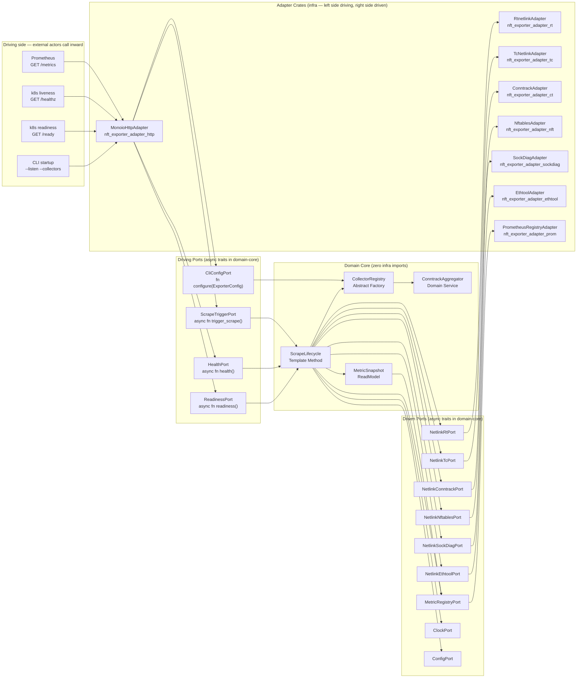

# Domain Overview

nft_exporter is a read-only Linux kernel metrics exporter. The domain model
follows hexagonal (ports-and-adapters) architecture with DDD tactical roles.
The kernel is the sole authority over all state; the exporter never mutates it.
Every bounded context is a read-only consumer that maps kernel netlink byte
streams to immutable ReadModels valid for exactly one scrape epoch.

---

## Bounded-Context Map

The diagram below shows all eight bounded contexts, their aggregate roots and
read models, the netlink API families they consume, and how data flows from the
Linux kernel to the Prometheus server.

```mermaid
graph TD
    subgraph kernel["Linux Kernel"]
        NL_ROUTE["NETLINK_ROUTE\n(rtnetlink + tc + extended)"]
        NL_NF["NETLINK_NETFILTER\n(ctnetlink + nfnetlink + ct-exp)"]
        NL_SD["NETLINK_SOCK_DIAG"]
        NL_GEN["NETLINK_GENERIC\n(ethtool / IPVS / wireguard\ndevlink / NET_DM)"]
        NL_XFRM["NETLINK_XFRM (family=6)\n+ /proc/net/xfrm_stat"]
    end

    subgraph adapters["Adapter Layer — monoio io_uring (ADR-0023)"]
        MONOIO["monoio PollFd\nio_uring POLL_ADD readiness\n(shared across all GenL families)"]
    end

    subgraph domain["Domain Core — nft_exporter"]
        RT["Rtnetlink\n─────────────\nAR: Link\nRM: LinkSnapshot\nRM: AddressSnapshot\nRM: RouteTableSnapshot\nRM: NeighborSnapshot"]
        TC["TrafficControl\n─────────────\nEntity: QdiscNode\nRM: TcTreeSnapshot"]
        CT["Conntrack\n─────────────\nAR: ConntrackFlow\nDS: ConntrackAggregator\nRM: ConntrackSummary\nRM: ConntrackExpectationSummary"]
        NFT["Nftables\n─────────────\nAR: NftChain\nRM: NftCounterSnapshot"]
        SD["SockDiag\n─────────────\nRM: SocketStateHistogram"]
        ETH["Ethtool\n─────────────\nRM: NicStatSnapshot"]
        XFRM["XfrmIpsec\n─────────────\nRM: XfrmSnapshot\n(runtime-gated)"]
        IPVS["Ipvs\n─────────────\nRM: IpvsSnapshot\n(runtime-gated)"]
        WG["Wireguard\n─────────────\nRM: WireguardSnapshot\n(runtime-gated)"]
        DL["Devlink\n─────────────\nRM: DevlinkSnapshot\n(runtime-gated)"]
        DM["DropMonitor\n─────────────\nRM: DropMonitorSnapshot\n(opt-in runtime-gated)"]
        RTEX["RtnetlinkExtended\n─────────────\nRM: RtnetlinkExtendedSnapshot\n(opt-in)"]
        ORCH["CollectionOrchestration\n─────────────\nTM: ScrapeLifecycle\nAF: CollectorRegistry\nRM: MetricSnapshot"]
        EXP["Exposition\n─────────────\nMonoioHttpAdapter\nPrometheusRegistryAdapter"]
    end

    subgraph external["External Systems"]
        PROM["Prometheus Server\nport 33400 GET /metrics"]
        AM["Alertmanager"]
        GF["Grafana"]
    end

    NL_ROUTE -->|RTM_GETLINK RTM_GETADDR\nRTM_GETROUTE RTM_GETNEIGH| RT
    NL_ROUTE -->|RTM_GETQDISC RTM_GETTCLASS\nRTM_GETTFILTER TCA_STATS2| TC
    NL_ROUTE -->|RTM_GETSTATS RTM_GETNEIGH/AF_BRIDGE\nRTM_GETRULE RTM_GETNEXTHOP| RTEX
    NL_NF -->|IPCTNL_MSG_CT_GET\nIPCTNL_MSG_CT_GET_STATS_CPU| CT
    NL_NF -->|IPCTNL_MSG_EXP_GET\nIPCTNL_MSG_EXP_GET_STATS_CPU| CT
    NL_NF -->|NFT_MSG_GETRULE\nNFT_MSG_GETCOUNTER\nNFT_MSG_GETSET NFT_MSG_GETCHAIN| NFT
    NL_SD -->|SOCK_DIAG_BY_FAMILY\nAF_INET AF_INET6| SD
    NL_GEN -->|ETHTOOL_MSG_STATS_GET\nLINKSETTINGS_GET PAUSE_GET\nFEC_GET RSS_GET| ETH
    NL_GEN -->|IPVS_CMD_GET_INFO\nIPVS_CMD_GET_SERVICE\nIPVS_CMD_GET_DEST| IPVS
    NL_GEN -->|WG_CMD_GET_DEVICE\nNLM_F_DUMP| WG
    NL_GEN -->|DEVLINK_CMD_GET\nDEVLINK_CMD_PORT_GET\nDEVLINK_CMD_HEALTH_REPORTER_GET| DL
    NL_GEN -->|NET_DM_CMD_CONFIG\nNET_DM_CMD_START\nNET_DM_GRP_ALERT multicast| DM
    NL_XFRM -->|XFRM_MSG_GETSA\nXFRM_MSG_GETPOLICY\nXFRM_MSG_GETSADINFO/SPDINFO| XFRM

    NL_GEN --> MONOIO
    MONOIO -->|PollFd io_uring readiness| ETH
    MONOIO -->|PollFd io_uring readiness| IPVS
    MONOIO -->|PollFd io_uring readiness| WG
    MONOIO -->|PollFd io_uring readiness| DL
    MONOIO -->|PollFd io_uring readiness| DM

    RT -->|LinkSnapshot\nAddressSnapshot\nRouteTableSnapshot\nNeighborSnapshot| ORCH
    TC -->|TcTreeSnapshot| ORCH
    CT -->|ConntrackSummary\nConntrackExpectationSummary| ORCH
    NFT -->|NftCounterSnapshot| ORCH
    SD -->|SocketStateHistogram| ORCH
    ETH -->|NicStatSnapshot| ORCH
    XFRM -->|XfrmSnapshot| ORCH
    IPVS -->|IpvsSnapshot| ORCH
    WG -->|WireguardSnapshot| ORCH
    DL -->|DevlinkSnapshot| ORCH
    DM -->|DropMonitorSnapshot| ORCH
    RTEX -->|RtnetlinkExtendedSnapshot| ORCH

    ORCH -->|MetricSnapshot| EXP
    EXP -->|OpenMetrics text\ntext/plain; version=0.0.4| PROM
    PROM --> AM
    PROM --> GF
```

### Context Relationships

| Context | Type | Upstream dependency | Downstream consumer |
|---|---|---|---|
| Rtnetlink | core subsystem | NETLINK_ROUTE | CollectionOrchestration |
| TrafficControl | core subsystem | NETLINK_ROUTE | CollectionOrchestration |
| Conntrack | core subsystem | NETLINK_NETFILTER (ctnetlink) | CollectionOrchestration |
| ConntrackExpectations | core subsystem | NETLINK_NETFILTER (NFNL_SUBSYS_CTNETLINK_EXP=2) | CollectionOrchestration |
| Nftables | core subsystem | NETLINK_NETFILTER (nfnetlink) | CollectionOrchestration |
| SockDiag | core subsystem | NETLINK_SOCK_DIAG | CollectionOrchestration |
| Ethtool | core subsystem | NETLINK_GENERIC | CollectionOrchestration |
| XfrmIpsec | runtime-gated subsystem | NETLINK_XFRM (family=6) + /proc/net/xfrm_stat | CollectionOrchestration |
| Ipvs | runtime-gated subsystem | NETLINK_GENERIC (IPVS family) | CollectionOrchestration |
| Wireguard | runtime-gated subsystem | NETLINK_GENERIC (wireguard family) | CollectionOrchestration |
| Devlink | runtime-gated subsystem | NETLINK_GENERIC (devlink family) | CollectionOrchestration |
| DropMonitor | opt-in runtime-gated subsystem | NETLINK_GENERIC (NET_DM family) | CollectionOrchestration |
| RtnetlinkExtended | opt-in subsystem | NETLINK_ROUTE (RTM_GETSTATS + RTM_GETRULE + RTM_GETNEXTHOP) | CollectionOrchestration |
| CollectionOrchestration | cross-cutting | all subsystems | Exposition |
| Exposition | cross-cutting | CollectionOrchestration | Prometheus Server |

---

## Ubiquitous Language

The following terms define the shared vocabulary used in code, tests, ADRs, and
operator documentation. All identifiers in Rust, CUE, Rego, and Gherkin use
these exact names.

| Term | DDD Role | Definition |
|---|---|---|
| **Collector** | Strategy (GoF) | Concrete implementation of the Collector trait for one netlink subsystem. Maps raw kernel nlmsghdr byte streams to ReadModels. |
| **CollectorRegistry** | Abstract Factory (GoF) | Instantiates and holds enabled Collector strategies from ExporterConfig. Adding a subsystem requires only a new registered concrete strategy. |
| **ConntrackAggregator** | Domain Service | Groups ConntrackFlow entries by (protocol, state, direction) and sums counters. Pure domain logic with no kernel dependency. |
| **ConntrackFlow** | Aggregate Root | One kernel connection-tracking entry identified by FlowKey. Never emitted as a Prometheus time series. |
| **ConntrackSummary** | Read Model | Aggregated conntrack data by (protocol, state) and (protocol, direction); the only conntrack structure that reaches MetricRegistryPort. |
| **ExporterApp** | Facade (GoF) | Single entry point that wires all ports and adapters, opens netlink sockets, drops capabilities, and starts the runtime. |
| **FlowKey** | Value Object | (src_ip, dst_ip, protocol, src_port, dst_port) tuple identifying a conntrack flow within one scrape epoch. Never a Prometheus label. |
| **Link** | Aggregate Root | A Linux network interface. Identity: ifindex. Owns AddressList and operational Flags. Invariant: AddressList non-empty when operstate=up. |
| **MetricSnapshot** | Read Model | Immutable container of all subsystem ReadModels from one scrape epoch. Passed to MetricRegistryPort. Valid for exactly one /metrics response. |
| **NftChain** | Aggregate Root | An nftables chain identified by (table, chain name). Owns NftRuleList and referenced SetList. |
| **ReadModel** | tactical pattern | Immutable snapshot of domain state valid for one scrape epoch, produced by a Collector and consumed by MetricRegistryPort. |
| **ScrapeLifecycle** | Template Method (GoF) | Orchestrates the invariant async sequence: pre_scrape_hook → collect_all → post_process → publish → post_scrape_hook. |
| **TcHandle** | Value Object | (major: u16, minor: u16) representing a TC object handle in major:minor hex notation. Identifies QdiscNode and traffic class entities. |

---

## Hexagonal Ports and Adapters

The exporter enforces a strict boundary between domain-core crates and
infrastructure crates. No domain-core crate may import rtnetlink, rustables,
prometheus-client, axum, clap, serde, or any other third-party infrastructure
library. This rule is enforced by `cargo deny` workspace-level rules (ADR-0002).

### Architecture diagram

### Driving Ports

| Port | Implemented by | Called when |
|---|---|---|
| `ScrapeTriggerPort` — `async fn trigger_scrape() -> Result<MetricSnapshot, ScrapeError>` | MonoioHttpAdapter | Prometheus pulls GET /metrics |
| `HealthPort` — `async fn health() -> HealthStatus` | MonoioHttpAdapter | k8s liveness probe GET /healthz |
| `ReadinessPort` — `async fn readiness() -> ReadinessStatus` | MonoioHttpAdapter | k8s readiness probe GET /ready; returns ready only after first successful scrape |
| `CliConfigPort` — `fn configure(config: ExporterConfig) -> Result<(), ConfigError>` | MonoioHttpAdapter | Once at startup; injects ExporterConfig without importing clap into domain-core |

### Driven Ports

| Port | Adapter | Infrastructure crate |
|---|---|---|
| `NetlinkRtPort` | RtnetlinkAdapter | rtnetlink 0.21, netlink-packet-route 0.30 |
| `NetlinkTcPort` | TcNetlinkAdapter | rtnetlink 0.21, netlink-packet-route 0.30 (tc module) |
| `NetlinkConntrackPort` | ConntrackAdapter | netlink-packet-netfilter 0.2 (vendored + patched) |
| `NetlinkNftablesPort` | NftablesAdapter | rustables 0.8.7 |
| `NetlinkSockDiagPort` | SockDiagAdapter | netlink-packet-sock-diag 0.4.2 |
| `NetlinkEthtoolPort` | EthtoolAdapter | ethtool 0.2.9, genetlink 0.2.6 |
| `MetricRegistryPort` | PrometheusRegistryAdapter | prometheus-client 0.24.1 |
| `ClockPort` — `fn now() -> Instant` | StdClockAdapter (prod) / FakeClockAdapter (test) | std::time |
| `ConfigPort` — `fn load() -> Result<ExporterConfig, ConfigError>` | EnvConfigAdapter | config-rs, clap 4.x |

### Design invariants

1. **Zero infra import in domain-core.** All bounded-context core crates declare
   only async trait ports and domain value objects. Enforced by `cargo deny`.

2. **ReadModel immutability.** Every ReadModel is an owned value constructed
   exactly once per scrape epoch and never mutated. The Collector trait returns
   `Box<dyn ReadModel>` by value.

3. **Cancel-safety.** ScrapeTriggerPort and all driven port impls are
   cancel-safe. A dropped scrape future leaves no partial state.

4. **Stale-snapshot fallback.** If a Collector panics or times out, ScrapeLifecycle
   serves the previous successful ReadModel for that collector and records
   `nft_scrape_collector_success{collector}=0`.

5. **Bounded cardinality.** No metric family uses per-connection, per-route-prefix,
   per-socket-inode, or per-MAC-address labels. Ceiling is 50,000 series per node.
   Overflow triggers `nft_scrape_collector_error_total{reason=cardinality_overflow}`
   and suppresses the offending family for that scrape.
