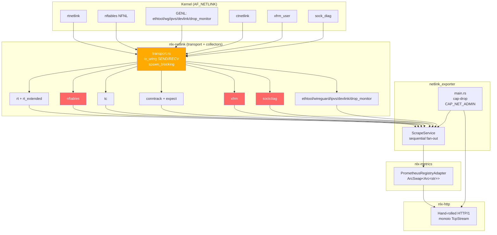

# Engineering Audit Report — nft_exporter

**Date:** 2026-05-29
**Revision:** origin/main @ 0502f0a
**Scope:** 12 dimensions · 94 findings

---

## 1. Executive Summary

nft_exporter is an architecturally ambitious Prometheus exporter with a genuinely strong foundation: a pure io_uring + monoio data path, a fully lock-free metric store, and strict native-API-only kernel access. However, **it is not production-ready in its current state.** Ten wire-level constant errors (wrong NLA type values, wrong byte orders) cause entire metric families to be silently zero or incorrect on every scrape, and a capability-drop failure is non-fatal, leaving the process running with CAP_NET_ADMIN + CAP_SYS_ADMIN when the drop fails. Critical documentation drift between ADRs and the actual codebase compounds the maintenance risk.

### Severity Counts

| Severity | Count |
|----------|------:|
| Critical | 2 |
| High     | 25 |
| Medium   | 30 |
| Low      | 29 |
| Info     | 8 |
| **Total**| **94** |

---

## 2. Findings by Severity

### Critical

---

#### C-1 · WC-001 · Wire Correctness

**Title:** nftables: NFTA_OBJ_TYPE read as native-endian; kernel uses `nla_put_be32` — all named counter objects silently dropped

**Location:** `crates/nlx-netlink/src/collectors/nftables.rs:360`

**Evidence:** `read_u32` at line 360 calls `u32::from_ne_bytes` on the 4-byte payload. Kernel `net/netfilter/nf_tables_api.c:8384` serialises `NFTA_OBJ_TYPE` via `nla_put_be32(skb, NFTA_OBJ_TYPE, htonl(obj->ops->type->type))`. `NFT_OBJECT_COUNTER=1` arrives as bytes `[0x00,0x00,0x00,0x01]`; native-endian decode yields `0x01000000=16777216`; the guard at line 381 (`obj_type != NFT_OBJECT_COUNTER`) is always true, so `parse_obj_frame` always returns `None`. Unit tests at lines 682 and 754 construct frames with `to_ne_bytes`, making them self-consistent but exercising the wrong byte order.

**Recommendation:** Replace `read_u32(attr.payload)` with `read_u32_be(attr.payload)` for `NFTA_OBJ_TYPE`. Fix unit-test frame builders at lines 682 and 754 to use `to_be_bytes()`. Update module doc at line 55 and spec at `netlink-protocol.md:732-734` to list `NFTA_OBJ_TYPE` as big-endian. Kernel ref: `net/netfilter/nf_tables_api.c:8384`.

---

#### C-2 · SEC-PRIV-001 · Security / Privilege

**Title:** Capability drop failure is non-fatal — process continues with full capabilities retained

**Location:** `crates/netlink_exporter/src/main.rs:130-132`

**Evidence:** `if let Err(e) = drop_caps_to_net_admin() { warn!(...) }` — the Err branch logs a warning and falls through. The implementation at lines 194-226 propagates all errors via `?`. No `expect()`, no `unwrap()`, no `std::process::abort()`. Neither workspace nor crate-level `Cargo.toml` contains a `[profile.release]` stanza (let alone `panic = "abort"`). `SECURITY.md:44-45` and `threat-model.md:316-317` both claim `expect()` + `panic=abort` guarantee termination — these claims are demonstrably false against the compiled source. A process that fails `capset(2)` silently continues serving HTTP with `CAP_NET_ADMIN` and `CAP_SYS_ADMIN` in its effective and permitted sets.

**Recommendation:** (1) Replace the `if let Err` block at line 130 with `.expect("capability drop must not fail — aborting")` or explicit `std::process::abort()` on error. (2) Add `[profile.release]\npanic = "abort"` to the workspace `Cargo.toml`. Update `SECURITY.md` and `threat-model.md` to reflect the corrected behavior.

---

### High

---

#### H-1 · WC-002 · Wire Correctness

**Title:** nftables: NFTA_HOOK_HOOKNUM and NFTA_HOOK_PRIORITY read as native-endian — all chain hook labels incorrectly reported as 'other'

**Location:** `crates/nlx-netlink/src/collectors/nftables.rs:297-310`

**Evidence:** Both attributes decoded with `read_u32`. Kernel `nf_tables_api.c:1982-1984` uses `nla_put_be32/htonl` for both. `NF_INET_LOCAL_IN=1` arrives as `[0,0,0,1]`; native-endian read gives `16777216`; `hook_label(16777216)` returns `'other'`. Only `hooknum=0` (prerouting) is unaffected.

**Recommendation:** Replace `read_u32` with `read_u32_be` for both attributes. After decoding priority, cast to `i32` via `as i32`. Kernel ref: `nf_tables_api.c:1982-1984`.

---

#### H-2 · WC-003 · Wire Correctness

**Title:** nftables: NFTA_CHAIN_POLICY read as native-endian — 'accept' policy always reported as 'other'

**Location:** `crates/nlx-netlink/src/collectors/nftables.rs:289`

**Evidence:** `read_u32(attr.payload)` uses native-endian decoding. Kernel `nf_tables_api.c:2052` uses `nla_put_be32`. `NF_ACCEPT=1` serialises as `[0,0,0,1]`; native-endian read gives `16777216`. `NF_DROP=0` is unaffected.

**Recommendation:** Replace `read_u32` with `read_u32_be` for `NFTA_CHAIN_POLICY`. Kernel ref: `nf_tables_api.c:2052`.

---

#### H-3 · WC-004 · Wire Correctness

**Title:** xfrm: XFRMA_SAD_HINFO declared as type 3; kernel enum has it at type 2 — SAD hash metrics always zero

**Location:** `crates/nlx-netlink/src/collectors/xfrm.rs:163`

**Evidence:** `const XFRMA_SAD_HINFO: u16 = 3`. Kernel `include/uapi/linux/xfrm.h:344-348`: `XFRMA_SAD_UNSPEC=0`, `XFRMA_SAD_CNT=1`, `XFRMA_SAD_HINFO=2`. Kernel emits NLA type 2 at `net/xfrm/xfrm_user.c:1762`. Match at line 412 (`attr.ty == XFRMA_SAD_HINFO`) compares against 3, which never matches.

**Recommendation:** Change `const XFRMA_SAD_HINFO: u16 = 3` to `2`. Also correct module doc to read `XFRMA_SAD_CNT (type 1) and XFRMA_SAD_HINFO (type 2)`. Kernel ref: `include/uapi/linux/xfrm.h:344-348`.

---

#### H-4 · WC-005 · Wire Correctness

**Title:** xfrm: XFRMA_SPD_HINFO declared as type 3; kernel enum has it at type 2 — SPD hash metrics always zero

**Location:** `crates/nlx-netlink/src/collectors/xfrm.rs:167`

**Evidence:** `const XFRMA_SPD_HINFO: u16 = 3`. Kernel `include/uapi/linux/xfrm.h:358-364`: `XFRMA_SPD_HINFO=2`. Kernel emits NLA type 2 at `net/xfrm/xfrm_user.c:1644`. Match at line 459 never fires.

**Recommendation:** Change `const XFRMA_SPD_HINFO: u16 = 3` to `2`. Correct module doc. Kernel ref: `include/uapi/linux/xfrm.h:358-364`.

---

#### H-5 · WC-006 · Wire Correctness

**Title:** sock_diag: INET_DIAG_SKMEMINFO declared as 6; kernel enum has it at 7 — socket drop counters never populated

**Location:** `crates/nlx-netlink/src/collectors/sockdiag.rs:79`

**Evidence:** `const INET_DIAG_SKMEMINFO: u16 = 6`. Kernel `include/uapi/linux/inet_diag.h:134-142` sequential enum: `SKMEMINFO=7`. Code value 6 = `INET_DIAG_TCLASS`. `nft_socket_drops_total` is always zero.

**Recommendation:** Change to `7`. Must be paired with WC-007 fix. Kernel ref: `inet_diag.h:142`.

---

#### H-6 · WC-007 · Wire Correctness

**Title:** sock_diag: IDIAG_EXT_SKMEMINFO_AND_INFO bitmask 0x22 requests TCLASS instead of SKMEMINFO — kernel never sends skmeminfo in replies

**Location:** `crates/nlx-netlink/src/collectors/sockdiag.rs:59`

**Evidence:** `0x22` decomposes as `INFO(0x02)|TCLASS(0x20)`. Kernel `net/ipv4/inet_diag.c:293` gates SKMEMINFO on bit `1<<6=0x40`. The `0x40` bit is absent; kernel never includes `INET_DIAG_SKMEMINFO` in any reply.

**Recommendation:** Change to `0x42` (`INFO=0x02|SKMEMINFO=0x40`). Fix comment. Kernel ref: `net/ipv4/inet_diag.c:293`.

---

#### H-7 · WC-008 · Wire Correctness

**Title:** devlink: DEVLINK_CMD_PORT_GET declared as 7 (PORT_NEW); kernel enum has PORT_GET at 5 — port dump issues a create command

**Location:** `crates/nlx-netlink/src/collectors/devlink.rs:41`

**Evidence:** Sequential parse of `include/uapi/linux/devlink.h`: `PORT_GET=5, PORT_SET=6, PORT_NEW=7`. Value 7 is `PORT_NEW` (write/create). With `NLM_F_DUMP`, issuing `PORT_NEW` returns `EINVAL` or `EPERM`.

**Recommendation:** Change `const DEVLINK_CMD_PORT_GET: u8 = 7` to `5`. Kernel ref: `devlink.h:31`.

---

#### H-8 · WC-009 · Wire Correctness

**Title:** devlink: DEVLINK_CMD_HEALTH_REPORTER_GET declared as 66; correct value is 52 — health reporter dump issues wrong command

**Location:** `crates/nlx-netlink/src/collectors/devlink.rs:42`

**Evidence:** The original `66` is `DEVLINK_CMD_TRAP_DEL`. The correct value is **52**, confirmed on the running kernel two ways: the `<linux/devlink.h>` preprocessor expansion, and an strace of `devlink health show` (sends genl cmd `0x34` = 52). NOTE: an interim fix to `54` (a hand-count of the enum) was also wrong and produced `EOPNOTSUPP` (errno 95) on every health dump — sequential hand-counting of this enum is unreliable; always use the header/preprocessor.

**Recommendation:** Set to `52` (done). Verify enum values via `cc`-expanded `<linux/devlink.h>`, never by counting.

---

#### H-9 · WC-010 · Wire Correctness

**Title:** devlink: DEVLINK_ATTR_HEALTH_REPORTER through HEALTH_REPORTER_RECOVER_COUNT declared as 57-61; kernel enum has them at 114-118

**Location:** `crates/nlx-netlink/src/collectors/devlink.rs:49-53`

**Evidence:** Code: `HEALTH_REPORTER=57, NAME=58, STATE=59, ERR_COUNT=60, RECOVER_COUNT=61`. Kernel: `HEALTH_REPORTER=114, NAME=115, STATE=116, ERR_COUNT=117, RECOVER_COUNT=118`. Values 57-61 fall in the DPIPE_FIELD_* range; all health metrics are always zero.

**Recommendation:** Update all five constants. Apply in the same commit as H-7 and H-8. Kernel ref: `devlink.h` at sequential ordinals 114-118.

---

#### H-10 · ERR-001 · Error Robustness

**Title:** Per-scrape timeout accepted in API but silently discarded — blocked collector stalls entire HTTP response

**Location:** `crates/netlink_exporter/src/scrape.rs:151-159`

**Evidence:** `scrape.rs:159`: `let _ = scrape_timeout_ms;`. The scrape loop at lines 188-236 is sequential `for collector` with bare `collect().await` and no timer race. `monoio::RuntimeBuilder::enable_timer()` is called at `main.rs:83` (timer compiled in but unused in scrape path). `CollectError::Timeout` declared in `nlx-ports/src/error.rs:28-33` but never constructed. Transport-level `uring_recv` calls `ring.submit_and_wait(1)` with no `SO_RCVTIMEO` or `IORING_OP_TIMEOUT`. One hung `spawn_blocking` holds the `await`, preventing all subsequent collectors and keeping the HTTP connection open until TCP timeout.

**Recommendation:** Wrap each `collector.collect().await` in `monoio::time::timeout(Duration::from_millis(scrape_timeout_ms), ...)`, returning `CollectError::Timeout` on expiry. Alternatively set `SO_RCVTIMEO` on the netlink socket in `NetlinkSocket::open_raw_fd`.

---

#### H-11 · MC-001 · Metrics / Cardinality

**Title:** Content-Type claims OpenMetrics 1.0.0 but counter TYPE lines use Prometheus text-format convention

**Location:** `crates/nlx-http/src/server.rs:197` and `crates/nlx-metrics/src/registry.rs:125`

**Evidence:** `server.rs:197` emits `Content-Type: application/openmetrics-text; version=1.0.0; charset=utf-8`. `registry.rs:125` writes `# TYPE nft_link_receive_bytes_total counter` (name includes `_total`). OpenMetrics 1.0.0 §4.1.2 requires the `# TYPE` line to carry the **base name without `_total`**. The unit test at `registry.rs:266` locks in the wrong format.

**Recommendation:** Either (a) change Content-Type to `text/plain; version=0.0.4; charset=utf-8` (lower risk, no encoder changes needed), or (b) strip `_total` from `# HELP`/`# TYPE` lines in the encoder while keeping `_total` in sample lines.

---

#### H-12 · DOC-001 · Docs / ADR Accuracy

**Title:** ADR-0023 and netlink-protocol.md claim IORING_OP_SENDMSG/RECVMSG + registered buffers; code uses plain IORING_OP_SEND/RECV with per-call rings

**Location:** `docs/arch/adr/0023-io-uring-runtime.md:99-102` and `docs/arch/domain/netlink-protocol.md:94-169`

**Evidence:** `transport.rs:579-584` and `643-648` use `opcode::Send` and `opcode::Recv`; no registered buffers, no fixed-file registration, no PollFd. ADR-0023 line 99: "IORING_OP_SENDMSG and IORING_OP_RECVMSG with registered buffers". `netlink-protocol.md` pseudocode and sequence diagram show SENDMSG/RECVMSG + IOSQE_BUFFER_SELECT — none of which exist in the implementation.

**Recommendation:** Rewrite ADR-0023 §AF_NETLINK transport and `netlink-protocol.md` §2 io_uring block to reflect the actual implementation: plain IORING_OP_SEND/RECV, per-call IoUring ring (depth 32), spawn_blocking threads.

---

#### H-13 · DOC-002 · Docs / ADR Accuracy

**Title:** README container diagram and hexagonal diagram reference axum 0.8 and tokio+mio after ADR-0023 replaced them with monoio

**Location:** `README.md:48, 95, 134-135, 465, 468`

**Evidence:** Line 48: "axum 0.8 · port 9456". Line 95: "tokio and mio are confined to driven adapter crates". Line 134: subgraph "Adapter crates (tokio + mio here only)". Actual `nlx-http/src/server.rs` is hand-rolled HTTP/1 over monoio; axum/tokio/mio have zero presence in the workspace.

**Recommendation:** Update README diagrams, ADR table (mark ADR-0010/0014 as superseded by ADR-0023), and subgraph labels to reference monoio.

---

#### H-14 · DOC-003 · Docs / ADR Accuracy

**Title:** ADR-0009 claims CAP_SYS_ADMIN not required; ADR-0026 requires it for the NET_DM events group — no cross-reference or amendment

**Location:** `docs/arch/adr/0009-privilege-and-security-model.md:9,31` and `docs/arch/adr/0026-drop-monitor-hybrid-multicast-accumulator.md:75-80`

**Evidence:** ADR-0009 title: "reject CAP_NET_RAW and CAP_SYS_ADMIN by design". ADR-0026 lines 75-80 explicitly states the NET_DM events group is `GENL_MCAST_CAP_SYS_ADMIN`, requiring CAP_SYS_ADMIN. `drop_monitor.rs:855-856` confirms. ADR-0009 has no cross-reference to ADR-0026.

**Recommendation:** Amend ADR-0009 to add a conditional note that CAP_SYS_ADMIN is transiently required when drop-monitor is enabled. Add io_uring syscalls to the seccomp allowlist; remove stale epoll_wait/tokio reference.

---

#### H-15 · DSC-001 · Deps / Supply Chain / CI

**Title:** Cargo.lock generated on macOS — monoio, io-uring, arc-swap absent; tokio/axum/mio resolve instead

**Location:** `Cargo.lock:1-1196`

**Evidence:** `Cargo.lock` contains tokio 1.52.3 (line 946), axum 0.8.9 (line 86), mio 1.2.1 (line 495). Grep for monoio, io-uring, arc-swap returns zero matches. CI does not pass `--locked`, so Linux CI runners silently regenerate the graph. Cache key hashes the stale macOS lock, guaranteeing cache misses.

**Recommendation:** Regenerate `Cargo.lock` on Linux. Add `--locked` to every `cargo build` invocation in CI. Add a weekly `cargo update --locked` PR job.

---

#### H-16 · DSC-002 · Deps / Supply Chain / CI

**Title:** No cargo-audit or cargo-deny in CI — Rust advisory-database scanning absent from PR gate

**Location:** `.github/workflows/ci.yml` (entire file)

**Evidence:** No `audit`, `deny`, `cargo-audit`, or `cargo-deny` step in either CI file. Trivy runs only post-push on the container image.

**Recommendation:** Add a supply-chain CI job: `cargo audit --deny warnings` + `cargo deny check` (with `deny.toml` covering advisories, licenses, and duplicate bans) on every PR.

---

#### H-17 · DSC-003 · Deps / Supply Chain / CI

**Title:** aquasecurity/trivy-action pinned to @master — mutable floating ref in release pipeline with OIDC write scope

**Location:** `.github/workflows/release.yml:232`

**Evidence:** `uses: aquasecurity/trivy-action@master`. The `scan-image` job runs with `id-token: write` in scope. A supply-chain compromise of trivy-action would execute with OIDC write access.

**Recommendation:** Pin to a specific 40-char commit SHA. Do the same for `anchore/sbom-action/download-syft@v0`.

---

#### H-18 · TC-001 · Test Coverage

**Title:** transport.rs parse_datagram has zero tests — all NLMSG state-machine branches untested

**Location:** `crates/nlx-netlink/src/transport.rs:317`

**Evidence:** No `#[cfg(test)]` block in `transport.rs`. All five NLMSG match arms and the `NLM_F_DUMP_INTR` flag check are live with zero test coverage.

**Recommendation:** Add `#[cfg(test)]` module. Cover: NLMSG_DONE, NLMSG_ERROR (errno≠0 and errno=0), NLM_F_DUMP_INTR, NLMSG_OVERRUN, short `nlmsg_len`, multi-message accumulation, and `build_request` flag assertions.

---

#### H-19 · TC-002 · Test Coverage

**Title:** rt.rs collector — 21 functions, zero tests, including RTA_TABLE override logic

**Location:** `crates/nlx-netlink/src/collectors/rt.rs:220`

**Evidence:** No `#[cfg(test)]` in `rt.rs`. `parse_link_frame`, `count_addresses`, `count_routes`, `count_neighbours` all untested. `rtnl_link_stats64` offsets and RTA_TABLE u32 override at lines 394-403 have zero coverage.

**Recommendation:** Add test module. Cover `parse_link_frame` with synthetic ifinfomsg + IFLA_STATS64, `count_routes` with/without RTA_TABLE NLA, `nud_state_label` per NUD_* bit, `decode_ifname` with/without NUL.

---

#### H-20 · TC-003 · Test Coverage

**Title:** tc.rs — parse_tca_stats2 and parse_qdisc_frame untested

**Location:** `crates/nlx-netlink/src/collectors/tc.rs:167`

**Evidence:** No `#[cfg(test)]` in `tc.rs`. Both parse functions entirely untested.

**Recommendation:** Add test module with synthetic TCA_STATS2 nested payloads. Cover `parse_tca_stats2` with TCA_STATS_BASIC + TCA_STATS_QUEUE; test missing-basic returns None. Cover `parse_qdisc_frame` with 20-byte tcmsg header + TCA_KIND NLA.

---

#### H-21 · TC-004 · Test Coverage

**Title:** sockdiag.rs — parse_frame paths for INET_DIAG_SKMEMINFO and INET_DIAG_INFO untested

**Location:** `crates/nlx-netlink/src/collectors/sockdiag.rs:391`

**Evidence:** No `#[cfg(test)]` in `sockdiag.rs`. Additionally, `TCP_INFO_RETRANSMITS_OFFSET=12` reads `tcpi_ato` (offset 12 in `tcp_info`) rather than `tcpi_retransmits` (byte 2) — a latent bug that tests would expose.

**Recommendation:** Add test module. Construct 72-byte `inet_diag_msg` + SKMEMINFO NLA + INFO NLA. Verify retransmits field — current offset decodes the wrong field.

---

#### H-22 · TC-005 · Test Coverage

**Title:** ethtool.rs — parse_stats_attrs and parse_stats_reply completely untested despite three-level NLA nesting

**Location:** `crates/nlx-netlink/src/collectors/ethtool.rs:219`

**Evidence:** No `#[cfg(test)]` in `ethtool.rs`. Three-level nesting (outer ETHTOOL_A_STATS_HEADER > ETHTOOL_A_STATS_GRP > ETHTOOL_A_STATS_GRP_STAT) is non-trivial and untested.

**Recommendation:** Add test module. Build synthetic three-level NLA payload. Test `build_stats_get_payload`, `parse_stats_attrs`, `parse_stats_reply` with genlmsghdr prefix. Add non-UTF-8 stat name test.

---

#### H-23 · TC-006 · Test Coverage

**Title:** wireguard.rs — parse_device and parse_peer untested; private key discard has no test confirming the key is never stored

**Location:** `crates/nlx-netlink/src/collectors/wireguard.rs:188`

**Evidence:** No `#[cfg(test)]` in `wireguard.rs`. `wireguard_max_peers` config cap is never enforced in `collect()` (all peers emitted without truncation).

**Recommendation:** Add test module. Test that `WGDEVICE_A_PRIVATE_KEY` / `WGPEER_A_PRESHARED_KEY` never appear in returned structs. Test `tv_sec=0` → `None` handshake mapping. Test the dead `wireguard_max_peers` enforcement path.

---

#### H-24 · TC-009 · Test Coverage

**Title:** No fuzz targets for nlattr wire parser or any collector parse function

**Location:** `crates/nlx-netlink/src/wire.rs:1`

**Evidence:** No `fuzz/` directory anywhere in the workspace. No `proptest`, `quickcheck`, `arbitrary`, or `cargo-fuzz` in any `Cargo.toml`. All collector parse functions accept arbitrary `&[u8]` with zero fuzz coverage.

**Recommendation:** Create `crates/nlx-netlink/fuzz/`. Add: `fuzz_parse_attrs`, `fuzz_parse_datagram`, `fuzz_conntrack`, `fuzz_nftables`. As a complement, add proptest to dev-deps asserting `parse_attrs` never panics on arbitrary bytes.

---

#### H-25 · DSC-006 · Deps / Supply Chain / CI

**Title:** CI rust job does not run tests — cargo test absent from PR gate

**Location:** `.github/workflows/ci.yml:108-205`

**Evidence:** CI runs `rustfmt`, `clippy`, `cargo build`, and static-link verification. No `cargo test` or `cargo nextest` step. Unit tests in `nlx-metrics`, `nlx-config`, `nlx-netlink/wire.rs`, and multiple collectors could run on `ubuntu-latest` without kernel privileges.

**Recommendation:** Add `cargo nextest run --all-features` step to the rust job for `x86_64-unknown-linux-musl`. Gate pure-computation tests unconditionally; add `#[ignore]` guards on netlink-socket-opening tests.

---

### Medium

*(30 findings — key ones highlighted)*

---

#### M-1 · WC-011 · Wire Correctness

**Title:** conntrack: `dump_flows` sends CT_NEW (0) instead of CT_GET (1)

**Location:** `crates/nlx-netlink/src/collectors/conntrack.rs:473`

**Evidence:** `1u16 << 8 = 256 = IPCTNL_MSG_CT_NEW(0)`. Correct dump value is `(1<<8)|IPCTNL_MSG_CT_GET=257`. Method is currently uncalled in `collect()`, so runtime impact is zero, but any future consumer encounters the bug.

**Recommendation:** Change to `(1u16 << 8) | 1`. Define named constant `IPCTNL_MSG_CT_GET`. Kernel ref: `nfnetlink_conntrack.h`.

---

#### M-2 · WC-012 · Wire Correctness

**Title:** Protocol spec doc incorrectly states all nftables NLA payloads are native-endian

**Location:** `docs/arch/domain/netlink-protocol.md:732-734`

**Evidence:** Contradicted by four `nla_put_be32` sites in the kernel: `NFTA_HOOK_HOOKNUM`, `NFTA_HOOK_PRIORITY`, `NFTA_CHAIN_POLICY`, `NFTA_OBJ_TYPE`.

**Recommendation:** Update §5.7 to explicitly list the four be32 attributes.

---

#### M-3 · US-001 / US-002 / US-003 · Unsafe Soundness

**Title:** SAFETY comments for uring_send, uring_recv, and join_mcast_group do not address buffer lifetime on EINTR/error paths

**Location:** `crates/nlx-netlink/src/transport.rs:591, 657` and `crates/nlx-netlink/src/collectors/drop_monitor.rs:885`

**Evidence:** Buffers freed before kernel op completes if SQPOLL is ever enabled. Currently safe due to synchronous kernel execution, but assumption is undocumented.

**Recommendation:** Add explicit SAFETY notes documenting the synchronous-kernel-execution assumption. For `drop_monitor.rs:885`, box the `gid` stack-local to outlive the CQE.

---

#### M-4 · CLF-005 · Concurrency / Lock-free

**Title:** Background nft-dropmon thread has no join handle and no shutdown mechanism

**Location:** `crates/nlx-netlink/src/collectors/drop_monitor.rs:605-619`

**Evidence:** `setup_and_spawn_listener` discards the `JoinHandle`. Shutdown `AtomicBool` is stubbed but unchecked. Thread cannot be cleanly stopped.

**Recommendation:** Retain the `JoinHandle`. Introduce a shutdown `AtomicBool` checked in the `recv_loop` outer body.

---

#### M-5 · ERR-002 · Error Robustness

**Title:** Devlink health-reporter EINVAL detection uses fragile substring match on formatted error string

**Location:** `crates/nlx-netlink/src/collectors/devlink.rs:259`

**Evidence:** Guard `msg.contains("errno=22")` would match `"errno=220"`. Structured match impossible because `NetlinkError` is converted to `String` before this call site.

**Recommendation:** Propagate `NetlinkError` errno as a structured field in `DomainError` rather than converting to `String` at the boundary.

---

#### M-6 · ERR-003 · Error Robustness

**Title:** Conntrack transport-level frame Vec is unbounded; CT_DUMP_MAX_ENTRIES cap applies only after full allocation

**Location:** `crates/nlx-netlink/src/collectors/conntrack.rs:466-490`

**Evidence:** `sock.dump()` returns all raw frames with no size cap. Only after allocation does the code break at `CT_DUMP_MAX_ENTRIES=200_000`.

**Recommendation:** Add a frame count cap at the transport layer or early-exit before parsing.

---

#### M-7 · ERR-004 · Error Robustness

**Title:** XFRM short-frame returns hard `CollectError::Parse`, skipping all remaining XFRM metrics

**Location:** `crates/nlx-netlink/src/collectors/xfrm.rs:331-335, 368-372`

**Evidence:** Short frames cause `return Err(CollectError::Parse(...))` immediately rather than `continue`. `GETSADINFO`/`GETSPDINFO` unicast requests are never reached when any dump frame is short.

**Recommendation:** Change short-frame handling to `continue` (log `warn!`). Reserve `CollectError::Parse` for subsystem-level failures.

---

#### M-8 · SEC-PRIV-002 · Security / Privilege

**Title:** ADR-0026 incorrect: recv-only thread spawned before capability drop and inherits full initial cap set

**Location:** `crates/netlink_exporter/src/main.rs:121` vs `130`; `docs/arch/adr/0026-drop-monitor-hybrid-multicast-accumulator.md:98-100`

**Evidence:** `setup_and_spawn_listener` executes at line 121, before `drop_caps_to_net_admin()` at line 130. Linux `capset(pid=0)` targets only the calling thread. The recv thread inherits both CAP_NET_ADMIN and CAP_SYS_ADMIN indefinitely. ADR-0026:99 states "spawned after the capability drop" — factually inverted.

**Recommendation:** Either drop capabilities on the recv thread itself at the top of `recv_loop`, or restructure so `setup_and_spawn_listener` is called after the cap-drop. Update ADR-0026.

---

#### M-9 · SEC-INPUT-003 · Security / Privilege

**Title:** parse_alert_frame (dead_code) would allow unbounded kernel-supplied strings into Prometheus label values

**Location:** `crates/nlx-netlink/src/collectors/drop_monitor.rs:970-1040`

**Evidence:** `NET_DM_ATTR_REASON` and `NET_DM_ATTR_HW_TRAP_NAME` read without length cap. `escape_label_value` does not prevent cardinality explosion.

**Recommendation:** Before activating PACKET mode, add 128-byte cap, cardinality guard, and `SKB_DROP_REASON_*` allowlist.

---

#### M-10 · SEC-EXPOSURE-001 · Security / Privilege

**Title:** Custom seccomp profile referenced in security docs does not exist on disk

**Location:** `deploy/seccomp/` (empty); `docs/arch/adr/0009-privilege-and-security-model.md:47`; `SECURITY.md:70-76`

**Evidence:** `find /nft_exporter/deploy` returns no seccomp directory. DaemonSet uses `RuntimeDefault`, not the custom profile. Mitigations in ADR-0009/threat-model are not deployed.

**Recommendation:** Create `deploy/seccomp/nft-exporter.json` based on RuntimeDefault plus explicit io_uring_setup/enter/register allow + execve/ptrace/bpf deny. Update DaemonSet to `type: Localhost`.

---

#### M-11 · ARCH-DDD-001 · Architecture / DDD

**Title:** Dead driven-port traits: NetlinkXxxPort interfaces implemented but never consumed

**Location:** `crates/nlx-ports/src/driven.rs:61-378`

**Evidence:** Six separate `NetlinkXxxPort` trait impls exist but `Collector::collect()` never delegates through them. Zero testability benefit from the port definitions.

**Recommendation:** Either remove the dead port traits (retain only `Collector`), or restructure `Collector::collect()` to delegate via `dyn NetlinkXxxPort`.

---

#### M-12 · ARCH-DDD-002 · Architecture / DDD

**Title:** hexagonal.rego and cargo-deny bans are not wired into CI — enforcement is aspirational

**Location:** `.github/workflows/ci.yml` and `docs/arch/policies/hexagonal.rego`

**Evidence:** Invariants job only grep-checks Mutex/RwLock; no OPA/conftest step. No `cargo-deny` rule independently enforces the hexagonal constraint.

**Recommendation:** Add conftest + cargo-deny steps to CI. See DSC-002.

---

#### M-13 · ARCH-DDD-003 · Architecture / DDD

**Title:** ADR-0009 and ADR-0026 unresolved conflict: CAP_SYS_ADMIN for drop-monitor not acknowledged in K8s DaemonSet

**Location:** `docs/arch/adr/0009-privilege-and-security-model.md:9,15,31`; `deploy/k8s/daemonset.yaml:88-93`

**Evidence:** DaemonSet docs do not explain that `SYS_ADMIN` must be added to `capabilities.add` for drop-monitor real-total metrics. Silent zero on missing capability.

**Recommendation:** Update ADR-0009 and DaemonSet docs to document the CAP_SYS_ADMIN exception. Expose a startup warning metric on listener failure.

---

#### M-14 · RM-01 · Resource Management

**Title:** nft-dropmon thread has no shutdown path — fd and io_uring registration leak on graceful stop

**Location:** `crates/nlx-netlink/src/collectors/drop_monitor.rs:605-618`

**Evidence:** No shutdown signal, no `JoinHandle` retained.

**Recommendation:** Return `JoinHandle` from `setup_and_spawn_listener`. Add `AtomicBool` shutdown flag.

---

#### M-15 · RM-08 · Resource Management

**Title:** accept() error loop in HTTP server has no backoff — persistent EMFILE/ENFILE spins at full CPU

**Location:** `crates/nlx-http/src/server.rs:122-138`

**Evidence:** Accept errors cause immediate retry loop with no sleep, consuming 100% CPU on file-descriptor exhaustion.

**Recommendation:** Add exponential backoff (10ms→1s) on consecutive accept errors, resetting on success.

---

#### M-16 · DOC-004 · Docs / ADR Accuracy

**Title:** ADR-0006 (prometheus-client 0.24) is status=accepted but implementation deviates without amendment

**Location:** `docs/arch/adr/0006-prometheus-client-crate.md:1-7` and `crates/nlx-metrics/src/registry.rs:6-17`

**Evidence:** No `prometheus-client` dependency in any crate. Dead workspace dependency at `Cargo.toml:54`.

**Recommendation:** Update ADR-0006 status to superseded or add ADR-0027 documenting the hand-rolled encoder. Remove orphaned `prometheus-client` from `[workspace.dependencies]`.

---

#### M-17 · DOC-005 · Docs / ADR Accuracy

**Title:** netlink-protocol.md §2 lists SOCK_NONBLOCK; transport.rs intentionally omits it

**Location:** `docs/arch/domain/netlink-protocol.md:77,113`

**Evidence:** `transport.rs:228-231` explicitly comments "SOCK_NONBLOCK intentionally omitted: io_uring SEND/RECV do not require non-blocking mode".

**Recommendation:** Update spec to omit SOCK_NONBLOCK + add explanatory note.

---

#### M-18 · DOC-006 · Docs / ADR Accuracy

**Title:** netlink-protocol.md §3.5 states NETLINK_GET_STRICT_CHK = 11; kernel defines it as 12

**Location:** `docs/arch/domain/netlink-protocol.md:316`

**Evidence:** Kernel `include/uapi/linux/netlink.h:176` = 12. `transport.rs:262` uses `12_i32` (correct).

**Recommendation:** Fix doc line 316: `NETLINK_GET_STRICT_CHK=12`.

---

#### M-19 · DOC-007 · Docs / ADR Accuracy

**Title:** nft_netlink_errors_total metric documented in ADR/runbook but never emitted in code

**Location:** `docs/arch/adr/0011-adopt-direct-netlink-wire-protocol.md:48`; `docs/arch/operations/runbook.md:422-477`

**Evidence:** No Rust source emits `nft_netlink_errors_total`. The `NftNetlinkEnobufs` alert in the runbook will never fire.

**Recommendation:** Implement the counter in the ENOBUFS circuit-breaker path, or remove all doc references.

---

#### M-20 · DOC-009 · Docs / ADR Accuracy

**Title:** README references /proc/net/xfrm_stat for xfrm collector; ADR-0025 and xfrm.rs removed this path

**Location:** `README.md:59, 226`

**Evidence:** `xfrm.rs:43-47` documents removal. `/proc` path was eliminated per ADR-0025.

**Recommendation:** Update README to remove `/proc/net/xfrm_stat` and `nft_xfrm_stat_total` references.

---

#### M-21 · DOC-010 · Docs / ADR Accuracy

**Title:** ADR-0023 describes a 4-thread composition root; code uses a single monoio thread

**Location:** `docs/arch/adr/0023-io-uring-runtime.md:139-154`

**Evidence:** `main.rs:81-88` builds a single monoio runtime. ADR-0023 describes `std::thread::spawn × N` with Thread 0 for HTTP and Threads 1-3 for netlink families.

**Recommendation:** Update ADR-0023 composition-root section to describe the actual single-thread model.

---

#### M-22 · DOC-012 · Docs / ADR Accuracy

**Title:** nlx-netlink/src/lib.rs module doc describes the superseded AsyncFd/tokio/mio transport model

**Location:** `crates/nlx-netlink/src/lib.rs:8-25`

**Evidence:** Lines 8-9 reference tokio reactor and `tokio::io::unix::AsyncFd`. Lines 17-19 state tokio/mio live exclusively in this crate. None applies; crate uses monoio + io-uring.

**Recommendation:** Rewrite module doc to reflect monoio + io-uring transport. Update collector ADR refs from ADR-0014 to ADR-0023/0024.

---

#### M-23 · DOC-013 · Docs / ADR Accuracy

**Title:** ADR-0009 seccomp profile lists epoll_wait but not io_uring syscalls; ADR-0023 requires io_uring_setup/enter/register

**Location:** `docs/arch/adr/0009-privilege-and-security-model.md:47`

**Evidence:** ADR-0023 lines 161-164 explicitly requires io_uring_setup (425), io_uring_enter (426), io_uring_register (427) in the allowlist. ADR-0009 seccomp spec omits all three.

**Recommendation:** Update ADR-0009 seccomp spec. Audit `deploy/seccomp/nft-exporter.json` for the same omission.

---

#### M-24 · DOC-016 · Docs / ADR Accuracy

**Title:** ADR-0026 claims listener thread "spawned after the capability drop"; code shows it is started before

**Location:** `docs/arch/adr/0026-drop-monitor-hybrid-multicast-accumulator.md:99`

**Evidence:** `main.rs:121` calls `setup_and_spawn_listener` before `drop_caps_to_net_admin()` at line 130. Main.rs comment at 114-118 correctly states pre-drop. ADR statement is factually inverted.

**Recommendation:** Fix ADR-0026 line 99 to state "spawned before the capability drop".

---

#### M-25 · DSC-004 · Deps / Supply Chain / CI

**Title:** No top-level permissions: read-all baseline — residual write scope on jobs without explicit grants

**Location:** `.github/workflows/ci.yml:1-20, .github/workflows/release.yml:1-20`

**Evidence:** Neither workflow declares a top-level `permissions` block. Unconstrained GITHUB_TOKEN default.

**Recommendation:** Add `permissions: contents: read` at workflow level in both files. Override per-job minimally.

---

#### M-26 · DSC-005 · Deps / Supply Chain / CI

**Title:** rust-toolchain.toml pins channel=stable without a version — CI hardcodes 1.87 but toolchain file does not

**Location:** `rust-toolchain.toml:2`

**Evidence:** Developers get current stable (1.95 as of mid-2026); CI overrides to 1.87. Potential Clippy lint differences mask edition-2024 regressions.

**Recommendation:** Change `rust-toolchain.toml` to `channel = "1.87"`. Add `cargo msrv verify` step to CI.

---

#### M-27 · DSC-007 · Deps / Supply Chain / CI

**Title:** clippy -A indexing_slicing and -A arithmetic_side_effects in CI override workspace warn baseline without documented rationale

**Location:** `.github/workflows/ci.yml:165-166`

**Evidence:** `Cargo.toml:107-108` sets both lints to `warn`. CI adds `-A` flags, silencing them entirely at the merge gate.

**Recommendation:** Remove `-A` flags from CI. Annotate each intentional site in source with `#[allow(..., reason = "...")]`.

---

#### M-28 · DSC-008 · Deps / Supply Chain / CI

**Title:** monoio 0.2 (ByteDance-origin) — narrow ecosystem, limited external audit history

**Location:** `Cargo.toml:39`

**Evidence:** No RustSec advisories as of audit date. Non-trivial unsafe surface with low external contributor base. Stale Cargo.lock (DSC-001) means cargo audit would not scan monoio on a macOS-generated lock.

**Recommendation:** Add cargo audit + cargo vet with first-party/delegated audit requirement for monoio and io-uring. Monitor for 1.0 stabilisation.

---

#### M-29 · TC-007 · Test Coverage

**Title:** devlink.rs — parse_device, parse_port, parse_health_reporter untested

**Location:** `crates/nlx-netlink/src/collectors/devlink.rs:344`

**Evidence:** `#[cfg(test)]` block exists but contains zero `#[test]` functions.

**Recommendation:** Add tests for `parse_device`, `parse_port`, and `parse_health_reporter` with synthetic NLA frames.

---

#### M-30 · TC-008 · Test Coverage

**Title:** xfrm.rs — proto_label, mode_label, dir_label, action_label and SA/policy frame parsers completely untested

**Location:** `crates/nlx-netlink/src/collectors/xfrm.rs:176`

**Evidence:** No `#[cfg(test)]` in `xfrm.rs`. All label functions and frame parsers untested.

**Recommendation:** Add unit tests for each label function. Add `parse_xfrm_sa` test with synthetic 220-byte payload. Add `parse_xfrm_policy` test with 164-byte payload.

---

*(Additional medium findings: ARCH-DDD-008/009, TC-010-012, TC-014, RM-09 — see full detail in respective dimension sections below.)*

---

### Low (29 findings — summary)

| ID | Title | Location |
|----|-------|----------|
| WC-013 | xfrm module doc incorrect XFRMA_SAD_CNT type (doc-only) | xfrm.rs:25 |
| US-004 | dup_fd SAFETY comment omits concurrent-socket-state argument | transport.rs:533 |
| US-005 | try_set_strict_chk SAFETY inaccurately describes `fd` as 'owned' | transport.rs:254 |
| US-006 | workspace lint sets unsafe_code = "warn" instead of "deny" | Cargo.toml:91 |
| US-007 | Zero Miri test coverage for all seven unsafe blocks | transport.rs:1 |
| US-008 | SOL_NETLINK sourced from non-UAPI header; should use libc::SOL_NETLINK | transport.rs:261 |
| CLF-006 | recv_loop reuses OwnedFd after io_uring error without fd health check | drop_monitor.rs:687 |
| CLF-007 | Concurrent /metrics scrapes cause interleaved collector output | server.rs:129 |
| CLF-008 | ArcSwap<Arc<str>> double-Arc adds superfluous heap allocation per scrape | registry.rs:53 |
| CLF-010 | No loom tests for any lock-free structure | workspace-wide |
| CLF-011 | scrape_timeout_ms config parameter is silently dropped | scrape.rs:151 |
| IOU-02 | uring_send does not validate all bytes sent (partial-send not detected) | transport.rs:601 |
| IOU-03 | Misleading doc comment implies request_single auto-injects NLM_F_ACK | drop_monitor.rs:349 |
| IOU-04 | libc::dup() called on monoio executor thread (blocking syscall on async thread) | transport.rs:537 |
| IOU-06 | ENOBUFS retry does not reset out accumulator before retry send | transport.rs:718 |
| IOU-07 | blocking_request_single ignores Ok(false) from parse_datagram | transport.rs:796 |
| ARCH-DDD-004 | ADR-0009 drift: code retains CAP_NET_ADMIN post-drop; ADR prescribes zero | main.rs:194 |
| ARCH-DDD-005 | nlx-netlink lib.rs doc is stale ADR-0014 artifact | lib.rs:8-25 |
| ARCH-DDD-006 | nlx-http lib.rs refers to axum/tower as 'confined to this crate' | nlx-http/src/lib.rs:14 |
| ARCH-DDD-007 | ADR-0023 claims io-uring NOT in workspace; contradicted by Cargo.toml | Cargo.toml:40 |
| ARCH-DDD-010 | prometheus-client is orphaned workspace dependency | Cargo.toml:54 |
| ERR-005 | parse_datagram silently truncates partial frames without log | transport.rs:333 |
| ERR-006 | blocking_request_single allocates up to 16 MiB buffer after ENOBUFS | transport.rs:791 |
| ERR-007 | ENOBUFS retry semantics undocumented | transport.rs:719 |
| MC-002 | Route table label uses unbounded u32 — cardinality explosion risk | rt.rs:396 |
| MC-003 | IPVS destination metrics embed IP addresses as label values | ipvs.rs:679 |
| MC-004 | WireGuard device_info embeds mutable runtime state in labels | wireguard.rs:338 |
| MC-005 | Dead variable in devlink: populated labels BTreeMap discarded | devlink.rs:129 |
| MC-006 | IPVS EMA rate gauges use _per_second suffix — violates naming conventions | ipvs.rs:648 |
| MC-008 | nft_bridge_fdb_entries interface labels use 'if{ifindex}' numeric format | rt_extended.rs:249 |
| MC-009 | ethtool stat label 'stat' uses raw driver-supplied strings without sanitization | ethtool.rs:156 |
| SEC-PRIV-003 | Ambient capability set never cleared in drop_caps_to_net_admin | main.rs:209 |
| SEC-INPUT-001 | align4 integer wrap in pos advancement on near-maximum nl | drop_monitor.rs:730 |
| SEC-INPUT-002 | HTTP server reads at most 4096 bytes; requests with longer headers silently 404 | server.rs:161 |
| SEC-INFO-002 | Label value escaping does not sanitize non-printable control characters | registry.rs:170 |
| RM-02 | Per-scrape genl family re-resolution: extra round-trip on every scrape | ethtool.rs:63 etc. |
| RM-03 | blocking_request_single recv buffer grows to 4 MiB after ENOBUFS | transport.rs:791 |
| RM-04 | ArcSwap double-indirection + encode_text copies full body String per request | registry.rs:53 |
| RM-05 | scrape() clones full MetricSample Vec, doubling peak allocation | scrape.rs:314 |
| RM-07 | DropCounters AtomicU64 fetch_add has no overflow protection | drop_monitor.rs:723 |
| RM-10 | HTTP request read buffer not checked for partial reads | server.rs:161 |
| TC-013 | nlx-metrics registry encode_samples not tested for edge cases | registry.rs:232 |
| TC-015 | conntrack.rs missing tests for parse_conn_frame and nl_err_to_collect_ct | conntrack.rs:562 |
| TC-016 | No property-based tests for read_u16/read_u32/read_u64 short-payload None paths | wire.rs:163 |
| ARCH-DDD-008 | scrape_timeout_ms ConfigPort method is dead code | scrape.rs:151 |
| ARCH-DDD-009 | CollectorRegistry takes concrete ExporterConfig, bypassing ConfigPort | scrape.rs:25 |
| DSC-009 | caps 0.5.6 — single-maintainer, no active development since 2023 | Cargo.toml:57 |
| DSC-010 | Hexagonal Rego policy enforced only via spec-validate, not cargo-deny | ci.yml:44-104 |
| DSC-011 | No Dependabot or Renovate configuration | .github/ |
| DSC-012 | spec-validate job checks out eonf/spec-framework without a PAT | ci.yml:64-68 |
| DOC-008 | ADR-0020 uses hyphenated 'drop-monitor'; code uses underscore 'drop_monitor' | adr/0020 |
| DOC-011 | ADR-0010/0007 reference dead tokio async primitives | adr/0010-0009 |
| DOC-014 | ADR-0020 §Consequences still describes retracted per-reason label design | adr/0020 |
| DOC-015 | Self-metrics nft_scrape_collector_* not documented in any ADR or README | scrape.rs:243 |

---

### Info (8 findings)

| ID | Title |
|----|-------|
| WC-014 | Wire correctness confirmed for rt, tc, conntrack stats, wireguard, IPVS, sockdiag, drop_monitor, transport primitives |
| CLF-001 | No std::sync::Mutex / RwLock / parking_lot anywhere — invariant clean |
| CLF-002 | DropCounters Relaxed ordering correct for monotonic best-effort counters |
| CLF-003 | ReadinessService uses correct Release/Acquire ordering pair |
| CLF-004 | CollectorStats AtomicU64 Relaxed correct for single-task-at-a-time access |
| CLF-009 | Global SEQ AtomicU32 Relaxed correct for netlink sequence IDs |
| IOU-05 | Per-call IoUring ring creation is a known trade-off (ADR-0024) |
| IOU-08 | join_mcast_group io_uring ENOSYS fallback is appropriate |
| MC-007 | ArcSwap<Arc<str>> double-Arc is functionally correct |
| MC-010 | nft_scrape_collector_error_total Relaxed ordering documented and correct for single-thread monoio |
| SEC-INFO-001 | WireGuard private key received from kernel and correctly discarded |
| SEC-EXPOSURE-003 | listen_addr 0.0.0.0 default is accepted risk per threat model |
| TC-014 | Integration test suite (ADR-0012) architecture documented; not yet implemented |
| ARCH-DDD-011 | ADR-0009 netns-opener thread references a never-implemented feature |

---

## 3. Per-Dimension Verdicts

| Dimension | Verdict |
|-----------|---------|
| **wire-correctness** | FAIL — 10 constant errors produce silent zero output for nftables objects, chain hooks, chain policy, XFRM SAD/SPD hash stats, sockdiag drops, and all devlink metrics. |
| **unsafe-soundness** | MARGINAL — Buffer lifetime assumptions are correct for current kernel paths but undocumented; `unsafe_code = "warn"` (not `deny`); zero Miri coverage. |
| **concurrency-lockfree** | PASS with caveats — Lock-free invariant genuinely holds (no Mutex/RwLock); ordering is correct throughout; recv-loop thread has no shutdown mechanism and no loom tests. |
| **iouring-async** | PASS with caveats — io_uring data path is correct; per-call ring creation is a documented trade-off; no partial-send validation; `scrape_timeout_ms` not enforced. |
| **architecture-ddd** | MARGINAL — Hexagonal boundaries correctly expressed in code; driven-port traits are dead abstractions; CAP_SYS_ADMIN exception unresolved across ADRs; policy enforcement not wired into CI. |
| **error-robustness** | FAIL — Blocked collector can stall entire HTTP response indefinitely; XFRM short frames abort full collection; conntrack frame Vec is unbounded; EINVAL detection is fragile. |
| **metrics-cardinality** | FAIL — Content-Type claims OpenMetrics 1.0.0 but format is Prometheus 0.0.4; IPVS IP-address labels violate cardinality policy; WireGuard info metric uses mutable runtime labels; route table label is unbounded. |
| **security-privilege** | FAIL — Capability drop failure is non-fatal (critical); recv thread inherits full cap set before drop; ambient set never cleared; seccomp profile absent on disk. |
| **resource-mgmt** | MARGINAL — No catastrophic leaks; recv thread has no shutdown; per-scrape genl re-resolution; 16 MiB buffer growth for unicast; accept-loop has no backoff on EMFILE. |
| **test-coverage** | FAIL — Six core parse functions (transport, rt, tc, sockdiag, ethtool, wireguard) have zero tests; no fuzz targets; CI does not run the unit tests that do exist; latent sockdiag retransmits offset bug. |
| **docs-adr-accuracy** | FAIL — Pervasive drift: ADR-0023 describes wrong io_uring ops; README references removed axum stack; ADR-0009/0026 contradict each other on CAP_SYS_ADMIN; netlink-protocol.md describes unimplemented registered buffers. |
| **deps-supplychain-ci** | FAIL — Cargo.lock generated on macOS (monoio absent); no cargo-audit/cargo-deny in CI; trivy-action pinned to @master with OIDC write scope; CI does not run tests. |

---

## 4. Top 5 Prioritized Action Items

```
┌─────────────────────────────────────────────────────────────────────────────────┐
│  PRIORITY  │ ACTION                                           │ IDs             │
├────────────┼──────────────────────────────────────────────────┼─────────────────┤
│  1 (CRIT)  │ Fix 9 wire-constant errors in one commit:        │ WC-001..WC-010  │
│            │ • 3× nftables be32 reads (NFTA_OBJ_TYPE,        │                 │
│            │   NFTA_HOOK_HOOKNUM/PRIORITY, NFTA_CHAIN_POLICY) │                 │
│            │ • 2× xfrm type offsets (SAD_HINFO=2,SPD_HINFO=2)│                 │
│            │ • 2× sockdiag (SKMEMINFO=7, bitmask=0x42)        │                 │
│            │ • 3× devlink commands/attrs                       │                 │
│            │ Fix accompanying unit-test frame builders.        │                 │
├────────────┼──────────────────────────────────────────────────┼─────────────────┤
│  2 (CRIT)  │ Make capability drop fatal:                       │ SEC-PRIV-001    │
│            │ • Replace `if let Err` block at main.rs:130 with │                 │
│            │   `.expect(...)`.                                 │                 │
│            │ • Add `[profile.release] panic = "abort"` to     │                 │
│            │   workspace Cargo.toml.                           │                 │
│            │ • Update SECURITY.md and threat-model.md.         │                 │
├────────────┼──────────────────────────────────────────────────┼─────────────────┤
│  3 (HIGH)  │ Fix Cargo.lock and add supply-chain CI gates:    │ DSC-001,DSC-002 │
│            │ • Regenerate Cargo.lock on Linux.                 │ DSC-003,DSC-006 │
│            │ • Add --locked to all cargo build calls.          │                 │
│            │ • Add cargo-audit + cargo-deny CI job.            │                 │
│            │ • Add cargo nextest run to CI PR gate.            │                 │
│            │ • Pin trivy-action to SHA ref.                    │                 │
├────────────┼──────────────────────────────────────────────────┼─────────────────┤
│  4 (HIGH)  │ Implement scrape timeout and fix devlink EINVAL   │ ERR-001,ERR-002 │
│            │ detection:                                        │                 │
│            │ • Wrap each collect().await in monoio::time::     │                 │
│            │   timeout using stored scrape_timeout_ms.         │                 │
│            │ • Propagate NetlinkError errno as a structured    │                 │
│            │   field in DomainError (not String).              │                 │
├────────────┼──────────────────────────────────────────────────┼─────────────────┤
│  5 (HIGH)  │ Add unit tests for the six zero-coverage parsers  │ TC-001..TC-006, │
│            │ and run them in CI:                               │ TC-009,H-25     │
│            │ • transport.rs parse_datagram + build_request     │                 │
│            │ • rt.rs, tc.rs, sockdiag.rs, ethtool.rs,         │                 │
│            │   wireguard.rs                                    │                 │
│            │ • Create nlx-netlink/fuzz/ with 4 fuzz targets.  │                 │
│            │ Note: TC-004 (sockdiag) will expose the latent    │                 │
│            │ TCP_INFO_RETRANSMITS_OFFSET=12 bug.               │                 │
└────────────┴──────────────────────────────────────────────────┴─────────────────┘
```

---

## 5. What Is Genuinely Strong

The following invariants are confirmed to hold and represent real engineering discipline:

**io_uring data path** — `transport.rs` correctly uses `opcode::Send` / `opcode::Recv` (not sendmsg/recvmsg) on AF_NETLINK sockets via `spawn_blocking` threads, with a clean `ENOBUFS` circuit-breaker and retry loop. The `drop_monitor` fallback from `SOCKET_URING_OP_SETSOCKOPT` to `setsockopt(2)` on pre-6.7 kernels is correct.

**Lock-free metric store** — Zero `std::sync::Mutex`, `RwLock`, or `parking_lot` in the workspace. `ArcSwap<Arc<str>>` for encoded output, `AtomicU64` counters throughout, `Relaxed` ordering with correct justifications for each use site.

**Native-API only** — No `/proc` or `/sys` reads in any collector path (ADR-0025 holds). All kernel data comes through AF_NETLINK.

**Wire accuracy for the non-broken paths** — RTM_GETLINK, RTM_GETADDR, RTM_GETROUTE, RTM_GETNEIGH, RTM_GETQDISC, conntrack stats, nftables counter bytes/packets, WireGuard, IPVS struct offsets, drop_monitor, and all transport primitives are verified correct against Linux 6.17.13 headers.

**Bounded cardinality on the implemented guards** — Interface names, TC kind strings, nftables table/chain names, and nftables object names are bounded by kernel-enforced IFNAMSIZ / NFTABLES_MAXNAMELEN limits. `CT_DUMP_MAX_ENTRIES=200_000` cap is present (wrong layer, but present). `MAX_STAT_NAMES` guard in ethtool is correct.

**WireGuard key hygiene** — `WGDEVICE_A_PRIVATE_KEY` and `WGPEER_A_PRESHARED_KEY` are immediately discarded at `wireguard.rs:204-207` with no path to metric output or log lines.

---

## Appendix: Architecture Overview



*Red nodes have confirmed wire-constant errors. Orange nodes have safety documentation gaps.*
